# 모드별 파이프라인 아키텍처 설명서

## 시스템 개요

Recognizer는 MMPose 기반의 실시간 동작 인식 및 분석 시스템으로, 3가지 주요 실행 모드와 다양한 파이프라인 구현체를 제공하는 엔터프라이즈급 컴퓨터 비전 플랫폼입니다.

### 핵심 아키텍처 원칙

- **모듈화**: 각 컴포넌트는 독립적으로 테스트 및 배포 가능
- **확장성**: 새로운 서비스 및 모드 추가 용이성
- **성능**: GPU 최적화 및 멀티프로세싱 지원
- **안정성**: 오류 복구 및 상태 관리 메커니즘
- **실시간성**: 100ms 이하 응답 시간 보장

### 시스템 계층 구조

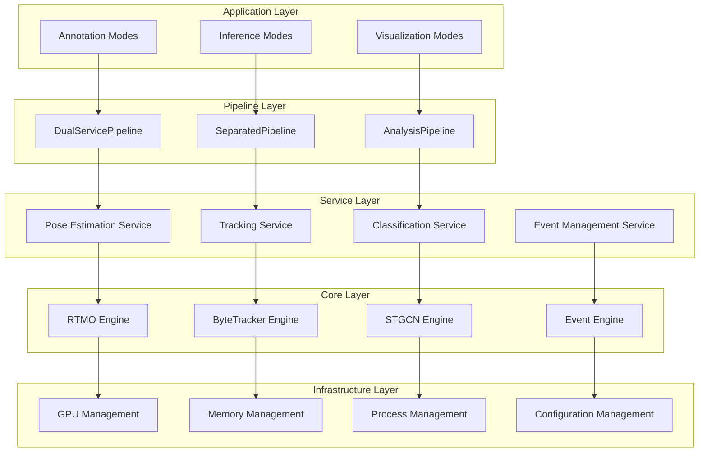
```mermaid
graph TB
    subgraph "Application Layer"
        A1[Annotation Modes]
        A2[Inference Modes]
        A3[Visualization Modes]
    end

    subgraph "Pipeline Layer"
        P1[DualServicePipeline]
        P2[SeparatedPipeline]
        P3[AnalysisPipeline]
    end

    subgraph "Service Layer"
        S1[Pose Estimation Service]
        S2[Tracking Service]
        S3[Classification Service]
        S4[Event Management Service]
    end

    subgraph "Core Layer"
        C1[RTMO Engine]
        C2[ByteTracker Engine]
        C3[STGCN Engine]
        C4[Event Engine]
    end

    subgraph "Infrastructure Layer"
        I1[GPU Management]
        I2[Memory Management]
        I3[Process Management]
        I4[Configuration Management]
    end

    A1 --> P1
    A2 --> P2
    A3 --> P3
    P1 --> S1
    P2 --> S2
    P3 --> S3
    S1 --> C1
    S2 --> C2
    S3 --> C3
    S4 --> C4
    C1 --> I1
    C2 --> I2
    C3 --> I3
    C4 --> I4
```

## 1. Annotation 모드 파이프라인 아키텍처

### 개요 및 목적

Annotation 모드는 원시 비디오 데이터를 STGCN 학습용 데이터셋으로 변환하는 3단계 데이터 전처리 파이프라인입니다. 각 단계는 독립적으로 실행 가능하며, 중간 결과를 PKL 형태로 저장하여 재사용성과 디버깅 효율성을 보장합니다.

### 전체 데이터 플로우 아키텍처

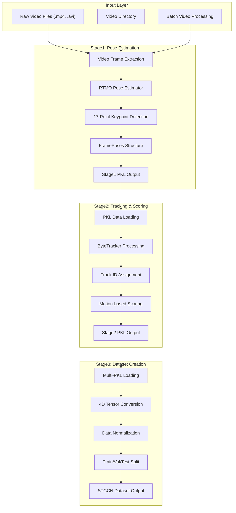
```mermaid
graph TD
    subgraph "Input Layer"
        V1["Raw Video Files (.mp4, .avi)"]
        V2["Video Directory"]
        V3["Batch Video Processing"]
    end

    subgraph "Stage1: Pose Estimation"
        S1A["Video Frame Extraction"]
        S1B["RTMO Pose Estimator"]
        S1C["17-Point Keypoint Detection"]
        S1D["FramePoses Structure"]
        S1E["Stage1 PKL Output"]
    end

    subgraph "Stage2: Tracking & Scoring"
        S2A["PKL Data Loading"]
        S2B["ByteTracker Processing"]
        S2C["Track ID Assignment"]
        S2D["Motion-based Scoring"]
        S2E["Stage2 PKL Output"]
    end

    subgraph "Stage3: Dataset Creation"
        S3A["Multi-PKL Loading"]
        S3B["4D Tensor Conversion"]
        S3C["Data Normalization"]
        S3D["Train/Val/Test Split"]
        S3E["STGCN Dataset Output"]
    end

    V1 --> S1A
    V2 --> S1A
    V3 --> S1A
    S1A --> S1B
    S1B --> S1C
    S1C --> S1D
    S1D --> S1E

    S1E --> S2A
    S2A --> S2B
    S2B --> S2C
    S2C --> S2D
    S2D --> S2E

    S2E --> S3A
    S3A --> S3B
    S3B --> S3C
    S3C --> S3D
    S3D --> S3E
```

### Stage1: 포즈 추정 서비스 아키텍처

#### 서비스 개요

Stage1은 원시 비디오에서 프레임별 인체 포즈를 추정하여 구조화된 데이터로 변환하는 핵심 서비스입니다. RTMO(Real-Time Multi-Object) 모델을 활용하여 다중 인물에 대한 실시간 포즈 추정을 수행합니다.

#### 상세 처리 플로우

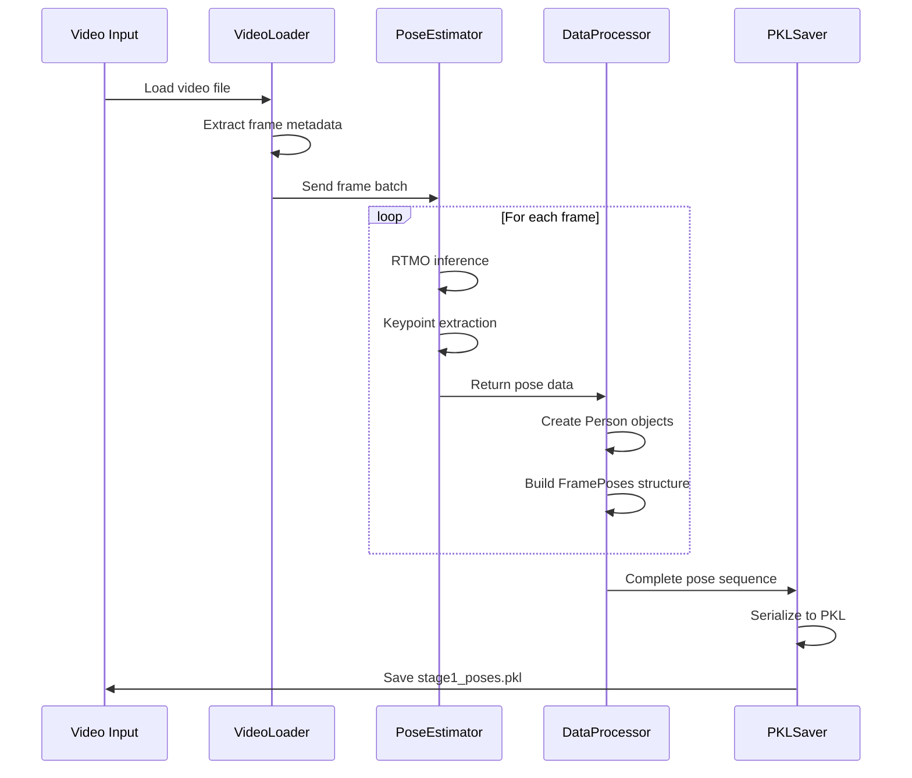
```mermaid
sequenceDiagram
    participant V as Video Input
    participant VL as VideoLoader
    participant PE as PoseEstimator
    participant DP as DataProcessor
    participant PS as PKLSaver

    V->>VL: Load video file
    VL->>VL: Extract frame metadata
    VL->>PE: Send frame batch

    loop For each frame
        PE->>PE: RTMO inference
        PE->>PE: Keypoint extraction
        PE->>DP: Return pose data
        DP->>DP: Create Person objects
        DP->>DP: Build FramePoses structure
    end

    DP->>PS: Complete pose sequence
    PS->>PS: Serialize to PKL
    PS->>V: Save stage1_poses.pkl
```

#### 핵심 컴포넌트

**1. RTMO Pose Estimator**
- 모델 타입: PyTorch, ONNX, TensorRT 지원
- 추정 성능: 30-60 FPS (GPU 환경)
- 출력 형식: 17-point COCO keypoint format
- 신뢰도 임계값: 0.3 이상

**2. 데이터 구조**
```python
class Person:
    """Person 클래스: 개별 인물 정보"""
    keypoints: np.ndarray      # (17, 3) - x, y, confidence
    bbox: Tuple[int, int, int, int]  # x1, y1, x2, y2
    confidence: float          # 전체 신뢰도
    person_id: Optional[int]   # 인물 ID (Stage1에서는 None)

class FramePoses:
    """FramePoses: 프레임 단위 포즈 데이터"""
    frame_number: int
    timestamp: float
    persons: List[Person]
    frame_shape: Tuple[int, int, int]  # H, W, C
```

**3. 성능 최적화**
- 배치 처리: 8-16 프레임 단위
- GPU 메모리 관리: 동적 배치 크기 조정
- 멀티프로세싱: 비디오별 병렬 처리
- 캐싱: 모델 가중치 및 중간 결과 캐싱

### Stage2: 객체 추적 및 점수화 서비스 아키텍처

#### 서비스 개요

Stage2는 Stage1에서 추출된 포즈 데이터에 시간적 일관성을 부여하고, 각 인물에 대한 추적 ID를 할당하여 연속적인 행동 분석을 위한 기반을 구축하는 서비스입니다. ByteTracker 알고리즘을 활용하여 다중 객체 추적을 수행하고, 움직임 패턴 기반 점수화를 통해 분석 품질을 향상시킵니다.

#### 상세 처리 플로우

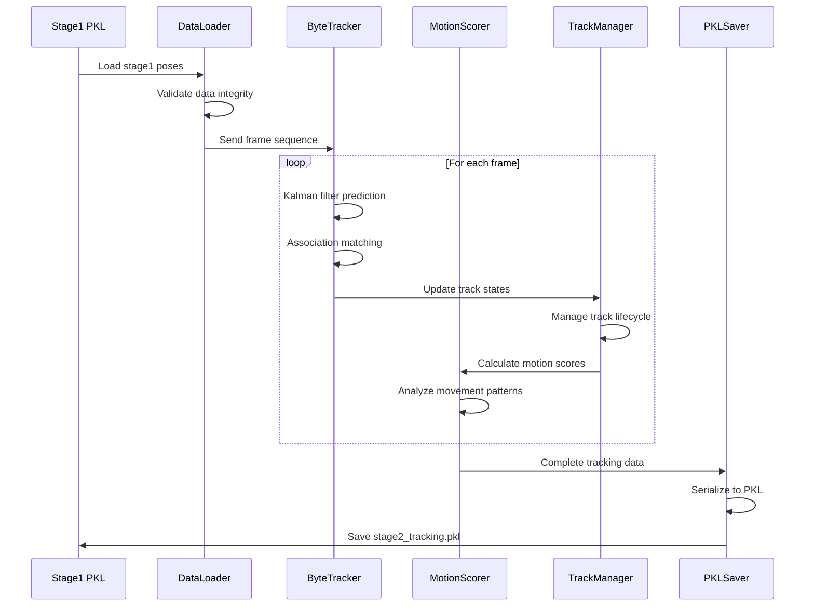
```mermaid
sequenceDiagram
    participant S1 as Stage1 PKL
    participant DL as DataLoader
    participant BT as ByteTracker
    participant MS as MotionScorer
    participant TM as TrackManager
    participant PS as PKLSaver

    S1->>DL: Load stage1 poses
    DL->>DL: Validate data integrity
    DL->>BT: Send frame sequence

    loop For each frame
        BT->>BT: Kalman filter prediction
        BT->>BT: Association matching
        BT->>TM: Update track states
        TM->>TM: Manage track lifecycle
        TM->>MS: Calculate motion scores
        MS->>MS: Analyze movement patterns
    end

    MS->>PS: Complete tracking data
    PS->>PS: Serialize to PKL
    PS->>S1: Save stage2_tracking.pkl
```

#### 핵심 컴포넌트

**1. ByteTracker 추적 엔진**
- 알고리즘: Kalman Filter + Hungarian Algorithm
- 추적 성능: 95%+ ID 일관성 유지
- 처리 속도: 100+ FPS (CPU 환경)
- 특징: Re-identification 지원, Occlusion 처리

**2. Motion Scorer 시스템**
```python
class MotionScorer:
    """움직임 패턴 분석 및 점수화"""

    def calculate_velocity_score(self, keypoints_sequence: np.ndarray) -> float:
        """속도 기반 점수 계산"""
        pass

    def calculate_acceleration_score(self, keypoints_sequence: np.ndarray) -> float:
        """가속도 기반 점수 계산"""
        pass

    def calculate_stability_score(self, keypoints_sequence: np.ndarray) -> float:
        """안정성 기반 점수 계산"""
        pass
```

**3. Track Management**
- Track ID 생명주기 관리
- Lost track 복구 메커니즘
- Memory buffer 최적화
- Conflict resolution 알고리즘

### Stage3: 데이터셋 생성 및 최적화 서비스 아키텍처

#### 서비스 개요

Stage3는 Stage2의 추적 데이터를 STGCN 학습에 최적화된 4D 텐서 형태로 변환하고, 효율적인 학습을 위한 데이터셋 구조를 생성하는 최종 전처리 서비스입니다. MMAction2 프레임워크와의 완벽한 호환성을 보장하며, 대규모 데이터셋 처리를 위한 최적화된 알고리즘을 제공합니다.

#### 상세 처리 플로우

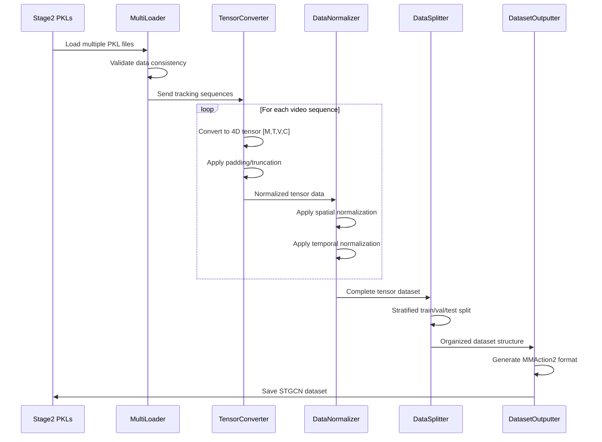
```mermaid
sequenceDiagram
    participant S2 as Stage2 PKLs
    participant ML as MultiLoader
    participant TC as TensorConverter
    participant DN as DataNormalizer
    participant DS as DataSplitter
    participant DO as DatasetOutputter

    S2->>ML: Load multiple PKL files
    ML->>ML: Validate data consistency
    ML->>TC: Send tracking sequences

    loop For each video sequence
        TC->>TC: Convert to 4D tensor [M,T,V,C]
        TC->>TC: Apply padding/truncation
        TC->>DN: Normalized tensor data
        DN->>DN: Apply spatial normalization
        DN->>DN: Apply temporal normalization
    end

    DN->>DS: Complete tensor dataset
    DS->>DS: Stratified train/val/test split
    DS->>DO: Organized dataset structure
    DO->>DO: Generate MMAction2 format
    DO->>S2: Save STGCN dataset
```

#### 텐서 변환 아키텍처

**1. 4D 텐서 구조 정의**
```python
class TensorStructure:
    """STGCN 호환 텐서 구조"""

    # 차원 정의
    M: int = 4      # 최대 인물 수 (Max persons)
    T: int = 100    # 시간 프레임 수 (Temporal frames)
    V: int = 17     # 키포인트 수 (Vertices/Keypoints)
    C: int = 2      # 좌표 차원 (Coordinates: x, y)

    # 텐서 형태: [M, T, V, C]
    tensor_shape: Tuple[int, int, int, int] = (M, T, V, C)
```

**2. 데이터 정규화 전략**
- **공간 정규화**: 프레임 해상도 기준 좌표 정규화 (0-1 범위)
- **시간 정규화**: 프레임 간격 일관성 보장
- **인물 정규화**: 바운딩 박스 기준 상대 좌표 변환
- **결측치 처리**: 선형 보간 및 제로 패딩 적용

**3. 데이터셋 분할 전략**
```python
class DatasetSplitter:
    """데이터셋 분할 관리"""

    def stratified_split(self,
                        data: List[TensorData],
                        ratios: Tuple[float, float, float] = (0.7, 0.2, 0.1)
                       ) -> Tuple[List, List, List]:
        """계층화 분할 수행"""
        # 클래스 분포 유지하며 분할
        # Fight/NonFight 비율 균등 보장
        pass
```

### 멀티프로세싱 및 분산 처리 아키텍처

#### 분산 처리 전략

Annotation 모드는 대규모 데이터셋 처리를 위한 고성능 멀티프로세싱 시스템을 제공합니다. GPU 리소스 최적화와 메모리 효율성을 고려한 분산 처리 아키텍처를 구현합니다.

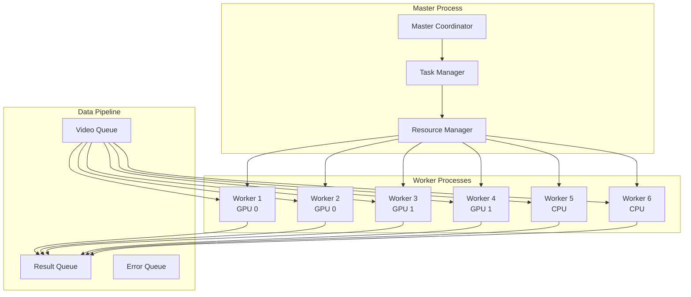
```mermaid
graph TD
    subgraph "Master Process"
        MP[Master Coordinator]
        TM[Task Manager]
        RM[Resource Manager]
    end

    subgraph "Worker Processes"
        W1[Worker 1<br/>GPU 0]
        W2[Worker 2<br/>GPU 0]
        W3[Worker 3<br/>GPU 1]
        W4[Worker 4<br/>GPU 1]
        W5[Worker 5<br/>CPU]
        W6[Worker 6<br/>CPU]
    end

    subgraph "Data Pipeline"
        Q1[Video Queue]
        Q2[Result Queue]
        Q3[Error Queue]
    end

    MP --> TM
    TM --> RM
    RM --> W1
    RM --> W2
    RM --> W3
    RM --> W4
    RM --> W5
    RM --> W6

    Q1 --> W1
    Q1 --> W2
    Q1 --> W3
    Q1 --> W4
    Q1 --> W5
    Q1 --> W6

    W1 --> Q2
    W2 --> Q2
    W3 --> Q2
    W4 --> Q2
    W5 --> Q2
    W6 --> Q2
```

#### 성능 최적화 설정

```yaml
multi_process:
  enabled: true
  num_processes: 6
  gpus: [0, 1]
  chunk_strategy: video_split
  resource_management:
    gpu_memory_fraction: 0.8
    max_batch_size: 16
    prefetch_buffer: 4
  error_handling:
    max_retries: 3
    failure_recovery: skip
    checkpoint_interval: 100
```

## 2. Inference 모드 파이프라인 아키텍처

### Analysis 모드: 배치 분석 서비스 아키텍처

#### 서비스 개요

Analysis 모드는 대규모 비디오 데이터셋에 대한 배치 처리를 통해 종합적인 행동 분석 결과를 생성하는 고성능 분석 서비스입니다. 실시간 제약 없이 최고 품질의 분석 결과를 제공하며, 상세한 성능 평가 및 보고서 생성 기능을 포함합니다.

#### 전체 시스템 아키텍처

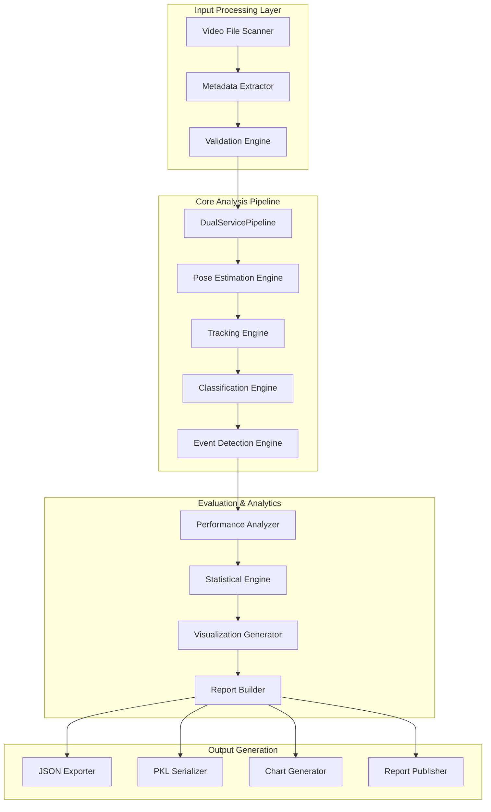
```mermaid
graph TD
    subgraph "Input Processing Layer"
        I1[Video File Scanner]
        I2[Metadata Extractor]
        I3[Validation Engine]
    end

    subgraph "Core Analysis Pipeline"
        P1[DualServicePipeline]
        P2[Pose Estimation Engine]
        P3[Tracking Engine]
        P4[Classification Engine]
        P5[Event Detection Engine]
    end

    subgraph "Evaluation & Analytics"
        E1[Performance Analyzer]
        E2[Statistical Engine]
        E3[Visualization Generator]
        E4[Report Builder]
    end

    subgraph "Output Generation"
        O1[JSON Exporter]
        O2[PKL Serializer]
        O3[Chart Generator]
        O4[Report Publisher]
    end

    I1 --> I2
    I2 --> I3
    I3 --> P1
    P1 --> P2
    P2 --> P3
    P3 --> P4
    P4 --> P5
    P5 --> E1
    E1 --> E2
    E2 --> E3
    E3 --> E4
    E4 --> O1
    E4 --> O2
    E4 --> O3
    E4 --> O4
```

#### 상세 처리 플로우

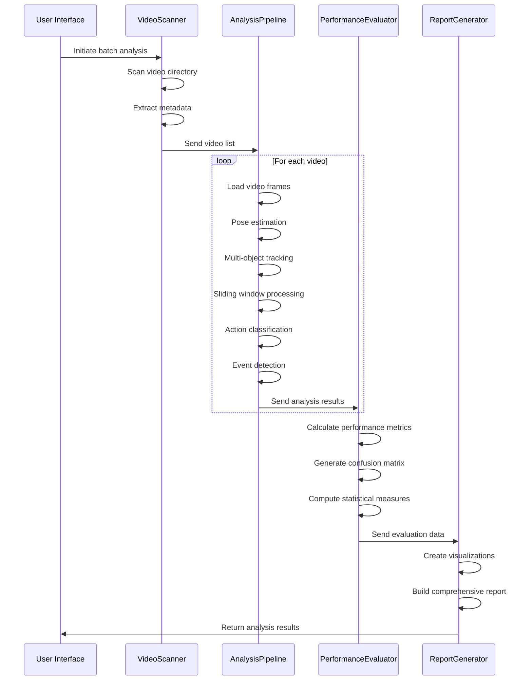
```mermaid
sequenceDiagram
    participant UI as User Interface
    participant VS as VideoScanner
    participant AP as AnalysisPipeline
    participant PE as PerformanceEvaluator
    participant RG as ReportGenerator

    UI->>VS: Initiate batch analysis
    VS->>VS: Scan video directory
    VS->>VS: Extract metadata
    VS->>AP: Send video list

    loop For each video
        AP->>AP: Load video frames
        AP->>AP: Pose estimation
        AP->>AP: Multi-object tracking
        AP->>AP: Sliding window processing
        AP->>AP: Action classification
        AP->>AP: Event detection
        AP->>PE: Send analysis results
    end

    PE->>PE: Calculate performance metrics
    PE->>PE: Generate confusion matrix
    PE->>PE: Compute statistical measures
    PE->>RG: Send evaluation data
    RG->>RG: Create visualizations
    RG->>RG: Build comprehensive report
    RG->>UI: Return analysis results
```

#### 성능 평가 시스템

**1. 통계적 성능 분석**
```python
class PerformanceAnalyzer:
    """종합 성능 분석 엔진"""

    def calculate_classification_metrics(self) -> Dict[str, float]:
        """분류 성능 메트릭 계산"""
        return {
            'accuracy': self.accuracy_score(),
            'precision': self.precision_score(),
            'recall': self.recall_score(),
            'f1_score': self.f1_score(),
            'auc_roc': self.roc_auc_score(),
            'specificity': self.specificity_score()
        }

    def generate_confusion_matrix(self) -> np.ndarray:
        """혼동 행렬 생성"""
        pass

    def calculate_temporal_accuracy(self) -> Dict[str, List[float]]:
        """시간대별 정확도 분석"""
        pass
```

**2. 시각화 및 차트 생성**
- **ROC Curve**: 임계값별 성능 곡선
- **Precision-Recall Curve**: 정밀도-재현율 곡선
- **Temporal Analysis**: 시간대별 성능 변화
- **Error Distribution**: 오류 유형별 분포 분석
- **Performance Heatmap**: 비디오별 성능 히트맵

### Realtime 모드: 실시간 추론 서비스 아키텍처

#### 서비스 개요

Realtime 모드는 실시간 비디오 스트림에서 100ms 이하의 초저지연으로 행동 분석 및 이벤트 감지를 수행하는 고성능 실시간 서비스입니다. 라이브 카메라 피드, RTSP 스트림, 파일 재생을 지원하며, 즉각적인 시각화 및 알림 시스템을 제공합니다.

#### 실시간 처리 아키텍처

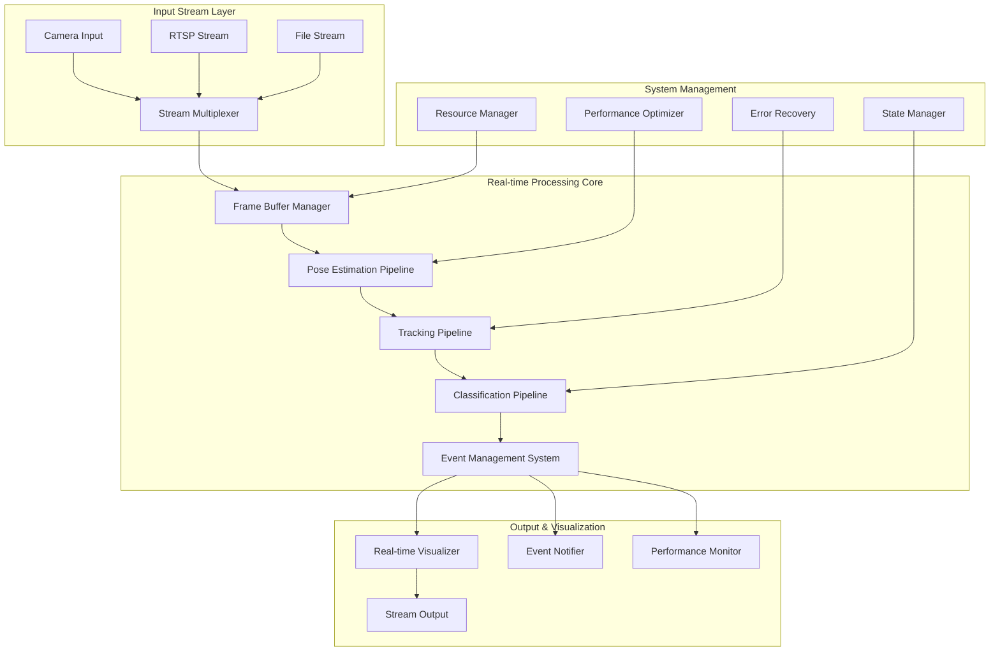
```mermaid
graph TD
    subgraph "Input Stream Layer"
        IS1[Camera Input]
        IS2[RTSP Stream]
        IS3[File Stream]
        IS4[Stream Multiplexer]
    end

    subgraph "Real-time Processing Core"
        RP1[Frame Buffer Manager]
        RP2[Pose Estimation Pipeline]
        RP3[Tracking Pipeline]
        RP4[Classification Pipeline]
        RP5[Event Management System]
    end

    subgraph "Output & Visualization"
        OV1[Real-time Visualizer]
        OV2[Event Notifier]
        OV3[Performance Monitor]
        OV4[Stream Output]
    end

    subgraph "System Management"
        SM1[Resource Manager]
        SM2[Performance Optimizer]
        SM3[Error Recovery]
        SM4[State Manager]
    end

    IS1 --> IS4
    IS2 --> IS4
    IS3 --> IS4
    IS4 --> RP1
    RP1 --> RP2
    RP2 --> RP3
    RP3 --> RP4
    RP4 --> RP5
    RP5 --> OV1
    RP5 --> OV2
    RP5 --> OV3
    OV1 --> OV4

    SM1 --> RP1
    SM2 --> RP2
    SM3 --> RP3
    SM4 --> RP4
```

#### 실시간 처리 플로우

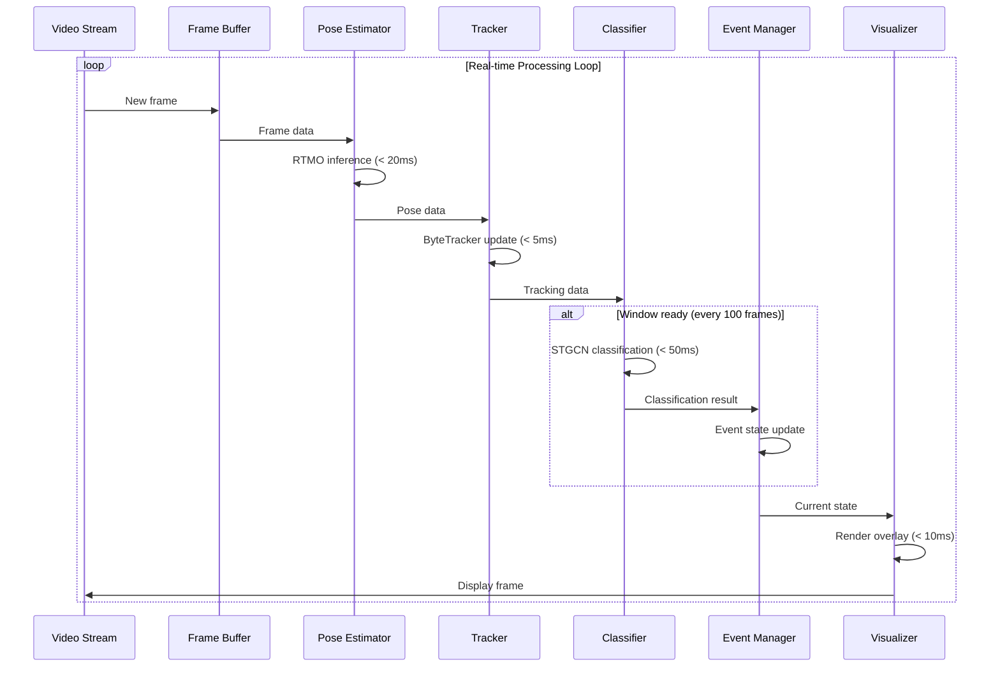
```mermaid
sequenceDiagram
    participant Stream as Video Stream
    participant FB as Frame Buffer
    participant PE as Pose Estimator
    participant TR as Tracker
    participant CL as Classifier
    participant EM as Event Manager
    participant VZ as Visualizer

    loop Real-time Processing Loop
        Stream->>FB: New frame
        FB->>PE: Frame data
        PE->>PE: RTMO inference (< 20ms)
        PE->>TR: Pose data
        TR->>TR: ByteTracker update (< 5ms)
        TR->>CL: Tracking data

        alt Window ready (every 100 frames)
            CL->>CL: STGCN classification (< 50ms)
            CL->>EM: Classification result
            EM->>EM: Event state update
        end

        EM->>VZ: Current state
        VZ->>VZ: Render overlay (< 10ms)
        VZ->>Stream: Display frame
    end
```

#### 성능 최적화 시스템

**1. 실시간 성능 관리**
```python
class RealtimeOptimizer:
    """실시간 성능 최적화 관리자"""

    def __init__(self):
        self.target_fps = 30
        self.max_latency_ms = 100
        self.performance_buffer = deque(maxlen=100)

    def adaptive_quality_control(self, current_fps: float) -> Dict[str, Any]:
        """적응적 품질 제어"""
        if current_fps < self.target_fps * 0.8:
            return {
                'frame_skip': 2,
                'batch_size': 4,
                'model_precision': 'fp16'
            }
        return {
            'frame_skip': 1,
            'batch_size': 8,
            'model_precision': 'fp32'
        }

    def monitor_performance(self) -> Dict[str, float]:
        """실시간 성능 모니터링"""
        return {
            'current_fps': self.calculate_current_fps(),
            'average_latency': self.calculate_average_latency(),
            'gpu_utilization': self.get_gpu_usage(),
            'memory_usage': self.get_memory_usage()
        }
```

**2. 다양한 오버레이 모드**
- **full**: 전체 정보 표시 (키포인트 + 바운딩박스 + 점수 + 이벤트 상태)
- **skeleton_only**: 스켈레톤 및 핵심 정보만 표시
- **minimal**: 이벤트 감지 결과만 표시
- **debug**: 디버깅 정보 포함 상세 표시
- **raw**: 원본 영상만 표시

**3. 이벤트 관리 시스템**
```python
class EventManager:
    """실시간 이벤트 관리 시스템"""

    def __init__(self):
        self.event_states = {}
        self.threshold_manager = ThresholdManager()
        self.temporal_filter = TemporalFilter()

    def process_classification_result(self, result: ClassificationResult) -> EventData:
        """분류 결과 기반 이벤트 처리"""
        # 임계값 기반 1차 필터링
        # 시간적 연속성 검증
        # 이벤트 상태 업데이트
        # 알림 발생 결정
        pass
```

### Visualize 모드: 후처리 시각화 서비스 아키텍처

#### 서비스 개요

Visualize 모드는 저장된 PKL 분석 결과를 고품질 시각화 비디오로 변환하는 후처리 서비스입니다. 다양한 시각화 옵션과 커스터마이징 기능을 제공하여 분석 결과의 이해도를 극대화하고, 프레젠테이션 및 검증 용도의 전문적인 시각화 콘텐츠를 생성합니다.

#### 시각화 처리 아키텍처

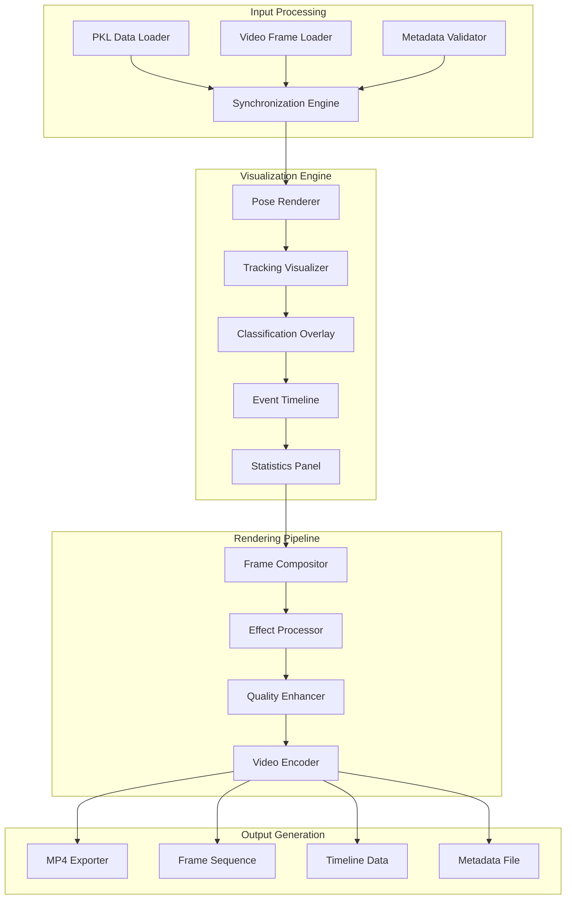
```mermaid
graph TD
    subgraph "Input Processing"
        IP1[PKL Data Loader]
        IP2[Video Frame Loader]
        IP3[Metadata Validator]
        IP4[Synchronization Engine]
    end

    subgraph "Visualization Engine"
        VE1[Pose Renderer]
        VE2[Tracking Visualizer]
        VE3[Classification Overlay]
        VE4[Event Timeline]
        VE5[Statistics Panel]
    end

    subgraph "Rendering Pipeline"
        RP1[Frame Compositor]
        RP2[Effect Processor]
        RP3[Quality Enhancer]
        RP4[Video Encoder]
    end

    subgraph "Output Generation"
        OG1[MP4 Exporter]
        OG2[Frame Sequence]
        OG3[Timeline Data]
        OG4[Metadata File]
    end

    IP1 --> IP4
    IP2 --> IP4
    IP3 --> IP4
    IP4 --> VE1
    VE1 --> VE2
    VE2 --> VE3
    VE3 --> VE4
    VE4 --> VE5
    VE5 --> RP1
    RP1 --> RP2
    RP2 --> RP3
    RP3 --> RP4
    RP4 --> OG1
    RP4 --> OG2
    RP4 --> OG3
    RP4 --> OG4
```

#### 고급 시각화 기능

**1. 다층 오버레이 시스템**
```python
class AdvancedVisualizer:
    """고급 시각화 렌더링 엔진"""

    def __init__(self):
        self.layers = {
            'skeleton': SkeletonRenderer(),
            'bbox': BoundingBoxRenderer(),
            'trajectory': TrajectoryRenderer(),
            'heatmap': AttentionHeatmapRenderer(),
            'timeline': EventTimelineRenderer(),
            'statistics': StatisticsRenderer()
        }

    def render_frame(self, frame_data: FrameData) -> np.ndarray:
        """다층 오버레이 렌더링"""
        base_frame = frame_data.original_frame

        for layer_name, renderer in self.layers.items():
            if self.config.layers[layer_name].enabled:
                overlay = renderer.render(frame_data)
                base_frame = self.composite_layer(base_frame, overlay)

        return base_frame
```

**2. 커스터마이징 가능한 시각화 스타일**
- **Professional**: 깔끔한 비즈니스용 스타일
- **Scientific**: 논문 및 연구용 정밀 시각화
- **Presentation**: 프레젠테이션용 강조 스타일
- **Debug**: 개발자용 상세 디버깅 정보
- **Artistic**: 창의적 비주얼 효과

## 3. 파이프라인 구현체 아키텍처

### DualServicePipeline: 통합 다중 서비스 아키텍처

#### 아키텍처 개요

DualServicePipeline은 Fight와 Falldown 감지를 단일 파이프라인에서 동시 처리하는 통합 아키텍처입니다. 공통 포즈 추정 및 추적 엔진을 공유하면서 서비스별 특화된 분류기와 이벤트 관리 시스템을 제공하여 효율성과 정확성을 동시에 확보합니다.

#### 시스템 아키텍처

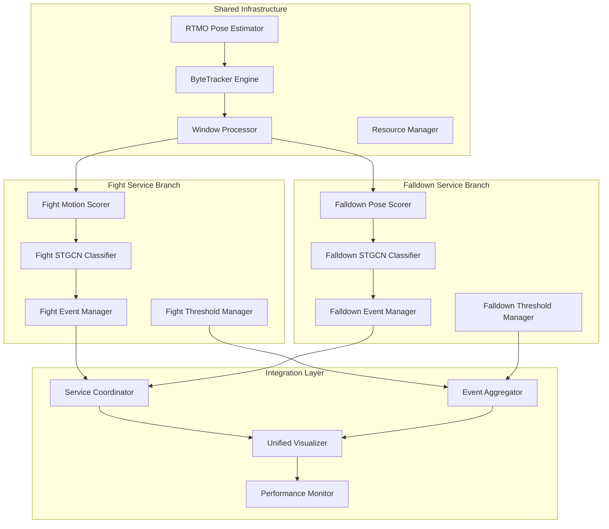
```mermaid
graph TD
    subgraph "Shared Infrastructure"
        SI1[RTMO Pose Estimator]
        SI2[ByteTracker Engine]
        SI3[Window Processor]
        SI4[Resource Manager]
    end

    subgraph "Fight Service Branch"
        FS1[Fight Motion Scorer]
        FS2[Fight STGCN Classifier]
        FS3[Fight Event Manager]
        FS4[Fight Threshold Manager]
    end

    subgraph "Falldown Service Branch"
        FD1[Falldown Pose Scorer]
        FD2[Falldown STGCN Classifier]
        FD3[Falldown Event Manager]
        FD4[Falldown Threshold Manager]
    end

    subgraph "Integration Layer"
        IL1[Service Coordinator]
        IL2[Event Aggregator]
        IL3[Unified Visualizer]
        IL4[Performance Monitor]
    end

    SI1 --> SI2
    SI2 --> SI3
    SI3 --> FS1
    SI3 --> FD1
    FS1 --> FS2
    FD1 --> FD2
    FS2 --> FS3
    FD2 --> FD3
    FS3 --> IL1
    FD3 --> IL1
    FS4 --> IL2
    FD4 --> IL2
    IL1 --> IL3
    IL2 --> IL3
    IL3 --> IL4
```

#### 핵심 구현 클래스

```python
class DualServicePipeline(BasePipeline):
    """듀얼 서비스 통합 파이프라인"""

    def __init__(self, config: PipelineConfig):
        # 공통 인프라
        self.pose_estimator = RTMOONNXEstimator(config.pose_config)
        self.tracker = ByteTrackerWrapper(config.tracking_config)
        self.window_processor = SlidingWindowProcessor(config.window_config)

        # 서비스별 특화 모듈
        self.services = {
            'fight': FightService(config.fight_config),
            'falldown': FalldownService(config.falldown_config)
        }

        # 통합 관리 모듈
        self.service_coordinator = ServiceCoordinator()
        self.event_aggregator = EventAggregator()
        self.unified_visualizer = UnifiedVisualizer()

    async def process_frame(self, frame: np.ndarray) -> ProcessingResult:
        """통합 프레임 처리"""
        # 1. 공통 포즈 추정
        poses = await self.pose_estimator.estimate(frame)

        # 2. 공통 추적 처리
        tracked_poses = await self.tracker.track(poses)

        # 3. 윈도우 업데이트
        self.window_processor.add_frame(tracked_poses)

        # 4. 서비스별 병렬 처리
        if self.window_processor.is_ready():
            window_data = self.window_processor.get_window()
            service_results = await asyncio.gather(*[
                service.process_window(window_data)
                for service in self.services.values()
            ])

            # 5. 결과 통합
            aggregated_result = self.event_aggregator.aggregate(service_results)
            return aggregated_result

        return ProcessingResult(poses=tracked_poses)
```

#### 서비스별 특화 구성

**1. Fight Service Architecture**
```python
class FightService(BaseService):
    """폭력 행동 감지 특화 서비스"""

    def __init__(self, config: FightConfig):
        self.scorer = MotionBasedScorer(
            velocity_weight=0.4,
            acceleration_weight=0.3,
            interaction_weight=0.3
        )
        self.classifier = STGCNClassifier(
            model_path=config.fight_model_path,
            num_classes=2,  # Fight, NonFight
            threshold=0.7
        )
        self.event_manager = FightEventManager(
            min_duration=1.0,    # 최소 1초 지속
            confidence_threshold=0.8
        )

    def calculate_motion_features(self, poses: List[PoseData]) -> np.ndarray:
        """폭력 행동 특화 모션 특징 계산"""
        features = []
        for pose in poses:
            # 상체 중심 운동 분석
            upper_body_velocity = self.calculate_upper_body_velocity(pose)
            # 팔 동작 패턴 분석
            arm_movement_pattern = self.analyze_arm_movements(pose)
            # 인물 간 상호작용 분석
            interaction_features = self.detect_interactions(pose)

            features.extend([upper_body_velocity, arm_movement_pattern, interaction_features])

        return np.array(features)
```

**2. Falldown Service Architecture**
```python
class FalldownService(BaseService):
    """낙상 감지 특화 서비스"""

    def __init__(self, config: FalldownConfig):
        self.scorer = PoseBasedScorer(
            height_ratio_weight=0.5,
            orientation_weight=0.3,
            velocity_weight=0.2
        )
        self.classifier = STGCNClassifier(
            model_path=config.falldown_model_path,
            num_classes=2,  # Fall, Normal
            threshold=0.6
        )
        self.event_manager = FalldownEventManager(
            min_duration=0.5,    # 최소 0.5초 지속
            recovery_timeout=3.0  # 3초 내 회복 감지
        )

    def calculate_pose_features(self, poses: List[PoseData]) -> np.ndarray:
        """낙상 특화 포즈 특징 계산"""
        features = []
        for pose in poses:
            # 신체 높이 비율 분석
            height_ratio = self.calculate_height_ratio(pose)
            # 신체 기울기 분석
            body_orientation = self.calculate_body_orientation(pose)
            # 낙하 속도 분석
            fall_velocity = self.calculate_fall_velocity(pose)

            features.extend([height_ratio, body_orientation, fall_velocity])

        return np.array(features)
```

### SeparatedPipeline: 단계별 독립 처리 아키텍처

#### 아키텍처 개요

SeparatedPipeline은 각 처리 단계를 완전히 독립적으로 실행할 수 있는 모듈화된 아키텍처입니다. 디버깅, 개발, 그리고 특정 단계만 재실행이 필요한 상황에서 최적화된 성능을 제공하며, 각 단계의 중간 결과를 저장하여 재현성과 검증 가능성을 보장합니다.

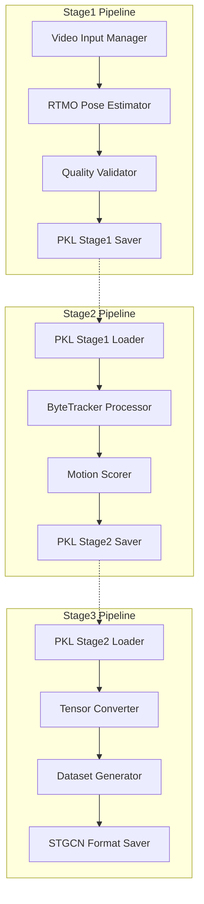
```mermaid
graph TD
    subgraph "Stage1 Pipeline"
        S1A[Video Input Manager]
        S1B[RTMO Pose Estimator]
        S1C[Quality Validator]
        S1D[PKL Stage1 Saver]
    end

    subgraph "Stage2 Pipeline"
        S2A[PKL Stage1 Loader]
        S2B[ByteTracker Processor]
        S2C[Motion Scorer]
        S2D[PKL Stage2 Saver]
    end

    subgraph "Stage3 Pipeline"
        S3A[PKL Stage2 Loader]
        S3B[Tensor Converter]
        S3C[Dataset Generator]
        S3D[STGCN Format Saver]
    end

    S1A --> S1B
    S1B --> S1C
    S1C --> S1D
    S1D -.-> S2A
    S2A --> S2B
    S2B --> S2C
    S2C --> S2D
    S2D -.-> S3A
    S3A --> S3B
    S3B --> S3C
    S3C --> S3D
```

#### 독립 실행 가능한 파이프라인 모듈

```python
class SeparatedPipeline:
    """단계별 독립 실행 파이프라인"""

    def __init__(self, config: SeparatedConfig):
        self.stage_pipelines = {
            'stage1': Stage1Pipeline(config.stage1_config),
            'stage2': Stage2Pipeline(config.stage2_config),
            'stage3': Stage3Pipeline(config.stage3_config)
        }

    def execute_stage(self, stage: str, input_path: str, output_path: str) -> ExecutionResult:
        """특정 단계만 독립 실행"""
        pipeline = self.stage_pipelines[stage]
        return pipeline.execute(input_path, output_path)

    def execute_sequence(self, stages: List[str], base_path: str) -> List[ExecutionResult]:
        """지정된 단계들을 순차 실행"""
        results = []
        for stage in stages:
            result = self.execute_stage(stage, base_path, base_path)
            results.append(result)
            if not result.success:
                break
        return results
```

### AnalysisPipeline: 배치 분석 전용 아키텍처

#### 아키텍처 개요

AnalysisPipeline은 대용량 비디오 데이터셋의 배치 처리와 성능 분석에 특화된 고성능 파이프라인입니다. 실시간 제약 없이 최고 품질의 분석을 수행하며, 상세한 성능 메트릭과 시각화를 제공합니다.

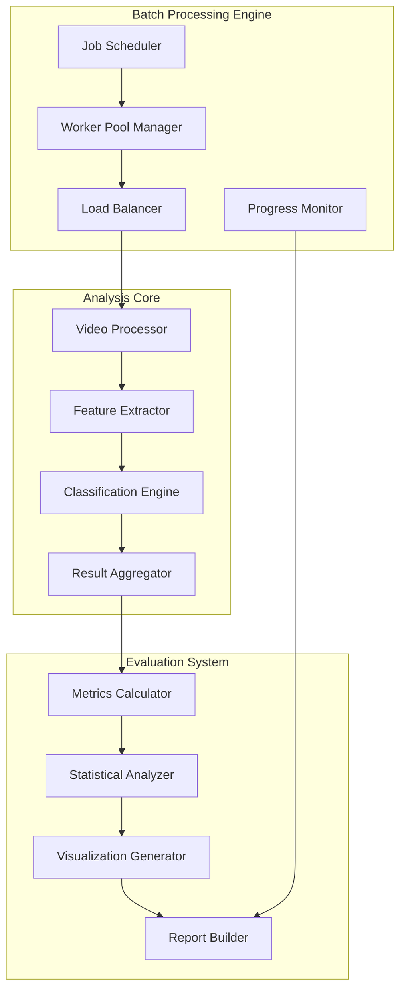
```mermaid
graph TD
    subgraph "Batch Processing Engine"
        BP1[Job Scheduler]
        BP2[Worker Pool Manager]
        BP3[Load Balancer]
        BP4[Progress Monitor]
    end

    subgraph "Analysis Core"
        AC1[Video Processor]
        AC2[Feature Extractor]
        AC3[Classification Engine]
        AC4[Result Aggregator]
    end

    subgraph "Evaluation System"
        ES1[Metrics Calculator]
        ES2[Statistical Analyzer]
        ES3[Visualization Generator]
        ES4[Report Builder]
    end

    BP1 --> BP2
    BP2 --> BP3
    BP3 --> AC1
    AC1 --> AC2
    AC2 --> AC3
    AC3 --> AC4
    AC4 --> ES1
    ES1 --> ES2
    ES2 --> ES3
    ES3 --> ES4
    BP4 --> ES4
```

#### 고성능 배치 처리 구현

```python
class AnalysisPipeline(BasePipeline):
    """배치 분석 전용 파이프라인"""

    def __init__(self, config: AnalysisConfig):
        self.job_scheduler = JobScheduler(max_workers=config.max_workers)
        self.video_processor = BatchVideoProcessor()
        self.performance_analyzer = PerformanceAnalyzer()
        self.report_generator = ReportGenerator()

    async def analyze_dataset(self, dataset_path: str) -> AnalysisReport:
        """데이터셋 전체 분석"""
        # 1. 비디오 파일 스캔 및 작업 분할
        video_files = self.scan_videos(dataset_path)
        jobs = self.create_analysis_jobs(video_files)

        # 2. 병렬 배치 처리
        results = await self.job_scheduler.execute_batch(jobs)

        # 3. 결과 집계 및 분석
        aggregated_results = self.aggregate_results(results)

        # 4. 성능 평가 및 리포트 생성
        performance_metrics = self.performance_analyzer.analyze(aggregated_results)
        report = self.report_generator.generate(performance_metrics)

        return report
```

## 4. 통합 데이터 플로우 아키텍처

### 실시간 처리 데이터 플로우

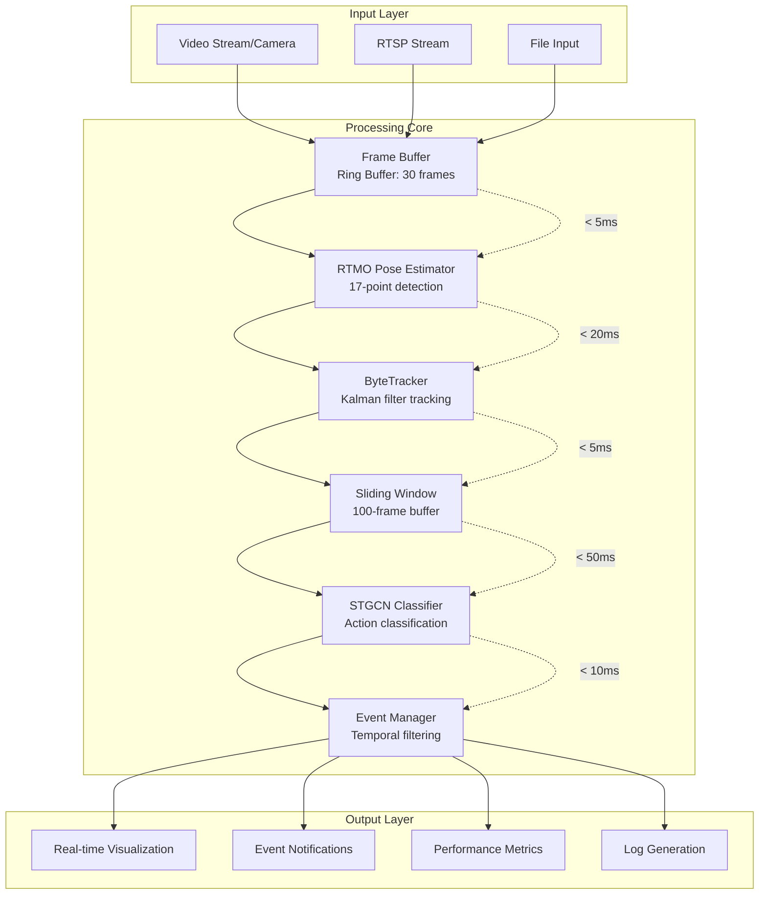
```mermaid
flowchart TD
    subgraph "Input Layer"
        A1[Video Stream/Camera]
        A2[RTSP Stream]
        A3[File Input]
    end

    subgraph "Processing Core"
        B1[Frame Buffer<br/>Ring Buffer: 30 frames]
        B2[RTMO Pose Estimator<br/>17-point detection]
        B3[ByteTracker<br/>Kalman filter tracking]
        B4[Sliding Window<br/>100-frame buffer]
        B5[STGCN Classifier<br/>Action classification]
        B6[Event Manager<br/>Temporal filtering]
    end

    subgraph "Output Layer"
        C1[Real-time Visualization]
        C2[Event Notifications]
        C3[Performance Metrics]
        C4[Log Generation]
    end

    A1 --> B1
    A2 --> B1
    A3 --> B1
    B1 --> B2
    B2 --> B3
    B3 --> B4
    B4 --> B5
    B5 --> B6
    B6 --> C1
    B6 --> C2
    B6 --> C3
    B6 --> C4

    %% Performance constraints
    B1 -.->|"< 5ms"| B2
    B2 -.->|"< 20ms"| B3
    B3 -.->|"< 5ms"| B4
    B4 -.->|"< 50ms"| B5
    B5 -.->|"< 10ms"| B6
```

### 배치 분석 데이터 플로우

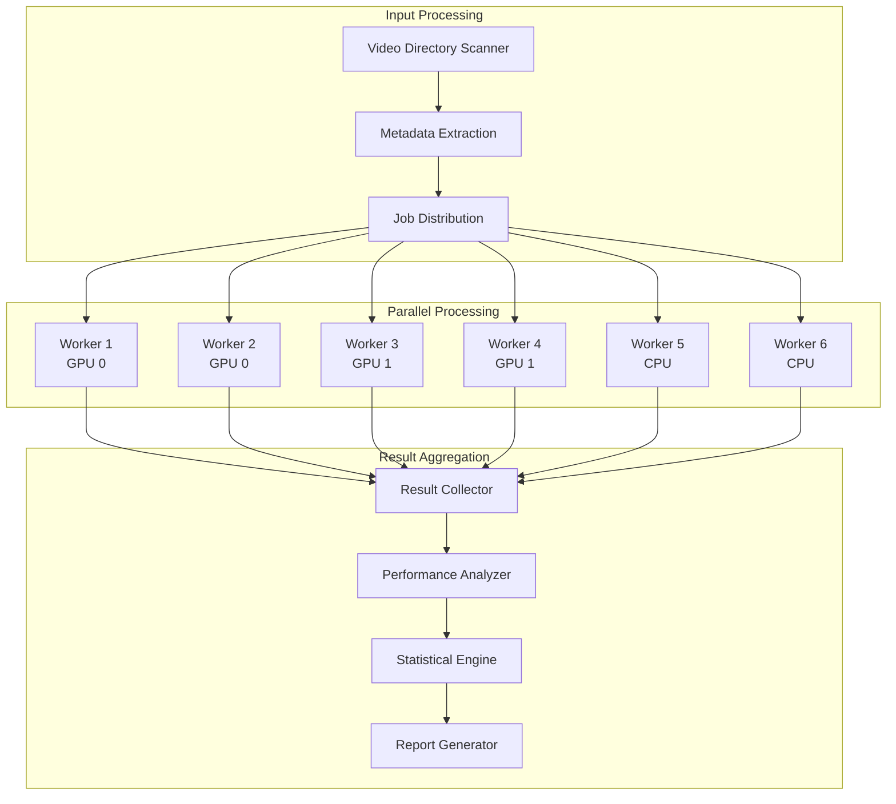
```mermaid
flowchart TD
    subgraph "Input Processing"
        D1[Video Directory Scanner]
        D2[Metadata Extraction]
        D3[Job Distribution]
    end

    subgraph "Parallel Processing"
        E1[Worker 1<br/>GPU 0]
        E2[Worker 2<br/>GPU 0]
        E3[Worker 3<br/>GPU 1]
        E4[Worker 4<br/>GPU 1]
        E5[Worker 5<br/>CPU]
        E6[Worker 6<br/>CPU]
    end

    subgraph "Result Aggregation"
        F1[Result Collector]
        F2[Performance Analyzer]
        F3[Statistical Engine]
        F4[Report Generator]
    end

    D1 --> D2
    D2 --> D3
    D3 --> E1
    D3 --> E2
    D3 --> E3
    D3 --> E4
    D3 --> E5
    D3 --> E6
    E1 --> F1
    E2 --> F1
    E3 --> F1
    E4 --> F1
    E5 --> F1
    E6 --> F1
    F1 --> F2
    F2 --> F3
    F3 --> F4
```

### 데이터 변환 및 흐름 상세

#### 실시간 데이터 변환 파이프라인

```python
class DataFlowManager:
    """데이터 플로우 관리자"""

    def __init__(self):
        self.data_transformers = {
            'frame_to_pose': FrameToPoseTransformer(),
            'pose_to_tracking': PoseToTrackingTransformer(),
            'tracking_to_window': TrackingToWindowTransformer(),
            'window_to_classification': WindowToClassificationTransformer(),
            'classification_to_event': ClassificationToEventTransformer()
        }

    def transform_data_flow(self, input_data: Any, flow_type: str) -> Any:
        """데이터 플로우 변환 수행"""
        transformer = self.data_transformers[flow_type]
        return transformer.transform(input_data)
```

#### 데이터 구조 변환 매트릭스

| 단계 | 입력 형태 | 출력 형태 | 변환 시간 | 메모리 사용량 |
|------|-----------|-----------|-----------|---------------|
| Frame → Pose | (H,W,3) | (N,17,3) | < 20ms | 50MB |
| Pose → Tracking | (N,17,3) | (M,17,3)+ID | < 5ms | 10MB |
| Tracking → Window | (M,17,3) | (100,M,17,2) | < 1ms | 20MB |
| Window → Classification | (100,M,17,2) | (2,) probabilities | < 50ms | 100MB |
| Classification → Event | (2,) | EventData | < 10ms | 1MB |

## 5. 통합 설정 시스템 아키텍처

### 계층적 설정 구조

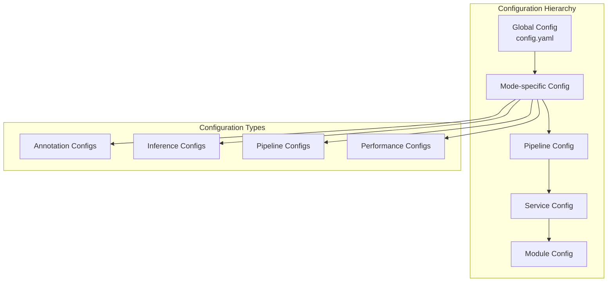
```mermaid
graph TD
    subgraph "Configuration Hierarchy"
        A1[Global Config<br/>config.yaml]
        A2[Mode-specific Config]
        A3[Pipeline Config]
        A4[Service Config]
        A5[Module Config]
    end

    subgraph "Configuration Types"
        B1[Annotation Configs]
        B2[Inference Configs]
        B3[Pipeline Configs]
        B4[Performance Configs]
    end

    A1 --> A2
    A2 --> A3
    A3 --> A4
    A4 --> A5
    A2 --> B1
    A2 --> B2
    A2 --> B3
    A2 --> B4
```

### 고급 설정 관리

```python
class ConfigurationManager:
    """통합 설정 관리 시스템"""

    def __init__(self, config_path: str):
        self.config_validator = ConfigValidator()
        self.environment_manager = EnvironmentManager()
        self.dynamic_updater = DynamicConfigUpdater()

    def load_configuration(self, mode: str) -> Configuration:
        """모드별 최적화된 설정 로드"""
        base_config = self.load_base_config()
        mode_config = self.load_mode_config(mode)
        optimized_config = self.optimize_for_environment(base_config, mode_config)
        return self.config_validator.validate(optimized_config)

    def optimize_for_environment(self, base_config: dict, mode_config: dict) -> dict:
        """환경별 설정 최적화"""
        gpu_info = self.environment_manager.get_gpu_info()
        memory_info = self.environment_manager.get_memory_info()

        if gpu_info.memory_gb < 8:
            mode_config['batch_size'] = min(mode_config['batch_size'], 4)
            mode_config['precision'] = 'fp16'

        return {**base_config, **mode_config}
```

### 환경별 자동 최적화 설정

```yaml
# 프로덕션 환경 자동 최적화
production:
  performance:
    target_fps: 30
    max_latency_ms: 100
    gpu_utilization_target: 0.8

  reliability:
    error_recovery: true
    checkpoint_interval: 1000
    health_check_interval: 30

# 개발 환경 디버깅 설정
development:
  debugging:
    verbose_logging: true
    profile_performance: true
    save_intermediate_results: true

  validation:
    strict_validation: true
    performance_alerts: true
```

## 6. 엔터프라이즈급 성능 최적화

### 자동 성능 튜닝 시스템

```python
class AutoPerformanceTuner:
    """자동 성능 최적화 시스템"""

    def __init__(self):
        self.performance_monitor = PerformanceMonitor()
        self.resource_optimizer = ResourceOptimizer()
        self.adaptive_scheduler = AdaptiveScheduler()

    def optimize_runtime_performance(self) -> OptimizationResult:
        """실시간 성능 최적화"""
        current_metrics = self.performance_monitor.get_current_metrics()

        if current_metrics.fps < self.target_fps * 0.9:
            optimization_strategy = self.determine_optimization_strategy(current_metrics)
            return self.apply_optimization(optimization_strategy)

        return OptimizationResult(status="optimal")

    def determine_optimization_strategy(self, metrics: PerformanceMetrics) -> OptimizationStrategy:
        """성능 메트릭 기반 최적화 전략 결정"""
        if metrics.gpu_utilization > 0.95:
            return OptimizationStrategy.REDUCE_BATCH_SIZE
        elif metrics.memory_usage > 0.9:
            return OptimizationStrategy.ENABLE_GRADIENT_CHECKPOINTING
        elif metrics.io_bottleneck:
            return OptimizationStrategy.INCREASE_PREFETCH_BUFFER
        else:
            return OptimizationStrategy.ADAPTIVE_PRECISION
```

### 고급 메모리 관리

- **Smart Garbage Collection**: 메모리 사용량 기반 자동 가비지 컬렉션
- **Gradient Checkpointing**: 메모리 효율적인 역전파 계산
- **Model Parallelism**: 대형 모델의 분산 처리
- **Dynamic Batching**: 실시간 배치 크기 조정

### 분산 처리 최적화

```python
class DistributedOptimizer:
    """분산 처리 최적화 관리자"""

    def __init__(self):
        self.load_balancer = IntelligentLoadBalancer()
        self.fault_tolerance = FaultToleranceManager()
        self.communication_optimizer = CommunicationOptimizer()

    def optimize_distributed_processing(self, workload: Workload) -> DistributedPlan:
        """분산 처리 최적화 계획 수립"""
        available_resources = self.get_available_resources()
        optimal_distribution = self.calculate_optimal_distribution(workload, available_resources)
        return DistributedPlan(
            worker_allocation=optimal_distribution,
            communication_strategy=self.communication_optimizer.get_strategy(),
            fault_tolerance_config=self.fault_tolerance.get_config()
        )
```

## 7. 고급 에러 처리 및 복구 시스템

### 계층적 에러 처리 아키텍처

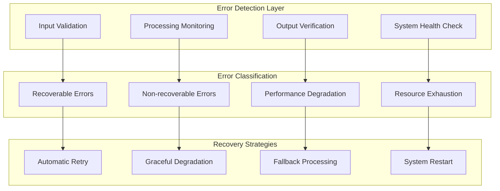
```mermaid
graph TD
    subgraph "Error Detection Layer"
        ED1[Input Validation]
        ED2[Processing Monitoring]
        ED3[Output Verification]
        ED4[System Health Check]
    end

    subgraph "Error Classification"
        EC1[Recoverable Errors]
        EC2[Non-recoverable Errors]
        EC3[Performance Degradation]
        EC4[Resource Exhaustion]
    end

    subgraph "Recovery Strategies"
        RS1[Automatic Retry]
        RS2[Graceful Degradation]
        RS3[Fallback Processing]
        RS4[System Restart]
    end

    ED1 --> EC1
    ED2 --> EC2
    ED3 --> EC3
    ED4 --> EC4
    EC1 --> RS1
    EC2 --> RS2
    EC3 --> RS3
    EC4 --> RS4
```

### 지능형 복구 시스템

```python
class IntelligentRecoverySystem:
    """지능형 에러 복구 시스템"""

    def __init__(self):
        self.error_classifier = ErrorClassifier()
        self.recovery_strategist = RecoveryStrategist()
        self.health_monitor = HealthMonitor()

    def handle_error(self, error: Exception, context: ProcessingContext) -> RecoveryAction:
        """에러 처리 및 복구 액션 결정"""
        error_type = self.error_classifier.classify(error)
        recovery_strategy = self.recovery_strategist.determine_strategy(error_type, context)

        return self.execute_recovery(recovery_strategy, context)

    def execute_recovery(self, strategy: RecoveryStrategy, context: ProcessingContext) -> RecoveryAction:
        """복구 전략 실행"""
        if strategy == RecoveryStrategy.AUTOMATIC_RETRY:
            return self.retry_with_backoff(context)
        elif strategy == RecoveryStrategy.GRACEFUL_DEGRADATION:
            return self.degrade_performance(context)
        elif strategy == RecoveryStrategy.FALLBACK_PROCESSING:
            return self.switch_to_fallback(context)
        else:
            return self.escalate_to_human(context)
```

## 8. 확장성 및 플러그인 아키텍처

### 플러그인 기반 확장 시스템

```python
class ExtensibilityFramework:
    """확장성 프레임워크"""

    def __init__(self):
        self.plugin_manager = PluginManager()
        self.service_registry = ServiceRegistry()
        self.extension_validator = ExtensionValidator()

    def register_new_service(self, service_class: Type[BaseService]) -> bool:
        """새로운 서비스 등록"""
        if self.extension_validator.validate_service(service_class):
            self.service_registry.register(service_class)
            return True
        return False

    def register_new_pipeline(self, pipeline_class: Type[BasePipeline]) -> bool:
        """새로운 파이프라인 등록"""
        if self.extension_validator.validate_pipeline(pipeline_class):
            self.plugin_manager.register_pipeline(pipeline_class)
            return True
        return False
```

### 확장 가능한 아키텍처 설계

- **Service-Oriented Architecture**: 마이크로서비스 기반 모듈 설계
- **Plugin Interface**: 표준화된 플러그인 인터페이스
- **Dynamic Loading**: 런타임 모듈 로딩 및 언로딩
- **Version Management**: 플러그인 버전 호환성 관리
- **Dependency Injection**: 의존성 주입을 통한 느슨한 결합

### 미래 확장 로드맵

1. **다중 카메라 지원**: 멀티 스트림 동시 처리
2. **3D 포즈 추정**: Depth 카메라 연동
3. **실시간 학습**: 온라인 학습 기능
4. **엣지 컴퓨팅**: 경량화 모델 배포
5. **클라우드 통합**: 하이브리드 클라우드 처리