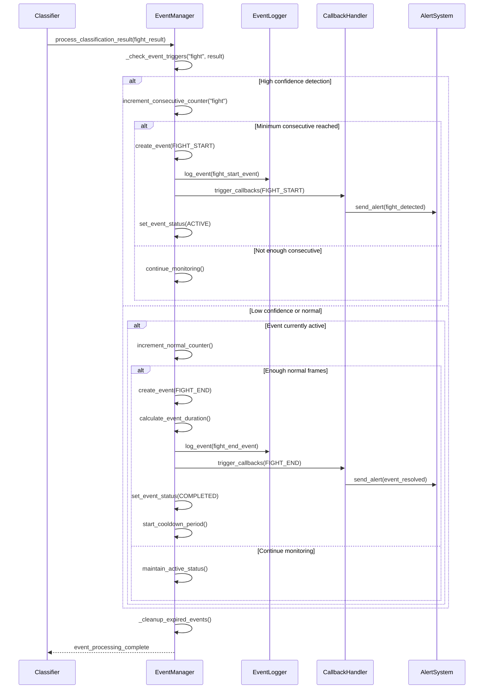

# UML 다이어그램 설계 문서

## 개요

Recognizer 시스템의 포괄적인 UML 다이어그램 모음으로, 시스템의 구조적 관계, 행위적 상호작용, 데이터 플로우를 시각화합니다. 모든 다이어그램은 Mermaid 형식으로 작성되어 GitHub에서 바로 렌더링됩니다.

## 목차

1. [클래스 다이어그램](#클래스-다이어그램)
2. [시퀀스 다이어그램](#시퀀스-다이어그램)
3. [상태 다이어그램](#상태-다이어그램)
4. [컴포넌트 다이어그램](#컴포넌트-다이어그램)
5. [배포 다이어그램](#배포-다이어그램)
6. [액티비티 다이어그램](#액티비티-다이어그램)
7. [유스케이스 다이어그램](#유스케이스-다이어그램)

## 클래스 다이어그램

### 1. 전체 시스템 클래스 구조


### 2. 포즈 추정 모듈 클래스 구조


### 3. 추적 및 스코어링 모듈 클래스 구조


### 4. 동작 분류 모듈 클래스 구조


### 5. 이벤트 관리 시스템 클래스 구조


### 6. 데이터 구조 클래스 다이어그램


### 7. 유틸리티 클래스 다이어그램


## 시퀀스 다이어그램

### 1. Annotation 파이프라인 실행 시퀀스


### 2. 실시간 추론 파이프라인 시퀀스

```mermaid
sequenceDiagram
    participant User
    participant RealtimeMode
    participant DualServicePipeline
    participant InputManager
    participant PoseEstimator
    participant Tracker
    participant WindowProcessor
    participant Classifier
    participant EventManager
    participant Visualizer
    participant EventLogger

    User->>RealtimeMode: execute()
    RealtimeMode->>DualServicePipeline: initialize_pipeline()

    par Initialize modules in parallel
        DualServicePipeline->>PoseEstimator: initialize_model()
        DualServicePipeline->>Tracker: initialize()
        DualServicePipeline->>Classifier: initialize()
        DualServicePipeline->>EventManager: initialize()
    end

    DualServicePipeline->>InputManager: start(input_source)
    InputManager-->>DualServicePipeline: stream_ready

    DualServicePipeline->>Visualizer: start_display()

    loop Main processing loop
        InputManager->>DualServicePipeline: get_frame()
        DualServicePipeline->>PoseEstimator: estimate_poses(frame)
        PoseEstimator-->>DualServicePipeline: persons_list

        DualServicePipeline->>Tracker: update_tracks(persons)
        Tracker-->>DualServicePipeline: tracked_persons

        DualServicePipeline->>WindowProcessor: add_frame_data(tracked_persons)

        alt Window ready for classification
            WindowProcessor-->>DualServicePipeline: window_ready
            DualServicePipeline->>WindowProcessor: get_window_data()
            WindowProcessor-->>DualServicePipeline: window_tensor

            par Classify for each service
                DualServicePipeline->>Classifier: classify_window(fight_data)
                Classifier-->>DualServicePipeline: fight_result
                DualServicePipeline->>Classifier: classify_window(falldown_data)
                Classifier-->>DualServicePipeline: falldown_result
            end

            DualServicePipeline->>EventManager: process_results(classification_results)

            opt Event triggered
                EventManager->>EventLogger: log_event(event_data)
                EventManager->>EventManager: trigger_callbacks()
            end

            EventManager-->>DualServicePipeline: event_data
        end

        DualServicePipeline->>Visualizer: show_frame(frame, poses, results, events)
        Visualizer-->>DualServicePipeline: continue_processing

        alt User requests stop
            DualServicePipeline->>InputManager: stop()
            DualServicePipeline->>Visualizer: stop_display()
            break
        end
    end

    DualServicePipeline->>DualServicePipeline: cleanup()
    DualServicePipeline-->>RealtimeMode: processing_completed
    RealtimeMode-->>User: execution_finished
```

### 3. 분석 모드 배치 처리 시퀀스


### 4. 이벤트 관리 상세 시퀀스



## 상태 다이어그램

### 1. 이벤트 상태 전이도


### 2. 파이프라인 실행 상태


### 3. 모듈 생명주기 상태


## 컴포넌트 다이어그램

### 1. 전체 시스템 컴포넌트 구조


### 2. 실시간 처리 컴포넌트 상세


### 3. 데이터 처리 파이프라인 컴포넌트


## 배포 다이어그램

### 1. Docker 컨테이너 배포 구조

```mermaid
graph TB
    subgraph "Host Environment"
        subgraph "Docker Container: mmlabs"
            subgraph "Workspace"
                WS1[/workspace/recognizer]
                WS2[/workspace/mmaction2]
                WS3[/workspace/mmpose]
            end

            subgraph "Python Environment"
                PE1[PyTorch 2.0+]
                PE2[MMPose Framework]
                PE3[MMAction2 Framework]
                PE4[ONNX Runtime]
                PE5[TensorRT]
            end

            subgraph "System Libraries"
                SL1[CUDA 11.8]
                SL2[cuDNN]
                SL3[OpenCV]
                SL4[FFmpeg]
            end
        end

        subgraph "Host Resources"
            HR1[NVIDIA GPU]
            HR2[CPU Cores]
            HR3[System Memory]
            HR4[Storage]
        end

        subgraph "Data Volumes"
            DV1[Input Videos]
            DV2[Model Checkpoints]
            DV3[Output Results]
            DV4[Configuration Files]
        end
    end

    %% Connections
    WS1 --> PE1
    WS1 --> PE2
    WS1 --> PE3
    WS2 --> PE3
    WS3 --> PE2

    PE1 --> SL1
    PE2 --> SL1
    PE3 --> SL1
    PE4 --> SL1
    PE5 --> SL1

    SL1 --> HR1
    SL2 --> HR1
    SL3 --> HR2
    SL4 --> HR2

    WS1 --> DV1
    WS1 --> DV2
    WS1 --> DV3
    WS1 --> DV4

    style "Docker Container: mmlabs" fill:#e1f5fe
    style "Host Environment" fill:#f3e5f5
```

### 2. 멀티 GPU 분산 처리 구조


### 3. 실시간 스트리밍 배포 구조


## 액티비티 다이어그램

### 1. Annotation 모드 전체 워크플로우

```mermaid
graph TD
    Start([시작]) --> LoadConfig[설정 파일 로드]
    LoadConfig --> ValidateConfig{설정 검증}
    ValidateConfig -->|실패| ConfigError[설정 오류 출력]
    ConfigError --> End([종료])
    ValidateConfig -->|성공| CheckMode{모드 확인}

    CheckMode -->|annotation.stage1| Stage1Flow
    CheckMode -->|annotation.stage2| Stage2Flow
    CheckMode -->|annotation.stage3| Stage3Flow
    CheckMode -->|annotation.visualize| VisualizeFlow

    subgraph Stage1Flow [Stage1: 포즈 추정]
        S1_Start[Stage1 시작] --> S1_ScanVideos[비디오 파일 스캔]
        S1_ScanVideos --> S1_CheckMultiProcess{멀티프로세싱 활성화?}
        S1_CheckMultiProcess -->|예| S1_SplitWork[작업 분할]
        S1_SplitWork --> S1_ParallelProcess[병렬 처리]
        S1_CheckMultiProcess -->|아니오| S1_SequentialProcess[순차 처리]
        S1_ParallelProcess --> S1_Aggregate[결과 집계]
        S1_SequentialProcess --> S1_Aggregate
        S1_Aggregate --> S1_SaveResults[Stage1 결과 저장]
        S1_SaveResults --> S1_End[Stage1 완료]
    end

    subgraph Stage2Flow [Stage2: 추적 및 스코어링]
        S2_Start[Stage2 시작] --> S2_LoadStage1[Stage1 결과 로드]
        S2_LoadStage1 --> S2_InitTracker[추적기 초기화]
        S2_InitTracker --> S2_ProcessFrames[프레임별 추적]
        S2_ProcessFrames --> S2_ScoreMotion[모션 스코어링]
        S2_ScoreMotion --> S2_SaveResults[Stage2 결과 저장]
        S2_SaveResults --> S2_End[Stage2 완료]
    end

    subgraph Stage3Flow [Stage3: 데이터셋 생성]
        S3_Start[Stage3 시작] --> S3_LoadStage2[Stage2 결과 로드]
        S3_LoadStage2 --> S3_ConvertTensor[텐서 변환]
        S3_ConvertTensor --> S3_SplitDataset[데이터셋 분할]
        S3_SplitDataset --> S3_SaveDataset[최종 데이터셋 저장]
        S3_SaveDataset --> S3_End[Stage3 완료]
    end

    subgraph VisualizeFlow [Visualize: 결과 시각화]
        V_Start[Visualize 시작] --> V_SelectStage{Stage 선택}
        V_SelectStage -->|stage1| V_LoadStage1[Stage1 PKL 로드]
        V_SelectStage -->|stage2| V_LoadStage2[Stage2 PKL 로드]
        V_LoadStage1 --> V_RenderVideo[오버레이 비디오 렌더링]
        V_LoadStage2 --> V_RenderVideo
        V_RenderVideo --> V_SaveOrDisplay{저장/표시 모드}
        V_SaveOrDisplay -->|저장| V_SaveVideo[비디오 파일 저장]
        V_SaveOrDisplay -->|표시| V_DisplayVideo[실시간 표시]
        V_SaveVideo --> V_End[Visualize 완료]
        V_DisplayVideo --> V_End
    end

    Stage1Flow --> CheckContinue1{다음 단계 실행?}
    CheckContinue1 -->|예| Stage2Flow
    CheckContinue1 -->|아니오| End

    Stage2Flow --> CheckContinue2{다음 단계 실행?}
    CheckContinue2 -->|예| Stage3Flow
    CheckContinue2 -->|아니오| End

    Stage3Flow --> End
    VisualizeFlow --> End
```

### 2. 실시간 처리 상세 워크플로우

```mermaid
graph TD
    Start([시작]) --> InitPipeline[파이프라인 초기화]
    InitPipeline --> LoadModels[모델 로드]
    LoadModels --> StartInput[입력 스트림 시작]
    StartInput --> StartDisplay[화면 표시 시작]
    StartDisplay --> MainLoop{메인 루프}

    MainLoop --> GetFrame[프레임 가져오기]
    GetFrame --> FrameValid{프레임 유효?}
    FrameValid -->|아니오| CheckStop{종료 요청?}
    FrameValid -->|예| EstimatePose[포즈 추정]

    EstimatePose --> PoseValid{포즈 유효?}
    PoseValid -->|아니오| SkipFrame[프레임 스킵]
    SkipFrame --> DisplayFrame
    PoseValid -->|예| TrackObjects[객체 추적]

    TrackObjects --> ScoreMotion[모션 스코어링]
    ScoreMotion --> UpdateWindow[윈도우 업데이트]
    UpdateWindow --> WindowReady{윈도우 준비됨?}

    WindowReady -->|아니오| DisplayFrame[프레임 표시]
    WindowReady -->|예| ClassifyAction[동작 분류]

    ClassifyAction --> ProcessEvents[이벤트 처리]
    ProcessEvents --> LogEvents{이벤트 발생?}
    LogEvents -->|예| TriggerAlert[알림 발생]
    LogEvents -->|아니오| DisplayFrame
    TriggerAlert --> DisplayFrame

    DisplayFrame --> CheckStop
    CheckStop -->|아니오| MainLoop
    CheckStop -->|예| Cleanup[정리 작업]
    Cleanup --> SaveLogs[로그 저장]
    SaveLogs --> End([종료])

    subgraph "병렬 분류 처리"
        ClassifyAction --> QueueWindow[윈도우 큐에 추가]
        QueueWindow --> AsyncClassify[비동기 분류]
        AsyncClassify --> ReturnResult[결과 반환]
        ReturnResult --> ProcessEvents
    end
```

### 3. 이벤트 처리 상세 워크플로우

```mermaid
graph TD
    Start([분류 결과 수신]) --> CheckConfidence{신뢰도 검사}
    CheckConfidence -->|낮음| UpdateNormalCounter[정상 카운터 증가]
    CheckConfidence -->|높음| UpdateViolenceCounter[폭력 카운터 증가]

    UpdateViolenceCounter --> CheckConsecutive{연속 감지 충분?}
    CheckConsecutive -->|아니오| ResetNormalCounter[정상 카운터 리셋]
    ResetNormalCounter --> EndProcess([처리 종료])
    CheckConsecutive -->|예| CheckEventActive{이벤트 활성?}

    CheckEventActive -->|아니오| CreateEvent[새 이벤트 생성]
    CreateEvent --> SetEventActive[이벤트 활성화]
    SetEventActive --> LogEventStart[이벤트 시작 로그]
    LogEventStart --> TriggerCallbacks[콜백 실행]
    TriggerCallbacks --> SendAlert[알림 전송]
    SendAlert --> EndProcess

    CheckEventActive -->|예| UpdateEventConfidence[이벤트 신뢰도 업데이트]
    UpdateEventConfidence --> CheckOngoingAlert{진행중 알림 필요?}
    CheckOngoingAlert -->|예| SendOngoingAlert[진행중 알림 전송]
    CheckOngoingAlert -->|아니오| EndProcess
    SendOngoingAlert --> EndProcess

    UpdateNormalCounter --> CheckEventActive2{이벤트 활성?}
    CheckEventActive2 -->|아니오| EndProcess
    CheckEventActive2 -->|예| CheckNormalConsecutive{연속 정상 충분?}
    CheckNormalConsecutive -->|아니오| EndProcess
    CheckNormalConsecutive -->|예| EndEvent[이벤트 종료]

    EndEvent --> CalculateDuration[지속 시간 계산]
    CalculateDuration --> LogEventEnd[이벤트 종료 로그]
    LogEventEnd --> TriggerEndCallbacks[종료 콜백 실행]
    TriggerEndCallbacks --> StartCooldown[쿨다운 시작]
    StartCooldown --> ResetCounters[카운터 리셋]
    ResetCounters --> EndProcess

    subgraph "이벤트 상태 관리"
        SetEventActive --> MonitorDuration[지속시간 모니터링]
        MonitorDuration --> CheckMaxDuration{최대 시간 초과?}
        CheckMaxDuration -->|예| ForceEndEvent[강제 종료]
        ForceEndEvent --> EndEvent
        CheckMaxDuration -->|아니오| ContinueMonitoring[모니터링 계속]
        ContinueMonitoring --> MonitorDuration
    end
```

## 유스케이스 다이어그램

### 1. 전체 시스템 유스케이스

```mermaid
graph LR
    subgraph "사용자 유형"
        Researcher[연구자]
        Developer[개발자]
        Operator[운영자]
        Analyst[분석가]
    end

    subgraph "Recognizer 시스템"
        subgraph "데이터 준비"
            UC1[비디오 포즈 추정]
            UC2[객체 추적]
            UC3[학습 데이터셋 생성]
            UC4[결과 시각화]
        end

        subgraph "실시간 처리"
            UC5[실시간 동작 감지]
            UC6[이벤트 모니터링]
            UC7[알림 관리]
            UC8[성능 모니터링]
        end

        subgraph "배치 분석"
            UC9[비디오 배치 분석]
            UC10[성능 평가]
            UC11[분석 보고서 생성]
            UC12[결과 시각화]
        end

        subgraph "시스템 관리"
            UC13[설정 관리]
            UC14[모델 관리]
            UC15[로그 관리]
            UC16[시스템 모니터링]
        end
    end

    %% 연구자 관련 유스케이스
    Researcher --> UC1
    Researcher --> UC2
    Researcher --> UC3
    Researcher --> UC10
    Researcher --> UC11

    %% 개발자 관련 유스케이스
    Developer --> UC1
    Developer --> UC2
    Developer --> UC3
    Developer --> UC4
    Developer --> UC13
    Developer --> UC14
    Developer --> UC15

    %% 운영자 관련 유스케이스
    Operator --> UC5
    Operator --> UC6
    Operator --> UC7
    Operator --> UC8
    Operator --> UC13
    Operator --> UC16

    %% 분석가 관련 유스케이스
    Analyst --> UC9
    Analyst --> UC10
    Analyst --> UC11
    Analyst --> UC12
    Analyst --> UC15

    %% 유스케이스 간 관계
    UC1 --> UC2 : includes
    UC2 --> UC3 : includes
    UC3 --> UC4 : includes
    UC5 --> UC6 : includes
    UC6 --> UC7 : includes
    UC9 --> UC10 : includes
    UC10 --> UC11 : includes
    UC11 --> UC12 : includes
```

### 2. 실시간 처리 상세 유스케이스

```mermaid
graph TB
    subgraph "Primary Actors"
        SecurityOperator[보안 운영자]
        SystemAdmin[시스템 관리자]
    end

    subgraph "Secondary Actors"
        Camera[IP 카메라]
        AlertSystem[알림 시스템]
        Database[데이터베이스]
        LoggingSystem[로깅 시스템]
    end

    subgraph "Real-time Processing Use Cases"
        UC1[스트림 입력 설정]
        UC2[실시간 포즈 추정]
        UC3[객체 추적 수행]
        UC4[동작 분류 실행]
        UC5[이벤트 감지]
        UC6[실시간 알림 전송]
        UC7[화면 표시]
        UC8[이벤트 로깅]
        UC9[성능 모니터링]
        UC10[시스템 설정 변경]
        UC11[처리 중단/재시작]
        UC12[결과 내보내기]
    end

    %% Primary Actor 관계
    SecurityOperator --> UC1
    SecurityOperator --> UC5
    SecurityOperator --> UC6
    SecurityOperator --> UC7
    SecurityOperator --> UC8
    SecurityOperator --> UC11
    SecurityOperator --> UC12

    SystemAdmin --> UC9
    SystemAdmin --> UC10
    SystemAdmin --> UC11

    %% Secondary Actor 관계
    Camera --> UC1
    AlertSystem --> UC6
    Database --> UC8
    LoggingSystem --> UC8
    LoggingSystem --> UC9

    %% Include 관계
    UC1 -.-> UC2 : includes
    UC2 -.-> UC3 : includes
    UC3 -.-> UC4 : includes
    UC4 -.-> UC5 : includes
    UC5 -.-> UC6 : includes
    UC5 -.-> UC8 : includes

    %% Extend 관계
    UC6 -.-> UC6_EXT[다중 채널 알림] : extends
    UC8 -.-> UC8_EXT[상세 로그 분석] : extends
    UC9 -.-> UC9_EXT[자동 최적화] : extends

    style UC6_EXT fill:#e8f4f8
    style UC8_EXT fill:#e8f4f8
    style UC9_EXT fill:#e8f4f8
```

### 3. 데이터 처리 파이프라인 유스케이스

```mermaid
graph TB
    subgraph "Primary Actors"
        DataScientist[데이터 과학자]
        MLEngineer[ML 엔지니어]
        ResearchStudent[연구생]
    end

    subgraph "Data Processing Use Cases"
        subgraph "Stage 1 Use Cases"
            UC1_1[비디오 데이터 로드]
            UC1_2[배치 포즈 추정]
            UC1_3[멀티프로세싱 실행]
            UC1_4[GPU 분산 처리]
            UC1_5[Stage1 결과 저장]
        end

        subgraph "Stage 2 Use Cases"
            UC2_1[Stage1 결과 로드]
            UC2_2[객체 추적 실행]
            UC2_3[모션 스코어링]
            UC2_4[품질 필터링]
            UC2_5[Stage2 결과 저장]
        end

        subgraph "Stage 3 Use Cases"
            UC3_1[Stage2 결과 집계]
            UC3_2[텐서 형식 변환]
            UC3_3[데이터셋 분할]
            UC3_4[STGCN 호환 형식 생성]
            UC3_5[최종 데이터셋 저장]
        end

        subgraph "Visualization Use Cases"
            UC4_1[PKL 결과 로드]
            UC4_2[오버레이 생성]
            UC4_3[시각화 렌더링]
            UC4_4[비디오 저장/표시]
        end

        subgraph "Quality Assurance Use Cases"
            UC5_1[처리 상태 모니터링]
            UC5_2[오류 감지 및 복구]
            UC5_3[품질 검증]
            UC5_4[성능 최적화]
        end
    end

    %% Actor 관계
    DataScientist --> UC1_1
    DataScientist --> UC2_1
    DataScientist --> UC3_1
    DataScientist --> UC4_1
    DataScientist --> UC5_3

    MLEngineer --> UC1_3
    MLEngineer --> UC1_4
    MLEngineer --> UC3_4
    MLEngineer --> UC5_1
    MLEngineer --> UC5_4

    ResearchStudent --> UC1_1
    ResearchStudent --> UC4_1
    ResearchStudent --> UC4_3
    ResearchStudent --> UC5_1

    %% 순차적 관계
    UC1_1 --> UC1_2
    UC1_2 --> UC1_5
    UC1_5 --> UC2_1
    UC2_1 --> UC2_2
    UC2_2 --> UC2_3
    UC2_3 --> UC2_4
    UC2_4 --> UC2_5
    UC2_5 --> UC3_1
    UC3_1 --> UC3_2
    UC3_2 --> UC3_3
    UC3_3 --> UC3_4
    UC3_4 --> UC3_5

    %% Include 관계
    UC1_2 -.-> UC1_3 : includes
    UC1_3 -.-> UC1_4 : includes
    UC4_1 -.-> UC4_2 : includes
    UC4_2 -.-> UC4_3 : includes

    %% Extend 관계
    UC5_2 -.-> UC5_2_EXT[자동 재시작] : extends
    UC5_4 -.-> UC5_4_EXT[하이퍼파라미터 튜닝] : extends

    style UC5_2_EXT fill:#fff2cc
    style UC5_4_EXT fill:#fff2cc
```

이 포괄적인 UML 다이어그램 문서는 Recognizer 시스템의 모든 측면을 시각적으로 문서화합니다. 각 다이어그램은 시스템의 다른 관점을 제공하며, 개발자들이 시스템을 이해하고 확장하는 데 도움이 됩니다.

## 주요 특징

1. **포괄적 커버리지**: 클래스 구조부터 배포까지 모든 아키텍처 측면 포함
2. **Mermaid 형식**: GitHub에서 바로 렌더링 가능한 다이어그램
3. **계층적 구조**: 전체 시스템부터 세부 모듈까지 점진적 상세화
4. **실제 코드 반영**: 실제 구현된 클래스와 메서드명 사용
5. **확장 가능성**: 새로운 모듈 추가 시 참조 가능한 패턴 제공