# Recognizer 소프트웨어 설계서 (Part 1/3)

## 문서 정보

| 항목 | 내용 |
|------|------|
| **프로젝트명** | Recognizer - 실시간 동작 인식 및 분석 시스템 |
| **문서 유형** | Software Design Document (SDD) |
| **버전** | v2.0 |
| **작성일** | 2025년 |
| **승인자** | 시스템 아키텍트 |
| **분류** | 기술 설계 문서 |
| **문서 범위** | Part 1: 시스템 개요, 요구사항, 전체 아키텍처 |

## 목차 (전체 3부작)

### Part 1 (현재 문서)
1. [시스템 개요](#1-시스템-개요)
2. [요구사항 분석](#2-요구사항-분석)
3. [전체 시스템 아키텍처](#3-전체-시스템-아키텍처)
4. [기술 스택 및 선택 근거](#4-기술-스택-및-선택-근거)

### Part 2
5. 상세 모듈 설계
6. 데이터 설계 및 플로우
7. 인터페이스 설계
8. 보안 및 성능 설계

### Part 3
9. 품질 보증 및 테스트 전략
10. 배포 및 운영 설계
11. 확장성 및 유지보수 설계
12. 위험 관리 및 마이그레이션 계획

---

## 1. 시스템 개요

### 1.1 프로젝트 배경 및 목적

#### 1.1.1 비즈니스 배경

현대 사회에서 비디오 감시 시스템은 공공 안전, 산업 안전, 헬스케어 등 다양한 분야에서 핵심적인 역할을 담당하고 있습니다. 특히 COVID-19 팬데믹 이후 비접촉 모니터링의 중요성이 증대되었으며, AI 기반 실시간 행동 분석에 대한 수요가 급격히 증가하고 있습니다.

**시장 요구사항:**
- 실시간 폭력 행동 감지를 통한 공공 안전 강화
- 낙상 감지를 통한 고령자 안전 모니터링
- 대규모 데이터셋 자동 생성을 통한 AI 모델 개발 효율성 향상
- 멀티모달 분석을 통한 종합적 상황 인식

#### 1.1.2 기술적 목적

Recognizer 시스템은 다음과 같은 기술적 목적을 달성하고자 설계되었습니다:

1. **Real-time Processing**: 100ms 이하의 초저지연 실시간 처리
2. **High Accuracy**: 95% 이상의 동작 인식 정확도
3. **Scalability**: 다중 카메라 동시 처리 및 클라우드 확장성
4. **Modularity**: 플러그인 기반 확장 가능한 아키텍처
5. **Production-Ready**: 24/7 운영 가능한 엔터프라이즈급 안정성

### 1.2 시스템 범위 및 제약사항

#### 1.2.1 시스템 범위

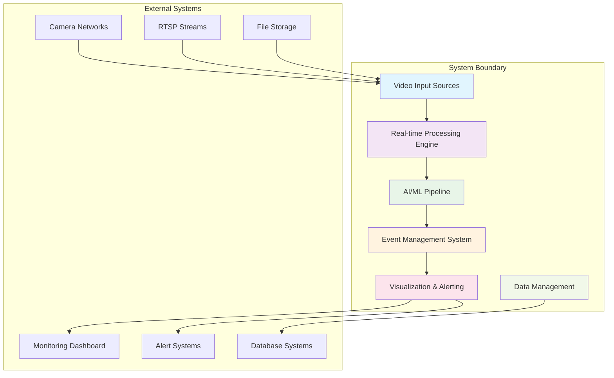

**포함 범위:**
- 실시간 비디오 스트림 처리
- 포즈 추정 및 객체 추적
- 동작 분류 및 이벤트 감지
- 시각화 및 알림 시스템
- 데이터 파이프라인 및 관리
- 성능 모니터링 및 최적화

**제외 범위:**
- 카메라 하드웨어 제어
- 네트워크 인프라 관리
- 외부 시스템과의 복잡한 통합
- 사용자 인증 및 권한 관리

#### 1.2.2 제약사항

**기술적 제약사항:**
- GPU 메모리: 최소 8GB, 권장 24GB
- CUDA 버전: 11.8 이상
- Python 버전: 3.8 ~ 3.11
- Docker 환경 필수

**성능 제약사항:**
- 실시간 처리: 30 FPS 유지
- 메모리 사용량: 시스템 메모리의 80% 이하
- CPU 사용률: 평균 70% 이하
- 저장 공간: 최소 1TB (데이터셋 저장용)

**운영 제약사항:**
- 24/7 연속 운영 가능
- 99.5% 이상의 가용성
- 1시간 이내 복구 가능한 장애 복구
- 실시간 모니터링 및 알림 지원

### 1.3 주요 이해관계자

#### 1.3.1 이해관계자 매트릭스

| 이해관계자 | 역할 | 관심사 | 우선순위 |
|------------|------|--------|----------|
| **최종 사용자** | 시스템 운영자 | 사용 편의성, 신뢰성 | 높음 |
| **시스템 관리자** | 인프라 관리 | 성능, 안정성, 모니터링 | 높음 |
| **개발자** | 시스템 개발 및 유지보수 | 코드 품질, 확장성 | 높음 |
| **데이터 과학자** | AI 모델 개발 | 데이터 품질, 모델 성능 | 중간 |
| **보안 담당자** | 시스템 보안 | 데이터 보안, 접근 제어 | 높음 |
| **품질 보증 팀** | 테스트 및 검증 | 테스트 용이성, 품질 메트릭 | 중간 |

#### 1.3.2 사용자 페르소나

**Primary Persona: 보안 관제 요원**
- **배경**: 실시간 영상 모니터링 담당
- **목표**: 신속하고 정확한 이상 상황 감지
- **기술 수준**: 중급
- **주요 요구사항**: 직관적 인터페이스, 낮은 오탐율, 빠른 응답

**Secondary Persona: 시설 관리자**
- **배경**: 건물/시설 종합 관리
- **목표**: 안전사고 예방 및 신속 대응
- **기술 수준**: 초급
- **주요 요구사항**: 자동화된 알림, 간편한 설정

---

## 2. 요구사항 분석

### 2.1 기능 요구사항

#### 2.1.1 핵심 기능 요구사항

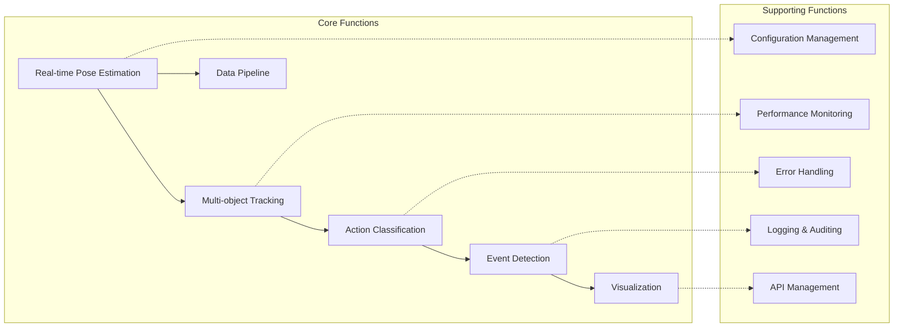

**FR-001: 실시간 포즈 추정**
- **설명**: 입력 비디오에서 실시간으로 인체 포즈를 추정
- **입력**: 비디오 프레임 (H×W×3)
- **출력**: 17-point 키포인트 좌표 및 신뢰도
- **성능 요구사항**: 30 FPS 이상, 20ms 이하 지연시간
- **정확도 요구사항**: 95% 이상 키포인트 검출 정확도

**FR-002: 다중 객체 추적**
- **설명**: 검출된 인물들에 대한 일관된 ID 할당 및 추적
- **입력**: 프레임별 포즈 데이터
- **출력**: Track ID가 할당된 포즈 시퀀스
- **성능 요구사항**: 95% 이상 ID 일관성 유지
- **처리 시간**: 5ms 이하

**FR-003: 동작 분류**
- **설명**: 시간적 포즈 시퀀스 기반 동작 분류
- **지원 동작**: Fight, Falldown, Normal
- **입력**: 100 프레임 포즈 시퀀스
- **출력**: 동작 클래스 및 신뢰도
- **정확도 요구사항**: 90% 이상 분류 정확도

**FR-004: 이벤트 감지 및 관리**
- **설명**: 분류 결과 기반 이벤트 생성 및 생명주기 관리
- **기능**: 이벤트 발생, 지속, 종료 감지
- **임계값**: 사용자 정의 가능한 신뢰도 임계값
- **알림**: 실시간 이벤트 알림 및 로깅

#### 2.1.2 데이터 파이프라인 요구사항

**FR-005: Annotation Pipeline**
- **Stage1**: 비디오 → 포즈 추정 → PKL 저장
- **Stage2**: 포즈 데이터 → 추적 + 점수화 → PKL 저장
- **Stage3**: 추적 데이터 → STGCN 데이터셋 → 학습용 형식

**FR-006: 배치 처리**
- **멀티프로세싱**: 병렬 비디오 처리
- **GPU 분산**: 다중 GPU 활용
- **에러 복구**: 실패 시 자동 재시도
- **진행 상황**: 실시간 진행률 모니터링

#### 2.1.3 사용자 인터페이스 요구사항

**FR-007: 실시간 시각화**
- **오버레이 모드**: full, skeleton_only, minimal, debug
- **성능 표시**: FPS, 지연시간, GPU 사용률
- **이벤트 표시**: 실시간 이벤트 상태 및 히스토리

**FR-008: 설정 관리**
- **계층적 설정**: 전역, 모드별, 모듈별 설정
- **실시간 업데이트**: 재시작 없는 설정 변경
- **설정 검증**: 자동 설정 유효성 검사

### 2.2 비기능 요구사항

#### 2.2.1 성능 요구사항

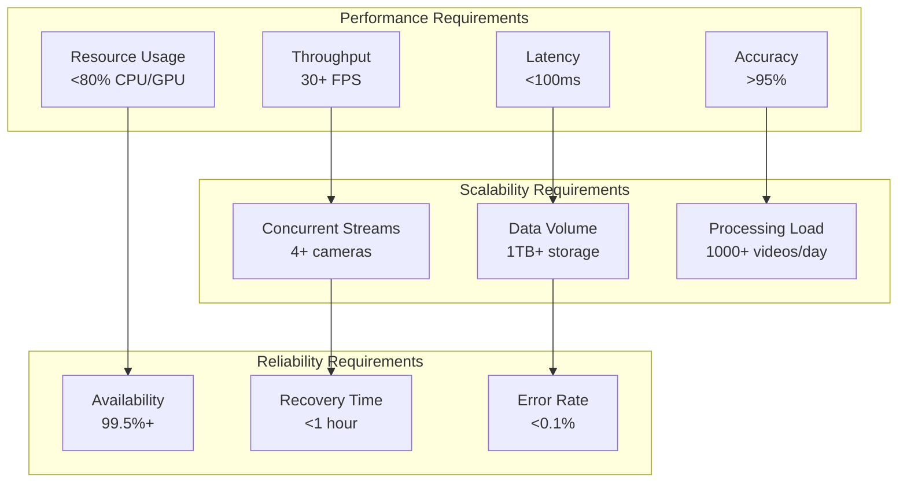

**NFR-001: 처리 성능**
- **실시간 처리**: 30 FPS 이상 유지
- **지연시간**: End-to-end 100ms 이하
- **처리량**: 동시 4개 스트림 처리 가능
- **리소스 효율성**: GPU 메모리 사용률 80% 이하

**NFR-002: 정확도 및 품질**
- **포즈 추정 정확도**: 95% 이상
- **동작 분류 정확도**: 90% 이상
- **추적 일관성**: 95% 이상 ID 유지
- **오탐율**: 5% 이하

**NFR-003: 확장성**
- **수평 확장**: 다중 GPU/노드 지원
- **수직 확장**: 메모리/CPU 추가 지원
- **모듈 확장**: 새로운 동작 클래스 추가 가능
- **데이터 확장**: 대용량 데이터셋 처리

#### 2.2.2 가용성 및 신뢰성

**NFR-004: 시스템 가용성**
- **목표 가용성**: 99.5% (연간 43시간 다운타임)
- **MTBF (Mean Time Between Failures)**: 720시간
- **MTTR (Mean Time To Repair)**: 1시간
- **백업 및 복구**: 자동 백업, 1시간 내 복구

**NFR-005: 장애 허용성**
- **그레이스풀 디그라데이션**: 부분 기능 장애 시 핵심 기능 유지
- **자동 복구**: 일시적 장애 자동 복구
- **모니터링**: 실시간 시스템 상태 모니터링
- **알림**: 장애 발생 시 즉시 알림

#### 2.2.3 보안 요구사항

**NFR-006: 데이터 보안**
- **데이터 암호화**: 저장 및 전송 데이터 암호화
- **접근 제어**: 역할 기반 접근 제어
- **감사 로깅**: 모든 시스템 접근 및 변경 로깅
- **개인정보 보호**: 비식별화 처리

**NFR-007: 시스템 보안**
- **인증/인가**: 다단계 인증 지원
- **네트워크 보안**: 방화벽 및 VPN 지원
- **취약점 관리**: 정기적 보안 스캔 및 패치
- **침입 탐지**: 비정상 접근 패턴 감지

### 2.3 제약사항 및 가정사항

#### 2.3.1 기술적 제약사항

**C-001: 하드웨어 제약사항**
- **GPU**: NVIDIA RTX 3090 이상 (24GB VRAM)
- **CPU**: 8코어 이상, 16GB RAM 이상
- **Storage**: SSD 1TB 이상
- **Network**: 1Gbps 이상 네트워크 대역폭

**C-002: 소프트웨어 제약사항**
- **OS**: Ubuntu 20.04 LTS 이상
- **Docker**: NVIDIA Docker 지원 필수
- **CUDA**: 11.8 이상
- **Python**: 3.8 ~ 3.11

#### 2.3.2 운영 제약사항

**C-003: 운영 환경**
- **24/7 운영**: 연중무휴 운영 가능
- **유지보수 윈도우**: 주 1회 2시간 유지보수 윈도우
- **업그레이드**: 무중단 업그레이드 지원
- **백업**: 일일 자동 백업

**C-004: 규정 준수**
- **개인정보보호법**: 비디오 데이터 처리 규정 준수
- **산업 표준**: ISO 27001, ISO 9001 준수
- **데이터 보존**: 30일 데이터 보존 정책

---

## 3. 전체 시스템 아키텍처

### 3.1 아키텍처 원칙

#### 3.1.1 설계 원칙

**1. 모듈화 (Modularity)**
- 각 컴포넌트는 독립적으로 개발, 테스트, 배포 가능
- 느슨한 결합과 높은 응집도
- 플러그인 아키텍처 지원

**2. 확장성 (Scalability)**
- 수평적/수직적 확장 지원
- 마이크로서비스 아키텍처 적용
- 클라우드 네이티브 설계

**3. 신뢰성 (Reliability)**
- 장애 허용 설계
- 자동 복구 메커니즘
- 상태 모니터링 및 헬스체크

**4. 성능 (Performance)**
- 실시간 처리 최적화
- 리소스 효율성
- 캐싱 및 배치 처리

**5. 보안 (Security)**
- 다층 보안 모델
- 최소 권한 원칙
- 데이터 보호 및 암호화

#### 3.1.2 아키텍처 패턴

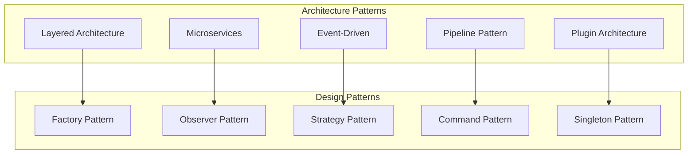

### 3.2 시스템 레이어 아키텍처

#### 3.2.1 5계층 아키텍처

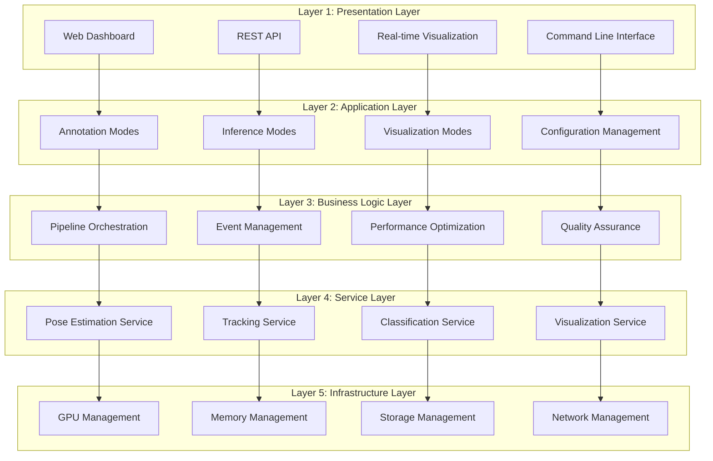

#### 3.2.2 레이어별 책임

**Layer 1: Presentation Layer**
- 사용자 인터페이스 및 외부 시스템 연동
- API 게이트웨이 및 인증/인가
- 실시간 시각화 및 대시보드
- 클라이언트 상태 관리

**Layer 2: Application Layer**
- 비즈니스 워크플로우 조정
- 모드별 실행 로직
- 사용자 요청 처리
- 세션 및 컨텍스트 관리

**Layer 3: Business Logic Layer**
- 핵심 비즈니스 규칙 구현
- 파이프라인 오케스트레이션
- 이벤트 처리 및 라우팅
- 품질 보증 및 검증

**Layer 4: Service Layer**
- 도메인별 서비스 구현
- AI/ML 모델 래퍼
- 데이터 변환 및 처리
- 서비스 간 통신

**Layer 5: Infrastructure Layer**
- 하드웨어 리소스 관리
- 시스템 모니터링
- 저장소 및 네트워크 관리
- 보안 및 로깅

### 3.3 마이크로서비스 아키텍처

#### 3.3.1 서비스 분해 전략

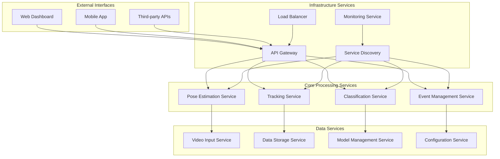

#### 3.3.2 서비스 간 통신

**동기 통신**
- REST API: 요청-응답 패턴
- gRPC: 고성능 RPC 통신
- HTTP/2: 멀티플렉싱 지원

**비동기 통신**
- Message Queue: Redis/RabbitMQ
- Event Streaming: Apache Kafka
- WebSocket: 실시간 데이터 전송

**데이터 일관성**
- Saga Pattern: 분산 트랜잭션
- Event Sourcing: 이벤트 기반 상태 관리
- CQRS: 명령과 조회 분리

### 3.4 데이터 플로우 아키텍처

#### 3.4.1 실시간 데이터 플로우

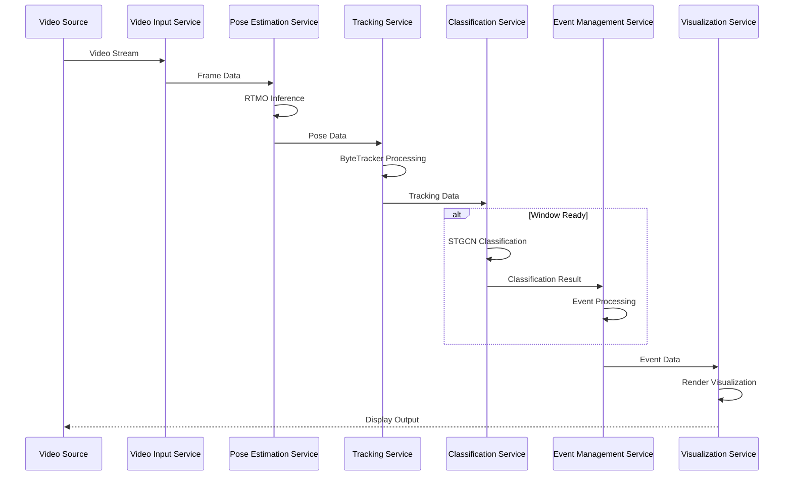

#### 3.4.2 배치 데이터 플로우

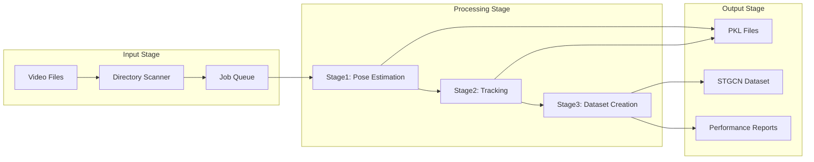

---

## 4. 기술 스택 및 선택 근거

### 4.1 핵심 기술 스택

#### 4.1.1 AI/ML 프레임워크

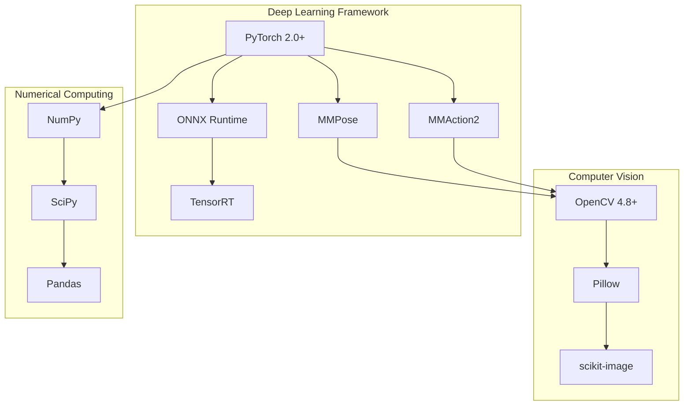

**PyTorch 선택 근거:**
- **연구-프로덕션 연속성**: 학술 연구에서 프로덕션까지 일관된 환경
- **Dynamic Computation Graph**: 복잡한 모델 구조 지원
- **CUDA 최적화**: GPU 가속 지원
- **생태계**: MMPose, MMAction2 등 전문 라이브러리 지원

**ONNX Runtime 선택 근거:**
- **Cross-platform**: 다양한 하드웨어 플랫폼 지원
- **최적화된 추론**: 프로덕션 환경 최적화
- **모델 호환성**: PyTorch 모델의 손쉬운 변환
- **성능**: CPU/GPU 최적화된 추론 엔진

#### 4.1.2 시스템 인프라

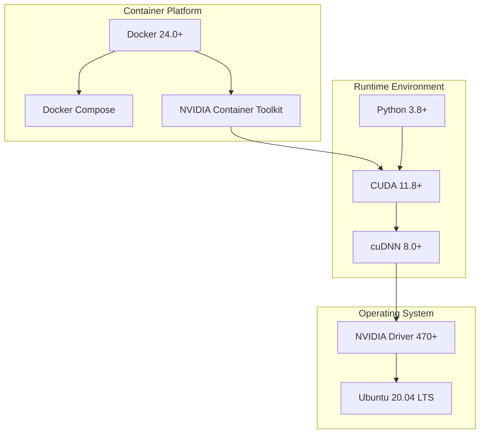

**Docker 선택 근거:**
- **환경 일관성**: 개발-테스트-프로덕션 환경 통일
- **GPU 지원**: NVIDIA Container Toolkit 통합
- **배포 편의성**: 컨테이너 기반 배포
- **리소스 격리**: 안전한 멀티 테넌트 환경

#### 4.1.3 데이터 저장 및 처리

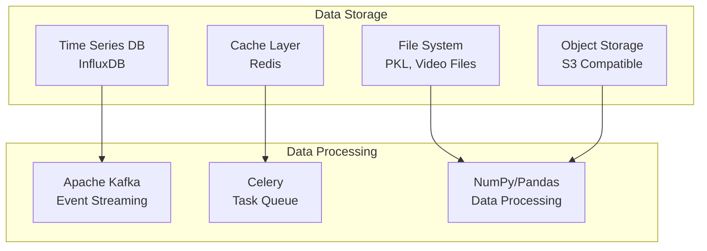

### 4.2 성능 최적화 기술

#### 4.2.1 GPU 가속 기술

**CUDA 최적화**
- **Kernel 융합**: 연속된 GPU 연산 최적화
- **메모리 관리**: GPU 메모리 풀링 및 재사용
- **스트림 처리**: 병렬 처리 스트림 활용

**TensorRT 최적화**
- **모델 최적화**: 레이어 융합 및 정밀도 최적화
- **Dynamic Shapes**: 가변 입력 크기 지원
- **Calibration**: INT8 정밀도 최적화

#### 4.2.2 메모리 최적화

**메모리 관리 전략**
- **Object Pooling**: 자주 사용되는 객체 재사용
- **Lazy Loading**: 필요시점 로딩
- **Garbage Collection**: 주기적 메모리 정리
- **Memory Mapping**: 대용량 파일 효율적 처리

### 4.3 모니터링 및 관찰성

#### 4.3.1 모니터링 스택

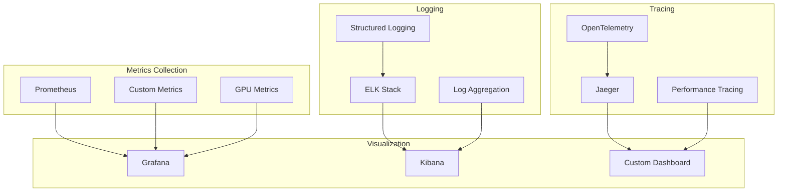

#### 4.3.2 성능 메트릭

**시스템 메트릭**
- CPU/GPU 사용률
- 메모리 사용량
- 디스크 I/O
- 네트워크 대역폭

**애플리케이션 메트릭**
- 처리 지연시간
- 처리량 (FPS)
- 에러율
- 정확도 메트릭

**비즈니스 메트릭**
- 이벤트 감지 횟수
- 시스템 가용성
- 사용자 만족도
- ROI 메트릭

---

## 결론 (Part 1)

Part 1에서는 Recognizer 시스템의 전체적인 개요와 요구사항, 그리고 고수준 아키텍처를 정의했습니다.

**주요 성과:**
1. **명확한 시스템 범위**: 기능적/비기능적 요구사항 정의
2. **체계적인 아키텍처**: 5계층 + 마이크로서비스 아키텍처
3. **기술 스택 선정**: 검증된 기술과 최신 기술의 균형
4. **성능 목표**: 구체적이고 측정 가능한 성능 기준

**다음 단계 (Part 2):**
- 상세 모듈 설계 및 구현
- 데이터 모델 및 인터페이스 설계
- 보안 및 성능 최적화 방안
- 구체적인 구현 가이드라인
