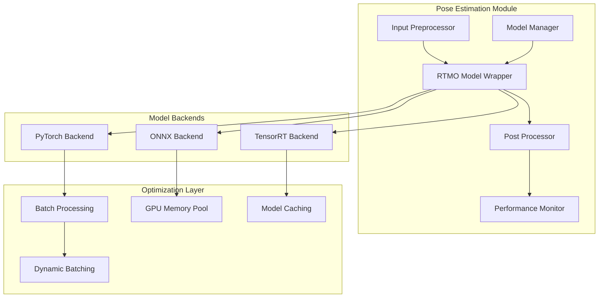
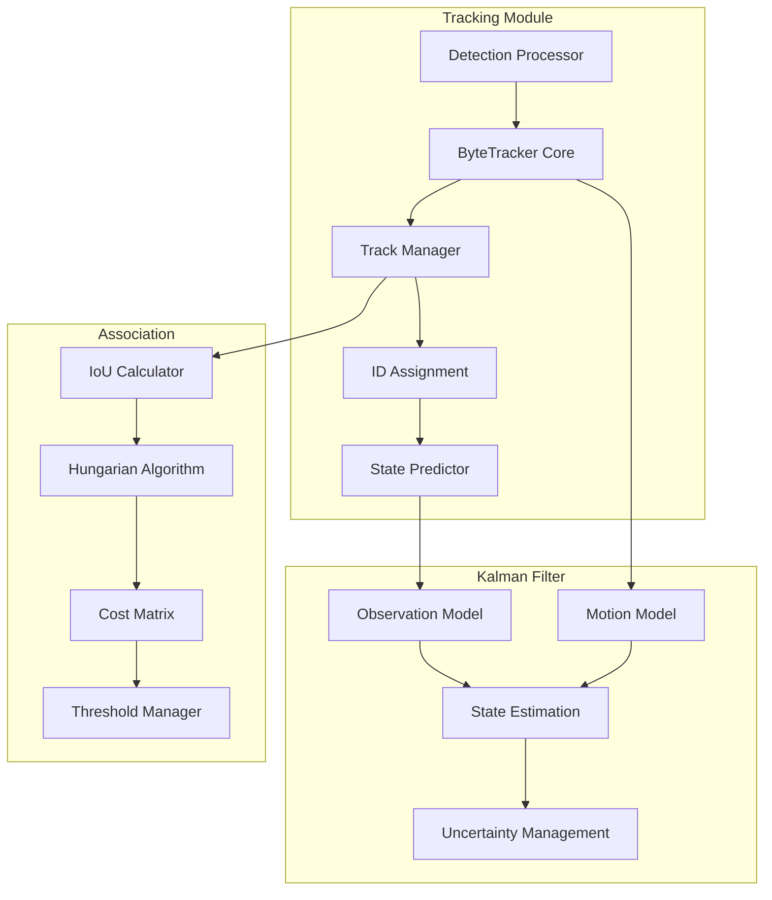
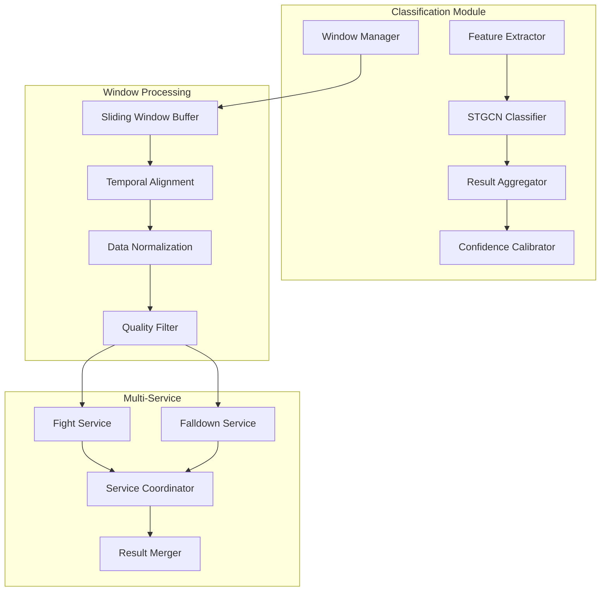
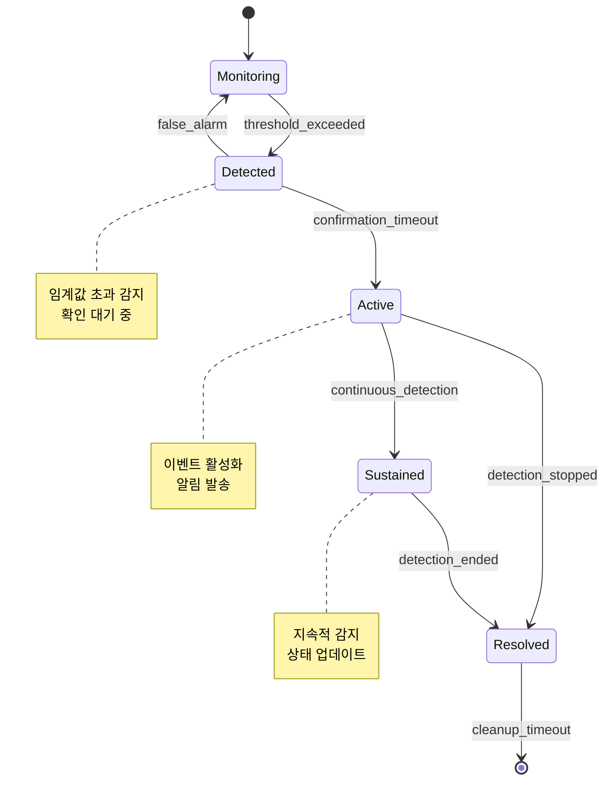
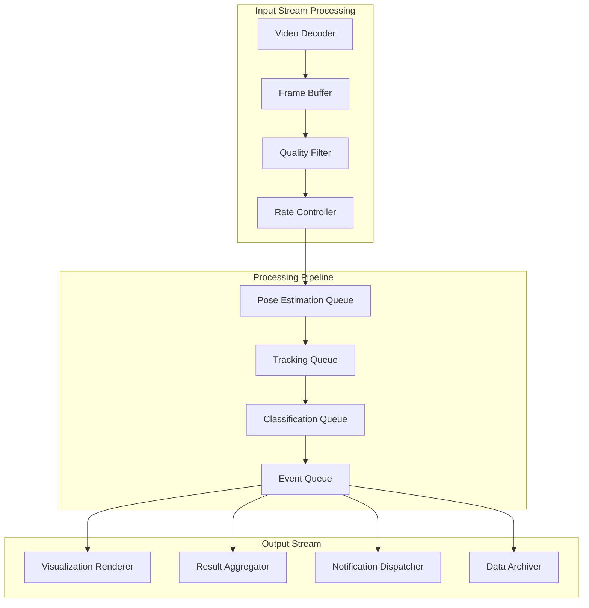
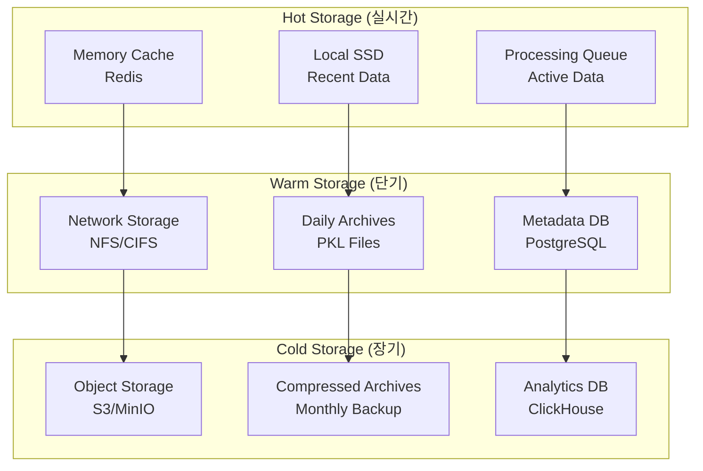
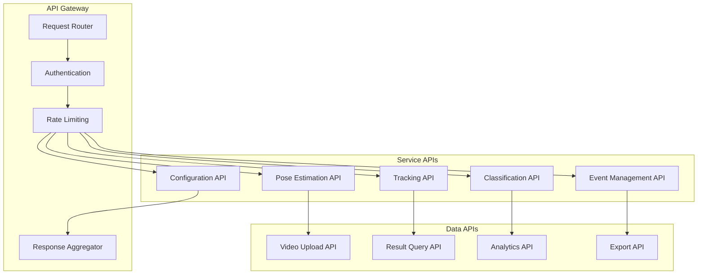
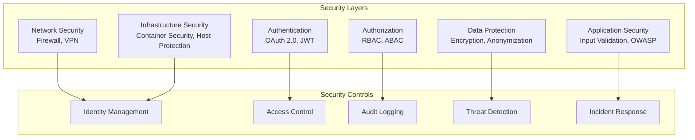

# Recognizer 소프트웨어 설계서 (Part 2/3)

## 문서 정보

| 항목 | 내용 |
|------|------|
| **프로젝트명** | Recognizer - 실시간 동작 인식 및 분석 시스템 |
| **문서 유형** | Software Design Document (SDD) |
| **버전** | v2.0 |
| **작성일** | 2025년 |
| **승인자** | 시스템 아키텍트 |
| **분류** | 기술 설계 문서 |
| **문서 범위** | Part 2: 상세 모듈 설계, 데이터 설계, 인터페이스 설계, 보안 및 성능 설계 |

## 목차 (Part 2)

5. [상세 모듈 설계](#5-상세-모듈-설계)
6. [데이터 설계 및 플로우](#6-데이터-설계-및-플로우)
7. [인터페이스 설계](#7-인터페이스-설계)
8. [보안 및 성능 설계](#8-보안-및-성능-설계)

---

## 5. 상세 모듈 설계

### 5.1 포즈 추정 모듈 (Pose Estimation Module)

#### 5.1.1 모듈 아키텍처



#### 5.1.2 클래스 설계

```python
class RTMOEstimator(BaseEstimator):
    """RTMO 포즈 추정기 - 메인 인터페이스"""

    def __init__(self, config: RTMOConfig):
        """
        초기화 매개변수:
        - model_path: 모델 파일 경로
        - backend: 추론 백엔드 (pytorch/onnx/tensorrt)
        - input_size: 입력 이미지 크기 (640x640)
        - confidence_threshold: 신뢰도 임계값 (0.3)
        - nms_threshold: NMS 임계값 (0.7)
        """

    def estimate(self, frame: np.ndarray) -> List[Person]:
        """단일 프레임 포즈 추정"""

    def estimate_batch(self, frames: List[np.ndarray]) -> List[List[Person]]:
        """배치 프레임 포즈 추정"""

    def preprocess(self, frame: np.ndarray) -> torch.Tensor:
        """입력 전처리: 리사이즈, 정규화, 텐서 변환"""

    def postprocess(self, outputs: torch.Tensor,
                   original_shape: Tuple[int, int]) -> List[Person]:
        """출력 후처리: NMS, 좌표 변환, Person 객체 생성"""

class ModelBackend(ABC):
    """모델 백엔드 추상 클래스"""

    @abstractmethod
    def load_model(self, model_path: str) -> None:
        """모델 로드"""

    @abstractmethod
    def inference(self, input_tensor: torch.Tensor) -> torch.Tensor:
        """추론 수행"""

    @abstractmethod
    def get_memory_usage(self) -> Dict[str, float]:
        """메모리 사용량 조회"""

class PyTorchBackend(ModelBackend):
    """PyTorch 백엔드 구현"""

    def __init__(self, device: str = 'cuda'):
        self.device = device
        self.model = None

    def load_model(self, model_path: str) -> None:
        """PyTorch 모델 로드 및 최적화"""
        self.model = torch.jit.load(model_path)
        self.model.eval()
        self.model.to(self.device)

        # 최적화 적용
        if hasattr(torch.jit, 'optimize_for_inference'):
            self.model = torch.jit.optimize_for_inference(self.model)

    def inference(self, input_tensor: torch.Tensor) -> torch.Tensor:
        """GPU 추론 실행"""
        with torch.no_grad():
            input_tensor = input_tensor.to(self.device)
            output = self.model(input_tensor)
        return output

class ONNXBackend(ModelBackend):
    """ONNX Runtime 백엔드 구현"""

    def __init__(self, providers: List[str] = None):
        self.providers = providers or ['CUDAExecutionProvider', 'CPUExecutionProvider']
        self.session = None

    def load_model(self, model_path: str) -> None:
        """ONNX 모델 로드"""
        import onnxruntime as ort

        # GPU 메모리 최적화 설정
        session_options = ort.SessionOptions()
        session_options.enable_mem_pattern = True
        session_options.enable_cpu_mem_arena = True

        # CUDA 프로바이더 설정
        provider_options = [
            {'device_id': 0, 'arena_extend_strategy': 'kSameAsRequested'},
            {}
        ]

        self.session = ort.InferenceSession(
            model_path,
            sess_options=session_options,
            providers=list(zip(self.providers, provider_options))
        )

    def inference(self, input_tensor: torch.Tensor) -> torch.Tensor:
        """ONNX 추론 실행"""
        input_name = self.session.get_inputs()[0].name
        output_name = self.session.get_outputs()[0].name

        # NumPy 변환
        input_array = input_tensor.cpu().numpy()

        # ONNX 추론
        outputs = self.session.run([output_name], {input_name: input_array})

        return torch.from_numpy(outputs[0])
```

#### 5.1.3 성능 최적화 전략

**Dynamic Batching**
```python
class DynamicBatcher:
    """동적 배치 처리기"""

    def __init__(self, max_batch_size: int = 8, timeout_ms: int = 10):
        self.max_batch_size = max_batch_size
        self.timeout_ms = timeout_ms
        self.pending_requests = []
        self.batch_processor = None

    async def add_request(self, frame: np.ndarray) -> List[Person]:
        """요청 추가 및 배치 처리"""
        request = PoseRequest(frame, asyncio.Event())
        self.pending_requests.append(request)

        # 배치 크기 또는 타임아웃에 도달하면 처리
        if (len(self.pending_requests) >= self.max_batch_size or
            self._timeout_reached()):
            await self._process_batch()

        await request.completion_event.wait()
        return request.result

    async def _process_batch(self):
        """배치 처리 실행"""
        if not self.pending_requests:
            return

        frames = [req.frame for req in self.pending_requests]
        results = await self.estimator.estimate_batch(frames)

        # 결과 배분
        for request, result in zip(self.pending_requests, results):
            request.result = result
            request.completion_event.set()

        self.pending_requests.clear()
```

### 5.2 객체 추적 모듈 (Object Tracking Module)

#### 5.2.1 모듈 아키텍처



#### 5.2.2 클래스 설계

```python
class ByteTrackerWrapper:
    """ByteTracker 래퍼 클래스"""

    def __init__(self, config: TrackingConfig):
        """
        추적 설정:
        - track_thresh: 추적 임계값 (0.5)
        - high_thresh: 높은 신뢰도 임계값 (0.6)
        - match_thresh: 매칭 임계값 (0.8)
        - max_time_lost: 최대 누락 시간 (30 frames)
        - frame_rate: 프레임 레이트 (30 FPS)
        """
        self.config = config
        self.tracker = BYTETracker(
            track_thresh=config.track_thresh,
            high_thresh=config.high_thresh,
            match_thresh=config.match_thresh,
            max_time_lost=config.max_time_lost,
            frame_rate=config.frame_rate
        )
        self.track_history = {}
        self.id_counter = 0

    def track(self, persons: List[Person]) -> List[TrackedPerson]:
        """추적 수행"""
        # Person을 Detection으로 변환
        detections = self._persons_to_detections(persons)

        # ByteTracker 실행
        online_targets = self.tracker.update(detections)

        # TrackedPerson으로 변환
        tracked_persons = []
        for target in online_targets:
            tracked_person = self._target_to_tracked_person(target)
            tracked_persons.append(tracked_person)

            # 히스토리 업데이트
            self._update_track_history(tracked_person)

        return tracked_persons

    def _persons_to_detections(self, persons: List[Person]) -> np.ndarray:
        """Person 리스트를 Detection 배열로 변환"""
        if not persons:
            return np.empty((0, 5))

        detections = []
        for person in persons:
            x1, y1, x2, y2 = person.bbox
            score = person.confidence
            detections.append([x1, y1, x2, y2, score])

        return np.array(detections)

    def _target_to_tracked_person(self, target) -> TrackedPerson:
        """BYTETracker Target을 TrackedPerson으로 변환"""
        bbox = target.tlbr.tolist()  # [x1, y1, x2, y2]
        track_id = target.track_id
        confidence = target.score

        # 원본 Person 객체에서 키포인트 복원
        person = self._find_matching_person(bbox)

        return TrackedPerson(
            keypoints=person.keypoints if person else None,
            bbox=tuple(map(int, bbox)),
            confidence=confidence,
            track_id=track_id,
            track_state=target.state,
            track_age=target.tracklet_len,
            time_since_update=target.time_since_update
        )

class TrackingQualityAssessment:
    """추적 품질 평가"""

    def __init__(self):
        self.track_metrics = {}

    def assess_track_quality(self, tracked_person: TrackedPerson) -> float:
        """추적 품질 점수 계산 (0.0 ~ 1.0)"""
        quality_factors = {
            'confidence': self._confidence_factor(tracked_person.confidence),
            'stability': self._stability_factor(tracked_person),
            'consistency': self._consistency_factor(tracked_person),
            'duration': self._duration_factor(tracked_person.track_age)
        }

        # 가중 평균 계산
        weights = {'confidence': 0.3, 'stability': 0.3, 'consistency': 0.2, 'duration': 0.2}
        quality_score = sum(quality_factors[k] * weights[k] for k in quality_factors)

        return min(max(quality_score, 0.0), 1.0)

    def _confidence_factor(self, confidence: float) -> float:
        """신뢰도 기반 품질 점수"""
        return min(confidence / 0.8, 1.0)  # 0.8 이상이면 만점

    def _stability_factor(self, tracked_person: TrackedPerson) -> float:
        """안정성 기반 품질 점수"""
        if tracked_person.time_since_update == 0:
            return 1.0
        else:
            return max(1.0 - tracked_person.time_since_update / 10.0, 0.0)

    def _consistency_factor(self, tracked_person: TrackedPerson) -> float:
        """일관성 기반 품질 점수"""
        # 포즈 일관성, 움직임 일관성 등을 고려
        return 0.8  # 임시 값

    def _duration_factor(self, track_age: int) -> float:
        """지속 시간 기반 품질 점수"""
        return min(track_age / 30.0, 1.0)  # 30프레임 이상이면 만점
```

### 5.3 동작 분류 모듈 (Action Classification Module)

#### 5.3.1 모듈 아키텍처



#### 5.3.2 클래스 설계

```python
class SlidingWindowProcessor:
    """슬라이딩 윈도우 처리기"""

    def __init__(self, config: WindowConfig):
        """
        윈도우 설정:
        - window_size: 윈도우 크기 (100 frames)
        - stride: 슬라이딩 간격 (50 frames)
        - max_persons: 최대 인물 수 (4명)
        - quality_threshold: 품질 임계값 (0.5)
        """
        self.config = config
        self.buffer = deque(maxlen=config.window_size)
        self.frame_count = 0

    def add_frame(self, tracked_persons: List[TrackedPerson]) -> None:
        """프레임 추가"""
        # 품질 필터링
        filtered_persons = self._filter_by_quality(tracked_persons)

        # 최대 인물 수 제한
        top_persons = self._select_top_persons(filtered_persons)

        # 정규화된 데이터 생성
        frame_data = self._create_frame_data(top_persons)

        self.buffer.append(frame_data)
        self.frame_count += 1

    def is_ready(self) -> bool:
        """윈도우 준비 상태 확인"""
        return (len(self.buffer) >= self.config.window_size and
                self.frame_count % self.config.stride == 0)

    def get_window(self) -> WindowData:
        """윈도우 데이터 반환"""
        if not self.is_ready():
            return None

        # 4D 텐서 생성 [M, T, V, C]
        tensor_data = self._create_4d_tensor()

        return WindowData(
            tensor=tensor_data,
            frame_count=self.frame_count,
            timestamp=time.time(),
            quality_score=self._calculate_window_quality()
        )

    def _filter_by_quality(self, persons: List[TrackedPerson]) -> List[TrackedPerson]:
        """품질 기반 필터링"""
        quality_assessor = TrackingQualityAssessment()

        filtered = []
        for person in persons:
            quality = quality_assessor.assess_track_quality(person)
            if quality >= self.config.quality_threshold:
                person.quality_score = quality
                filtered.append(person)

        return filtered

    def _create_4d_tensor(self) -> torch.Tensor:
        """4D 텐서 생성 [M, T, V, C]"""
        M = self.config.max_persons
        T = self.config.window_size
        V = 17  # COCO 키포인트 수
        C = 2   # x, y 좌표

        tensor = torch.zeros(M, T, V, C)

        for t, frame_data in enumerate(self.buffer):
            for m, person_data in enumerate(frame_data.persons[:M]):
                if person_data is not None:
                    tensor[m, t] = person_data.normalized_keypoints

        return tensor

class STGCNClassifier:
    """STGCN++ 분류기"""

    def __init__(self, config: ClassifierConfig):
        """
        분류기 설정:
        - model_path: 모델 파일 경로
        - num_classes: 클래스 수 (2: Action/Normal)
        - confidence_threshold: 신뢰도 임계값 (0.7)
        - backend: 추론 백엔드
        """
        self.config = config
        self.model = self._load_model()
        self.preprocessor = STGCNPreprocessor()
        self.postprocessor = STGCNPostprocessor()

    def classify(self, window_data: WindowData) -> ClassificationResult:
        """동작 분류 수행"""
        # 전처리
        processed_input = self.preprocessor.process(window_data.tensor)

        # 추론
        with torch.no_grad():
            logits = self.model(processed_input)
            probabilities = torch.softmax(logits, dim=-1)

        # 후처리
        result = self.postprocessor.process(
            probabilities,
            window_data.timestamp,
            window_data.quality_score
        )

        return result

    def _load_model(self) -> torch.nn.Module:
        """모델 로드 및 최적화"""
        if self.config.backend == 'pytorch':
            model = torch.jit.load(self.config.model_path)
        elif self.config.backend == 'onnx':
            model = ONNXModel(self.config.model_path)
        elif self.config.backend == 'tensorrt':
            model = TensorRTModel(self.config.model_path)

        model.eval()
        return model

class DualServicePipeline:
    """듀얼 서비스 파이프라인"""

    def __init__(self, config: PipelineConfig):
        """
        파이프라인 구성:
        - 공통 모듈: 포즈 추정, 추적, 윈도우 처리
        - 서비스별 모듈: Fight/Falldown 분류기
        - 통합 모듈: 이벤트 관리, 시각화
        """
        # 공통 모듈
        self.pose_estimator = RTMOEstimator(config.pose_config)
        self.tracker = ByteTrackerWrapper(config.tracking_config)
        self.window_processor = SlidingWindowProcessor(config.window_config)

        # 서비스별 모듈
        self.services = {}
        if 'fight' in config.enabled_services:
            self.services['fight'] = FightService(config.fight_config)
        if 'falldown' in config.enabled_services:
            self.services['falldown'] = FalldownService(config.falldown_config)

        # 통합 모듈
        self.service_coordinator = ServiceCoordinator()
        self.event_manager = EventManager(config.event_config)
        self.visualizer = UnifiedVisualizer(config.visualization_config)

    async def process_frame(self, frame: np.ndarray) -> ProcessingResult:
        """프레임 처리 파이프라인"""
        start_time = time.time()

        # 1. 포즈 추정
        persons = await self.pose_estimator.estimate(frame)

        # 2. 객체 추적
        tracked_persons = self.tracker.track(persons)

        # 3. 윈도우 업데이트
        self.window_processor.add_frame(tracked_persons)

        # 4. 분류 (윈도우 준비시)
        classification_results = {}
        if self.window_processor.is_ready():
            window_data = self.window_processor.get_window()

            # 서비스별 병렬 처리
            tasks = []
            for service_name, service in self.services.items():
                task = asyncio.create_task(service.classify(window_data))
                tasks.append((service_name, task))

            # 결과 수집
            for service_name, task in tasks:
                result = await task
                classification_results[service_name] = result

        # 5. 이벤트 처리
        event_data = self.event_manager.process_results(classification_results)

        # 6. 성능 메트릭
        processing_time = time.time() - start_time

        return ProcessingResult(
            poses=tracked_persons,
            classifications=classification_results,
            events=event_data,
            processing_time=processing_time,
            timestamp=time.time()
        )
```

### 5.4 이벤트 관리 모듈 (Event Management Module)

#### 5.4.1 이벤트 생명주기 관리



#### 5.4.2 클래스 설계

```python
class EventManager:
    """이벤트 관리자"""

    def __init__(self, config: EventConfig):
        """
        이벤트 설정:
        - detection_threshold: 감지 임계값
        - confirmation_frames: 확인 프레임 수
        - resolution_frames: 해제 프레임 수
        - max_event_duration: 최대 이벤트 지속시간
        """
        self.config = config
        self.active_events = {}
        self.event_history = []
        self.state_machines = {}
        self.notifier = EventNotifier(config.notification_config)

    def process_results(self, classification_results: Dict[str, ClassificationResult]) -> EventData:
        """분류 결과 기반 이벤트 처리"""
        current_timestamp = time.time()
        detected_events = []

        # 서비스별 이벤트 감지
        for service_name, result in classification_results.items():
            event_type = self._determine_event_type(service_name, result)

            if event_type:
                event_id = f"{service_name}_{int(current_timestamp)}"

                # 상태 머신 업데이트
                if event_id not in self.state_machines:
                    self.state_machines[event_id] = EventStateMachine(event_type, self.config)

                state_machine = self.state_machines[event_id]
                new_state = state_machine.update(result.confidence, current_timestamp)

                # 이벤트 생성/업데이트
                if new_state in [EventState.ACTIVE, EventState.SUSTAINED]:
                    event_data = self._create_event_data(
                        event_id, event_type, result, new_state, current_timestamp
                    )
                    detected_events.append(event_data)

                    # 알림 발송
                    if new_state == EventState.ACTIVE:
                        await self.notifier.send_notification(event_data)

        # 이벤트 정리
        self._cleanup_expired_events(current_timestamp)

        return EventData(
            active_events=detected_events,
            total_events=len(self.active_events),
            timestamp=current_timestamp
        )

class EventStateMachine:
    """이벤트 상태 머신"""

    def __init__(self, event_type: str, config: EventConfig):
        self.event_type = event_type
        self.config = config
        self.state = EventState.MONITORING
        self.detection_count = 0
        self.last_detection_time = 0
        self.event_start_time = None

    def update(self, confidence: float, timestamp: float) -> EventState:
        """상태 업데이트"""
        if confidence >= self.config.detection_threshold:
            self.detection_count += 1
            self.last_detection_time = timestamp

            if self.state == EventState.MONITORING:
                if self.detection_count >= self.config.confirmation_frames:
                    self.state = EventState.ACTIVE
                    self.event_start_time = timestamp
                else:
                    self.state = EventState.DETECTED

            elif self.state == EventState.DETECTED:
                if self.detection_count >= self.config.confirmation_frames:
                    self.state = EventState.ACTIVE
                    self.event_start_time = timestamp

            elif self.state == EventState.ACTIVE:
                self.state = EventState.SUSTAINED

        else:
            # 신뢰도가 임계값 이하
            time_since_last = timestamp - self.last_detection_time

            if time_since_last >= self.config.resolution_timeout:
                if self.state in [EventState.ACTIVE, EventState.SUSTAINED]:
                    self.state = EventState.RESOLVED
                else:
                    self.state = EventState.MONITORING
                    self.detection_count = 0

        return self.state

class EventNotifier:
    """이벤트 알림 시스템"""

    def __init__(self, config: NotificationConfig):
        self.config = config
        self.channels = self._setup_notification_channels()

    async def send_notification(self, event_data: EventData) -> None:
        """이벤트 알림 발송"""
        notification_message = self._create_message(event_data)

        # 채널별 알림 발송
        tasks = []
        for channel in self.channels:
            if channel.is_enabled():
                task = asyncio.create_task(channel.send(notification_message))
                tasks.append(task)

        # 모든 알림 완료 대기
        await asyncio.gather(*tasks, return_exceptions=True)

    def _setup_notification_channels(self) -> List[NotificationChannel]:
        """알림 채널 설정"""
        channels = []

        if self.config.email_enabled:
            channels.append(EmailChannel(self.config.email_config))

        if self.config.webhook_enabled:
            channels.append(WebhookChannel(self.config.webhook_config))

        if self.config.log_enabled:
            channels.append(LogChannel(self.config.log_config))

        return channels
```

---

## 6. 데이터 설계 및 플로우

### 6.1 데이터 모델 설계

#### 6.1.1 핵심 데이터 구조

```mermaid
erDiagram
    FramePoses {
        int frame_number
        float timestamp
        tuple frame_shape
        list persons
    }

    Person {
        ndarray keypoints
        tuple bbox
        float confidence
        optional_int person_id
    }

    TrackedPerson {
        ndarray keypoints
        tuple bbox
        float confidence
        int track_id
        enum track_state
        int track_age
        int time_since_update
        float quality_score
    }

    WindowData {
        tensor tensor_4d
        int frame_count
        float timestamp
        float quality_score
        dict metadata
    }

    ClassificationResult {
        str action_type
        float confidence
        dict probabilities
        float timestamp
        dict features
    }

    EventData {
        str event_id
        str event_type
        enum event_state
        float confidence
        float start_time
        float end_time
        dict metadata
    }

    FramePoses ||--o{ Person : contains
    Person ||--|| TrackedPerson : evolves_to
    TrackedPerson }o--|| WindowData : aggregated_in
    WindowData ||--|| ClassificationResult : produces
    ClassificationResult ||--o{ EventData : triggers
```



#### 6.1.2 데이터 검증 및 품질 관리

```python
from pydantic import BaseModel, validator, Field
from typing import Optional, List, Dict, Any
import numpy as np

class PersonModel(BaseModel):
    """Person 데이터 모델 (Pydantic 검증)"""

    keypoints: np.ndarray = Field(..., description="17x3 keypoints array")
    bbox: tuple = Field(..., description="Bounding box (x1, y1, x2, y2)")
    confidence: float = Field(..., ge=0.0, le=1.0, description="Detection confidence")
    person_id: Optional[int] = Field(None, description="Person ID for tracking")

    class Config:
        arbitrary_types_allowed = True

    @validator('keypoints')
    def validate_keypoints(cls, v):
        """키포인트 배열 검증"""
        if v.shape != (17, 3):
            raise ValueError(f"Keypoints must be (17, 3), got {v.shape}")

        # 좌표 범위 검증 (예: 0-1920, 0-1080)
        x_coords, y_coords, confidences = v[:, 0], v[:, 1], v[:, 2]

        if np.any(confidences < 0) or np.any(confidences > 1):
            raise ValueError("Confidence values must be in range [0, 1]")

        return v

    @validator('bbox')
    def validate_bbox(cls, v):
        """바운딩 박스 검증"""
        if len(v) != 4:
            raise ValueError("Bbox must have 4 elements")

        x1, y1, x2, y2 = v
        if x2 <= x1 or y2 <= y1:
            raise ValueError("Invalid bbox coordinates")

        return v

class DataQualityAssessment:
    """데이터 품질 평가"""

    def __init__(self, quality_thresholds: Dict[str, float]):
        self.thresholds = quality_thresholds

    def assess_frame_quality(self, frame_poses: FramePoses) -> float:
        """프레임 품질 평가"""
        if not frame_poses.persons:
            return 0.0

        quality_scores = []
        for person in frame_poses.persons:
            person_quality = self._assess_person_quality(person)
            quality_scores.append(person_quality)

        return np.mean(quality_scores)

    def _assess_person_quality(self, person: Person) -> float:
        """개별 인물 품질 평가"""
        factors = {
            'detection_confidence': person.confidence,
            'keypoint_visibility': self._calculate_keypoint_visibility(person.keypoints),
            'pose_completeness': self._calculate_pose_completeness(person.keypoints),
            'anatomical_consistency': self._check_anatomical_consistency(person.keypoints)
        }

        weights = {'detection_confidence': 0.3, 'keypoint_visibility': 0.3,
                  'pose_completeness': 0.2, 'anatomical_consistency': 0.2}

        quality_score = sum(factors[k] * weights[k] for k in factors)
        return min(max(quality_score, 0.0), 1.0)

    def _calculate_keypoint_visibility(self, keypoints: np.ndarray) -> float:
        """키포인트 가시성 계산"""
        visible_count = np.sum(keypoints[:, 2] > self.thresholds['min_keypoint_confidence'])
        return visible_count / len(keypoints)

    def _calculate_pose_completeness(self, keypoints: np.ndarray) -> float:
        """포즈 완성도 계산"""
        # 핵심 키포인트 (머리, 어깨, 엉덩이) 확인
        critical_indices = [0, 5, 6, 11, 12]  # nose, shoulders, hips
        critical_visible = np.sum(keypoints[critical_indices, 2] > 0.3)
        return critical_visible / len(critical_indices)

    def _check_anatomical_consistency(self, keypoints: np.ndarray) -> float:
        """해부학적 일관성 검사"""
        # 관절 간 거리 검증
        # 예: 어깨 너비, 다리 길이 등의 비율 검사
        consistency_score = 1.0  # 기본값

        # 어깨 너비 검사
        left_shoulder = keypoints[5]
        right_shoulder = keypoints[6]
        if left_shoulder[2] > 0.3 and right_shoulder[2] > 0.3:
            shoulder_distance = np.linalg.norm(left_shoulder[:2] - right_shoulder[:2])
            if shoulder_distance < 10 or shoulder_distance > 200:  # 픽셀 단위
                consistency_score *= 0.8

        return consistency_score
```

### 6.2 데이터 플로우 최적화

#### 6.2.1 스트리밍 데이터 처리



#### 6.2.2 백프레셔(Backpressure) 관리

```python
import asyncio
from asyncio import Queue
from typing import Optional

class BackpressureManager:
    """백프레셔 관리자"""

    def __init__(self, max_queue_size: int = 100):
        self.max_queue_size = max_queue_size
        self.queues = {}
        self.metrics = {}

    async def enqueue_with_backpressure(self,
                                      queue_name: str,
                                      item: Any,
                                      timeout: float = 1.0) -> bool:
        """백프레셔를 고려한 큐 삽입"""
        queue = self._get_or_create_queue(queue_name)

        try:
            # 타임아웃과 함께 큐에 삽입 시도
            await asyncio.wait_for(queue.put(item), timeout=timeout)
            self._update_metrics(queue_name, 'enqueued')
            return True

        except asyncio.TimeoutError:
            # 백프레셔 발생: 큐가 가득 참
            self._update_metrics(queue_name, 'dropped')
            self._handle_backpressure(queue_name)
            return False

    def _handle_backpressure(self, queue_name: str):
        """백프레셔 처리 전략"""
        current_size = self.queues[queue_name].qsize()

        if current_size > self.max_queue_size * 0.9:
            # 큐가 90% 이상 찬 경우
            if queue_name == 'pose_estimation':
                # 프레임 스킵 증가
                self._increase_frame_skip()
            elif queue_name == 'classification':
                # 배치 크기 증가로 처리량 향상
                self._increase_batch_size()

    def _get_or_create_queue(self, queue_name: str) -> Queue:
        """큐 가져오기 또는 생성"""
        if queue_name not in self.queues:
            self.queues[queue_name] = Queue(maxsize=self.max_queue_size)
            self.metrics[queue_name] = {'enqueued': 0, 'dropped': 0, 'processed': 0}

        return self.queues[queue_name]

class DataFlowOptimizer:
    """데이터 플로우 최적화"""

    def __init__(self):
        self.performance_monitor = PerformanceMonitor()
        self.adaptive_controller = AdaptiveController()

    async def optimize_processing_pipeline(self):
        """처리 파이프라인 최적화"""
        while True:
            # 성능 메트릭 수집
            metrics = self.performance_monitor.get_current_metrics()

            # 병목 구간 식별
            bottleneck = self._identify_bottleneck(metrics)

            # 최적화 전략 적용
            if bottleneck:
                optimization = self.adaptive_controller.get_optimization(bottleneck)
                await self._apply_optimization(optimization)

            await asyncio.sleep(5)  # 5초마다 최적화 수행

    def _identify_bottleneck(self, metrics: Dict[str, float]) -> Optional[str]:
        """병목 구간 식별"""
        queue_sizes = {
            'pose_estimation': metrics.get('pose_queue_size', 0),
            'tracking': metrics.get('tracking_queue_size', 0),
            'classification': metrics.get('classification_queue_size', 0)
        }

        # 큐 크기가 임계값을 초과하는 구간 찾기
        for stage, size in queue_sizes.items():
            if size > 50:  # 임계값
                return stage

        return None

    async def _apply_optimization(self, optimization: Dict[str, Any]):
        """최적화 적용"""
        if optimization['type'] == 'increase_workers':
            await self._scale_workers(optimization['stage'], optimization['count'])
        elif optimization['type'] == 'adjust_batch_size':
            await self._adjust_batch_size(optimization['stage'], optimization['size'])
        elif optimization['type'] == 'enable_frame_skip':
            await self._enable_frame_skip(optimization['skip_rate'])
```

### 6.3 데이터 저장 및 아카이빙

#### 6.3.1 계층화된 저장 전략



#### 6.3.2 데이터 라이프사이클 관리

```python
class DataLifecycleManager:
    """데이터 생명주기 관리자"""

    def __init__(self, config: DataLifecycleConfig):
        self.config = config
        self.storage_tiers = {
            'hot': HotStorageManager(config.hot_storage),
            'warm': WarmStorageManager(config.warm_storage),
            'cold': ColdStorageManager(config.cold_storage)
        }

    async def manage_data_lifecycle(self):
        """데이터 생명주기 관리"""
        while True:
            # Hot -> Warm 이동 (1일 후)
            await self._move_hot_to_warm()

            # Warm -> Cold 이동 (30일 후)
            await self._move_warm_to_cold()

            # Cold 데이터 정리 (1년 후)
            await self._cleanup_cold_data()

            await asyncio.sleep(3600)  # 1시간마다 실행

    async def _move_hot_to_warm(self):
        """Hot Storage에서 Warm Storage로 이동"""
        cutoff_time = time.time() - self.config.hot_retention_days * 86400

        hot_data = await self.storage_tiers['hot'].find_data_older_than(cutoff_time)

        for data_item in hot_data:
            # Warm Storage로 복사
            await self.storage_tiers['warm'].store_data(data_item)

            # Hot Storage에서 삭제
            await self.storage_tiers['hot'].delete_data(data_item.id)

class DataCompressionManager:
    """데이터 압축 관리자"""

    def __init__(self):
        self.compressors = {
            'pkl': PKLCompressor(),
            'video': VideoCompressor(),
            'json': JSONCompressor()
        }

    async def compress_archive(self, data_path: str, compression_type: str) -> str:
        """데이터 압축 및 아카이빙"""
        compressor = self.compressors.get(compression_type)
        if not compressor:
            raise ValueError(f"Unsupported compression type: {compression_type}")

        compressed_path = await compressor.compress(data_path)

        # 압축률 및 메타데이터 기록
        original_size = os.path.getsize(data_path)
        compressed_size = os.path.getsize(compressed_path)
        compression_ratio = compressed_size / original_size

        await self._record_compression_metadata(
            original_path=data_path,
            compressed_path=compressed_path,
            compression_ratio=compression_ratio,
            compression_type=compression_type
        )

        return compressed_path
```

---

## 7. 인터페이스 설계

### 7.1 API 설계

#### 7.1.1 RESTful API 아키텍처



#### 7.1.2 API 스펙 정의

```yaml
# OpenAPI 3.0 스펙 예시
openapi: 3.0.0
info:
  title: Recognizer API
  version: 2.0.0
  description: Real-time Action Recognition and Analysis System API

servers:
  - url: https://api.recognizer.example.com/v2
    description: Production server
  - url: https://staging-api.recognizer.example.com/v2
    description: Staging server

paths:
  /pose/estimate:
    post:
      summary: Estimate poses in a single frame
      operationId: estimatePose
      tags:
        - Pose Estimation
      requestBody:
        required: true
        content:
          multipart/form-data:
            schema:
              type: object
              properties:
                image:
                  type: string
                  format: binary
                  description: Input image file
                confidence_threshold:
                  type: number
                  minimum: 0.0
                  maximum: 1.0
                  default: 0.3
      responses:
        '200':
          description: Pose estimation successful
          content:
            application/json:
              schema:
                $ref: '#/components/schemas/PoseEstimationResponse'
        '400':
          description: Invalid input
        '500':
          description: Internal server error

  /realtime/start:
    post:
      summary: Start real-time processing
      operationId: startRealtimeProcessing
      tags:
        - Realtime Processing
      requestBody:
        required: true
        content:
          application/json:
            schema:
              type: object
              properties:
                input_source:
                  type: string
                  description: Video source (file path, camera ID, RTSP URL)
                services:
                  type: array
                  items:
                    type: string
                    enum: [fight, falldown]
                visualization:
                  $ref: '#/components/schemas/VisualizationConfig'
      responses:
        '200':
          description: Real-time processing started
          content:
            application/json:
              schema:
                type: object
                properties:
                  session_id:
                    type: string
                  status:
                    type: string
                    enum: [started, running, stopped]

components:
  schemas:
    PoseEstimationResponse:
      type: object
      properties:
        persons:
          type: array
          items:
            $ref: '#/components/schemas/Person'
        processing_time:
          type: number
          description: Processing time in milliseconds

    Person:
      type: object
      properties:
        keypoints:
          type: array
          items:
            type: array
            items:
              type: number
            minItems: 3
            maxItems: 3
          minItems: 17
          maxItems: 17
        bbox:
          type: array
          items:
            type: number
          minItems: 4
          maxItems: 4
        confidence:
          type: number
          minimum: 0.0
          maximum: 1.0
        person_id:
          type: integer
          nullable: true
```

#### 7.1.3 API 클라이언트 SDK

```python
from typing import List, Dict, Optional, Union
import httpx
import asyncio

class RecognizerClient:
    """Recognizer API 클라이언트 SDK"""

    def __init__(self,
                 base_url: str,
                 api_key: Optional[str] = None,
                 timeout: float = 30.0):
        self.base_url = base_url.rstrip('/')
        self.api_key = api_key
        self.timeout = timeout
        self.session = httpx.AsyncClient(
            base_url=self.base_url,
            timeout=httpx.Timeout(timeout),
            headers=self._get_default_headers()
        )

    def _get_default_headers(self) -> Dict[str, str]:
        """기본 헤더 생성"""
        headers = {
            'Content-Type': 'application/json',
            'User-Agent': 'RecognizerClient/2.0.0'
        }

        if self.api_key:
            headers['Authorization'] = f'Bearer {self.api_key}'

        return headers

    async def estimate_pose(self,
                          image: Union[str, bytes],
                          confidence_threshold: float = 0.3) -> Dict:
        """포즈 추정 API 호출"""

        if isinstance(image, str):
            # 파일 경로인 경우
            with open(image, 'rb') as f:
                image_data = f.read()
        else:
            image_data = image

        files = {'image': ('image.jpg', image_data, 'image/jpeg')}
        data = {'confidence_threshold': confidence_threshold}

        response = await self.session.post('/pose/estimate', files=files, data=data)
        response.raise_for_status()

        return response.json()

    async def start_realtime_processing(self,
                                      input_source: str,
                                      services: List[str] = None,
                                      visualization_config: Dict = None) -> Dict:
        """실시간 처리 시작"""

        payload = {
            'input_source': input_source,
            'services': services or ['fight', 'falldown'],
            'visualization': visualization_config or {}
        }

        response = await self.session.post('/realtime/start', json=payload)
        response.raise_for_status()

        return response.json()

    async def get_realtime_status(self, session_id: str) -> Dict:
        """실시간 처리 상태 조회"""
        response = await self.session.get(f'/realtime/status/{session_id}')
        response.raise_for_status()

        return response.json()

    async def stop_realtime_processing(self, session_id: str) -> Dict:
        """실시간 처리 중지"""
        response = await self.session.post(f'/realtime/stop/{session_id}')
        response.raise_for_status()

        return response.json()

    async def close(self):
        """클라이언트 세션 종료"""
        await self.session.aclose()

# 사용 예시
async def example_usage():
    """SDK 사용 예시"""

    client = RecognizerClient(
        base_url='https://api.recognizer.example.com/v2',
        api_key='your-api-key'
    )

    try:
        # 포즈 추정
        pose_result = await client.estimate_pose('input_image.jpg')
        print(f"Detected {len(pose_result['persons'])} persons")

        # 실시간 처리 시작
        realtime_result = await client.start_realtime_processing(
            input_source='rtsp://camera.example.com/stream',
            services=['fight', 'falldown']
        )

        session_id = realtime_result['session_id']
        print(f"Started realtime processing: {session_id}")

        # 상태 모니터링
        for _ in range(10):
            status = await client.get_realtime_status(session_id)
            print(f"Status: {status['status']}")
            await asyncio.sleep(5)

        # 처리 중지
        await client.stop_realtime_processing(session_id)

    finally:
        await client.close()
```

### 7.2 이벤트 기반 인터페이스

#### 7.2.1 WebSocket 실시간 통신

```python
import websockets
import json
from typing import Callable, Dict, Any

class RealtimeEventClient:
    """실시간 이벤트 WebSocket 클라이언트"""

    def __init__(self, websocket_url: str, api_key: Optional[str] = None):
        self.websocket_url = websocket_url
        self.api_key = api_key
        self.websocket = None
        self.event_handlers = {}
        self.running = False

    async def connect(self):
        """WebSocket 연결"""
        headers = {}
        if self.api_key:
            headers['Authorization'] = f'Bearer {self.api_key}'

        self.websocket = await websockets.connect(
            self.websocket_url,
            extra_headers=headers
        )
        self.running = True

    async def listen(self):
        """이벤트 수신 및 처리"""
        if not self.websocket:
            raise RuntimeError("Not connected. Call connect() first.")

        try:
            async for message in self.websocket:
                try:
                    event_data = json.loads(message)
                    await self._handle_event(event_data)
                except json.JSONDecodeError:
                    print(f"Invalid JSON received: {message}")
                except Exception as e:
                    print(f"Error handling event: {e}")

        except websockets.exceptions.ConnectionClosed:
            print("WebSocket connection closed")
        finally:
            self.running = False

    def register_handler(self, event_type: str, handler: Callable[[Dict], None]):
        """이벤트 핸들러 등록"""
        if event_type not in self.event_handlers:
            self.event_handlers[event_type] = []
        self.event_handlers[event_type].append(handler)

    async def _handle_event(self, event_data: Dict[str, Any]):
        """이벤트 처리"""
        event_type = event_data.get('type')

        if event_type in self.event_handlers:
            for handler in self.event_handlers[event_type]:
                try:
                    if asyncio.iscoroutinefunction(handler):
                        await handler(event_data)
                    else:
                        handler(event_data)
                except Exception as e:
                    print(f"Error in event handler: {e}")

    async def send_command(self, command: Dict[str, Any]):
        """명령 전송"""
        if self.websocket:
            await self.websocket.send(json.dumps(command))

    async def close(self):
        """연결 종료"""
        self.running = False
        if self.websocket:
            await self.websocket.close()

# 사용 예시
async def realtime_monitoring_example():
    """실시간 모니터링 예시"""

    client = RealtimeEventClient(
        websocket_url='wss://api.recognizer.example.com/v2/realtime',
        api_key='your-api-key'
    )

    # 이벤트 핸들러 등록
    def on_fight_detected(event_data):
        print(f"Fight detected: {event_data['confidence']}")
        # 알림 발송, 대응 조치 등

    def on_falldown_detected(event_data):
        print(f"Falldown detected: {event_data['confidence']}")
        # 응급 상황 대응

    def on_performance_update(event_data):
        print(f"Performance: {event_data['fps']} FPS")

    client.register_handler('fight_detected', on_fight_detected)
    client.register_handler('falldown_detected', on_falldown_detected)
    client.register_handler('performance_update', on_performance_update)

    try:
        await client.connect()

        # 처리 시작 명령
        await client.send_command({
            'action': 'start_processing',
            'input_source': 'rtsp://camera.example.com/stream'
        })

        # 이벤트 수신
        await client.listen()

    finally:
        await client.close()
```

---

## 8. 보안 및 성능 설계

### 8.1 보안 아키텍처

#### 8.1.1 다층 보안 모델



#### 8.1.2 인증 및 인가 시스템

```python
from fastapi import Depends, HTTPException, status
from fastapi.security import HTTPBearer, HTTPAuthorizationCredentials
import jwt
from datetime import datetime, timedelta
from typing import Optional, List

class SecurityManager:
    """보안 관리자"""

    def __init__(self, config: SecurityConfig):
        self.config = config
        self.jwt_secret = config.jwt_secret
        self.jwt_algorithm = config.jwt_algorithm
        self.token_expiry = config.token_expiry_hours

    def create_access_token(self, user_id: str, roles: List[str]) -> str:
        """액세스 토큰 생성"""
        payload = {
            'user_id': user_id,
            'roles': roles,
            'exp': datetime.utcnow() + timedelta(hours=self.token_expiry),
            'iat': datetime.utcnow(),
            'iss': 'recognizer-api'
        }

        token = jwt.encode(payload, self.jwt_secret, algorithm=self.jwt_algorithm)
        return token

    def verify_token(self, token: str) -> Dict[str, Any]:
        """토큰 검증"""
        try:
            payload = jwt.decode(
                token,
                self.jwt_secret,
                algorithms=[self.jwt_algorithm]
            )
            return payload

        except jwt.ExpiredSignatureError:
            raise HTTPException(
                status_code=status.HTTP_401_UNAUTHORIZED,
                detail="Token has expired"
            )
        except jwt.InvalidTokenError:
            raise HTTPException(
                status_code=status.HTTP_401_UNAUTHORIZED,
                detail="Invalid token"
            )

class RoleBasedAccessControl:
    """역할 기반 접근 제어"""

    def __init__(self):
        self.permissions = {
            'admin': ['*'],  # 모든 권한
            'operator': [
                'realtime:start', 'realtime:stop', 'realtime:view',
                'analysis:run', 'analysis:view',
                'config:view'
            ],
            'viewer': [
                'realtime:view', 'analysis:view', 'results:view'
            ],
            'api_user': [
                'pose:estimate', 'tracking:track', 'classification:classify'
            ]
        }

    def check_permission(self, user_roles: List[str], required_permission: str) -> bool:
        """권한 확인"""
        for role in user_roles:
            role_permissions = self.permissions.get(role, [])

            # 관리자는 모든 권한
            if '*' in role_permissions:
                return True

            # 특정 권한 확인
            if required_permission in role_permissions:
                return True

            # 와일드카드 권한 확인
            for permission in role_permissions:
                if permission.endswith('*'):
                    prefix = permission[:-1]
                    if required_permission.startswith(prefix):
                        return True

        return False

# FastAPI 의존성 주입
security = HTTPBearer()
security_manager = SecurityManager(security_config)
rbac = RoleBasedAccessControl()

async def get_current_user(credentials: HTTPAuthorizationCredentials = Depends(security)):
    """현재 사용자 정보 추출"""
    token = credentials.credentials
    payload = security_manager.verify_token(token)
    return payload

def require_permission(permission: str):
    """권한 요구 데코레이터"""
    def decorator(func):
        def wrapper(*args, current_user: dict = Depends(get_current_user), **kwargs):
            user_roles = current_user.get('roles', [])

            if not rbac.check_permission(user_roles, permission):
                raise HTTPException(
                    status_code=status.HTTP_403_FORBIDDEN,
                    detail=f"Permission '{permission}' required"
                )

            return func(*args, current_user=current_user, **kwargs)
        return wrapper
    return decorator
```

#### 8.1.3 데이터 보호 및 암호화

```python
from cryptography.fernet import Fernet
from cryptography.hazmat.primitives import hashes
from cryptography.hazmat.primitives.kdf.pbkdf2 import PBKDF2HMAC
import os
import base64

class DataEncryptionManager:
    """데이터 암호화 관리자"""

    def __init__(self, master_key: str):
        self.master_key = master_key.encode()
        self.cipher_suite = self._create_cipher_suite()

    def _create_cipher_suite(self) -> Fernet:
        """암호화 스위트 생성"""
        salt = os.urandom(16)
        kdf = PBKDF2HMAC(
            algorithm=hashes.SHA256(),
            length=32,
            salt=salt,
            iterations=100000,
        )
        key = base64.urlsafe_b64encode(kdf.derive(self.master_key))
        return Fernet(key)

    def encrypt_sensitive_data(self, data: str) -> str:
        """민감 데이터 암호화"""
        encrypted_data = self.cipher_suite.encrypt(data.encode())
        return base64.urlsafe_b64encode(encrypted_data).decode()

    def decrypt_sensitive_data(self, encrypted_data: str) -> str:
        """민감 데이터 복호화"""
        encrypted_bytes = base64.urlsafe_b64decode(encrypted_data.encode())
        decrypted_data = self.cipher_suite.decrypt(encrypted_bytes)
        return decrypted_data.decode()

class PersonalDataAnonymizer:
    """개인정보 비식별화"""

    def __init__(self):
        self.face_blur_kernel = (25, 25)

    def anonymize_video_frame(self, frame: np.ndarray, persons: List[Person]) -> np.ndarray:
        """비디오 프레임 비식별화"""
        anonymized_frame = frame.copy()

        for person in persons:
            # 얼굴 영역 블러 처리
            face_region = self._extract_face_region(person.keypoints)
            if face_region is not None:
                anonymized_frame = self._blur_region(anonymized_frame, face_region)

        return anonymized_frame

    def _extract_face_region(self, keypoints: np.ndarray) -> Optional[tuple]:
        """얼굴 영역 추출"""
        # 얼굴 키포인트 (코, 눈, 귀)
        face_indices = [0, 1, 2, 3, 4]  # nose, eyes, ears
        face_points = keypoints[face_indices]

        valid_points = face_points[face_points[:, 2] > 0.3]  # 신뢰도 0.3 이상

        if len(valid_points) < 2:
            return None

        x_coords = valid_points[:, 0]
        y_coords = valid_points[:, 1]

        x1, y1 = int(x_coords.min()), int(y_coords.min())
        x2, y2 = int(x_coords.max()), int(y_coords.max())

        # 여백 추가
        margin = 20
        return (x1-margin, y1-margin, x2+margin, y2+margin)

    def _blur_region(self, frame: np.ndarray, region: tuple) -> np.ndarray:
        """영역 블러 처리"""
        x1, y1, x2, y2 = region
        h, w = frame.shape[:2]

        # 경계 검사
        x1, y1 = max(0, x1), max(0, y1)
        x2, y2 = min(w, x2), min(h, y2)

        if x2 > x1 and y2 > y1:
            frame[y1:y2, x1:x2] = cv2.GaussianBlur(
                frame[y1:y2, x1:x2],
                self.face_blur_kernel,
                0
            )

        return frame
```

### 8.2 성능 최적화 설계

#### 8.2.1 시스템 성능 모니터링

```python
import psutil
import GPUtil
import time
from dataclasses import dataclass
from typing import Dict, List
import asyncio

@dataclass
class SystemMetrics:
    """시스템 메트릭"""

    # CPU 메트릭
    cpu_percent: float
    cpu_count: int
    load_average: tuple

    # 메모리 메트릭
    memory_total: int
    memory_used: int
    memory_percent: float

    # GPU 메트릭
    gpu_count: int
    gpu_utilization: List[float]
    gpu_memory_used: List[float]
    gpu_memory_total: List[float]

    # 디스크 메트릭
    disk_usage_percent: float
    disk_io_read: int
    disk_io_write: int

    # 네트워크 메트릭
    network_io_sent: int
    network_io_recv: int

    # 타임스탬프
    timestamp: float

class PerformanceMonitor:
    """성능 모니터링"""

    def __init__(self, collection_interval: float = 1.0):
        self.collection_interval = collection_interval
        self.metrics_history = []
        self.running = False

    async def start_monitoring(self):
        """모니터링 시작"""
        self.running = True

        while self.running:
            metrics = self._collect_system_metrics()
            self.metrics_history.append(metrics)

            # 히스토리 크기 제한 (최근 1000개)
            if len(self.metrics_history) > 1000:
                self.metrics_history.pop(0)

            await asyncio.sleep(self.collection_interval)

    def _collect_system_metrics(self) -> SystemMetrics:
        """시스템 메트릭 수집"""
        # CPU 메트릭
        cpu_percent = psutil.cpu_percent(interval=None)
        cpu_count = psutil.cpu_count()
        load_average = psutil.getloadavg() if hasattr(psutil, 'getloadavg') else (0, 0, 0)

        # 메모리 메트릭
        memory = psutil.virtual_memory()

        # GPU 메트릭
        gpus = GPUtil.getGPUs()
        gpu_utilization = [gpu.load * 100 for gpu in gpus]
        gpu_memory_used = [gpu.memoryUsed for gpu in gpus]
        gpu_memory_total = [gpu.memoryTotal for gpu in gpus]

        # 디스크 메트릭
        disk = psutil.disk_usage('/')
        disk_io = psutil.disk_io_counters()

        # 네트워크 메트릭
        network_io = psutil.net_io_counters()

        return SystemMetrics(
            cpu_percent=cpu_percent,
            cpu_count=cpu_count,
            load_average=load_average,
            memory_total=memory.total,
            memory_used=memory.used,
            memory_percent=memory.percent,
            gpu_count=len(gpus),
            gpu_utilization=gpu_utilization,
            gpu_memory_used=gpu_memory_used,
            gpu_memory_total=gpu_memory_total,
            disk_usage_percent=disk.percent,
            disk_io_read=disk_io.read_bytes if disk_io else 0,
            disk_io_write=disk_io.write_bytes if disk_io else 0,
            network_io_sent=network_io.bytes_sent if network_io else 0,
            network_io_recv=network_io.bytes_recv if network_io else 0,
            timestamp=time.time()
        )

    def get_performance_summary(self, duration_minutes: int = 5) -> Dict[str, float]:
        """성능 요약 조회"""
        cutoff_time = time.time() - (duration_minutes * 60)
        recent_metrics = [m for m in self.metrics_history if m.timestamp >= cutoff_time]

        if not recent_metrics:
            return {}

        return {
            'avg_cpu_percent': sum(m.cpu_percent for m in recent_metrics) / len(recent_metrics),
            'avg_memory_percent': sum(m.memory_percent for m in recent_metrics) / len(recent_metrics),
            'avg_gpu_utilization': sum(
                sum(m.gpu_utilization) / len(m.gpu_utilization) if m.gpu_utilization else 0
                for m in recent_metrics
            ) / len(recent_metrics),
            'peak_cpu_percent': max(m.cpu_percent for m in recent_metrics),
            'peak_memory_percent': max(m.memory_percent for m in recent_metrics),
            'disk_usage_percent': recent_metrics[-1].disk_usage_percent
        }

class AdaptivePerformanceOptimizer:
    """적응형 성능 최적화"""

    def __init__(self, performance_monitor: PerformanceMonitor):
        self.performance_monitor = performance_monitor
        self.optimization_rules = self._load_optimization_rules()
        self.current_settings = {}

    async def optimize_continuously(self):
        """지속적 성능 최적화"""
        while True:
            # 성능 메트릭 분석
            performance_summary = self.performance_monitor.get_performance_summary()

            # 최적화 필요성 판단
            optimization_needed = self._assess_optimization_need(performance_summary)

            if optimization_needed:
                # 최적화 전략 선택
                strategy = self._select_optimization_strategy(performance_summary)

                # 최적화 적용
                await self._apply_optimization(strategy)

            await asyncio.sleep(30)  # 30초마다 최적화 검토

    def _assess_optimization_need(self, performance_summary: Dict[str, float]) -> bool:
        """최적화 필요성 평가"""
        thresholds = {
            'cpu_percent': 80.0,
            'memory_percent': 85.0,
            'gpu_utilization': 90.0
        }

        for metric, threshold in thresholds.items():
            if performance_summary.get(f'avg_{metric}', 0) > threshold:
                return True

        return False

    def _select_optimization_strategy(self, performance_summary: Dict[str, float]) -> str:
        """최적화 전략 선택"""
        if performance_summary.get('avg_gpu_utilization', 0) > 90:
            return 'reduce_gpu_load'
        elif performance_summary.get('avg_memory_percent', 0) > 85:
            return 'reduce_memory_usage'
        elif performance_summary.get('avg_cpu_percent', 0) > 80:
            return 'reduce_cpu_load'
        else:
            return 'general_optimization'

    async def _apply_optimization(self, strategy: str):
        """최적화 적용"""
        optimizations = {
            'reduce_gpu_load': {
                'batch_size': 4,  # 배치 크기 감소
                'precision': 'fp16',  # 반정밀도 사용
                'frame_skip': 2  # 프레임 스킵 증가
            },
            'reduce_memory_usage': {
                'window_size': 50,  # 윈도우 크기 감소
                'cache_size': 100,  # 캐시 크기 감소
                'gc_frequency': 10  # 가비지 컬렉션 빈도 증가
            },
            'reduce_cpu_load': {
                'num_workers': 2,  # 워커 수 감소
                'queue_size': 50,  # 큐 크기 감소
                'polling_interval': 0.1  # 폴링 간격 증가
            }
        }

        if strategy in optimizations:
            new_settings = optimizations[strategy]
            await self._update_system_settings(new_settings)

    async def _update_system_settings(self, new_settings: Dict[str, Any]):
        """시스템 설정 업데이트"""
        for setting, value in new_settings.items():
            self.current_settings[setting] = value
            # 실제 시스템 설정 업데이트 로직
            await self._notify_components_of_setting_change(setting, value)
```

---

## 결론 (Part 2)

Part 2에서는 Recognizer 시스템의 상세한 모듈 설계, 데이터 아키텍처, 인터페이스 설계, 그리고 보안 및 성능 최적화 방안을 다뤘습니다.

**주요 성과:**
1. **모듈별 상세 설계**: 포즈 추정, 추적, 분류, 이벤트 관리 모듈의 구체적 구현
2. **데이터 아키텍처**: 품질 관리, 플로우 최적화, 생명주기 관리
3. **인터페이스 설계**: RESTful API, WebSocket, SDK 제공
4. **보안 설계**: 다층 보안, 인증/인가, 데이터 보호
5. **성능 최적화**: 모니터링, 적응형 최적화, 리소스 관리

**다음 단계 (Part 3):**
- 품질 보증 및 테스트 전략
- 배포 및 운영 설계
- 확장성 및 유지보수 설계
- 위험 관리 및 마이그레이션 계획
