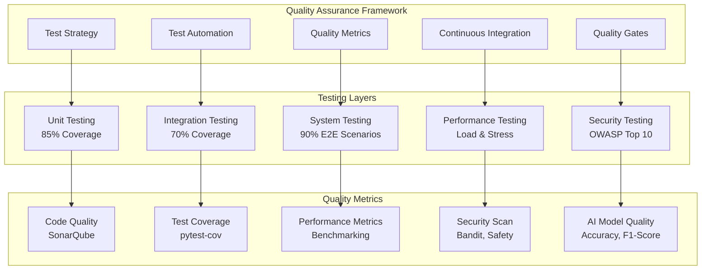
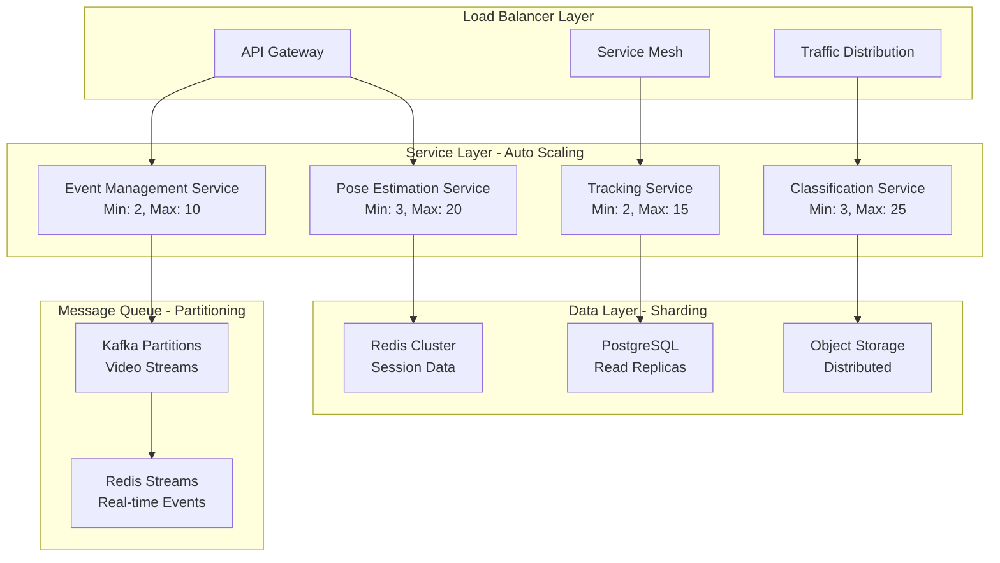
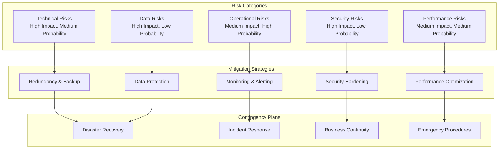

# Recognizer 소프트웨어 설계서 (Part 3/3)

## 문서 정보

| 항목 | 내용 |
|------|------|
| **프로젝트명** | Recognizer - 실시간 동작 인식 및 분석 시스템 |
| **문서 유형** | Software Design Document (SDD) |
| **버전** | v2.0 |
| **작성일** | 2025년 |
| **승인자** | 시스템 아키텍트 |
| **분류** | 기술 설계 문서 |
| **문서 범위** | Part 3: 품질보증, 배포/운영, 확장성, 위험관리 |

## 목차 (Part 3)

9. [품질 보증 및 테스트 전략](#9-품질-보증-및-테스트-전략)
10. [배포 및 운영 설계](#10-배포-및-운영-설계)
11. [확장성 및 유지보수 설계](#11-확장성-및-유지보수-설계)
12. [위험 관리 및 마이그레이션 계획](#12-위험-관리-및-마이그레이션-계획)

---

## 9. 품질 보증 및 테스트 전략

### 9.1 품질 보증 프레임워크

#### 9.1.1 품질 보증 아키텍처



#### 9.1.2 테스트 피라미드 구현

```python
import pytest
import numpy as np
import torch
from unittest.mock import Mock, patch
from typing import List, Dict, Any

class TestPyramid:
    """테스트 피라미드 구현"""

    def __init__(self):
        self.unit_tests = UnitTestSuite()
        self.integration_tests = IntegrationTestSuite()
        self.system_tests = SystemTestSuite()
        self.performance_tests = PerformanceTestSuite()

class UnitTestSuite:
    """단위 테스트 스위트"""

    def test_pose_estimation_preprocessing(self):
        """포즈 추정 전처리 테스트"""
        # Given
        estimator = RTMOEstimator(mock_config)
        input_frame = np.random.randint(0, 255, (480, 640, 3), dtype=np.uint8)

        # When
        processed = estimator.preprocess(input_frame)

        # Then
        assert processed.shape == (1, 3, 640, 640)
        assert processed.dtype == torch.float32
        assert 0 <= processed.min() <= processed.max() <= 1

    def test_tracking_association(self):
        """추적 연관성 테스트"""
        # Given
        tracker = ByteTrackerWrapper(mock_config)
        detections = [
            Mock(bbox=[100, 100, 200, 200], confidence=0.8),
            Mock(bbox=[300, 300, 400, 400], confidence=0.9)
        ]

        # When
        tracked_objects = tracker.track(detections)

        # Then
        assert len(tracked_objects) == 2
        assert all(obj.track_id is not None for obj in tracked_objects)
        assert all(obj.track_state in ['New', 'Tracked'] for obj in tracked_objects)

    def test_classification_window_processing(self):
        """분류 윈도우 처리 테스트"""
        # Given
        processor = SlidingWindowProcessor(mock_config)
        mock_persons = [Mock() for _ in range(5)]

        # When
        for i in range(100):  # 윈도우 크기만큼 추가
            processor.add_frame(mock_persons)

        # Then
        assert processor.is_ready()
        window_data = processor.get_window()
        assert window_data.tensor.shape == (4, 100, 17, 2)  # [M, T, V, C]

class IntegrationTestSuite:
    """통합 테스트 스위트"""

    @pytest.mark.integration
    async def test_pose_estimation_to_tracking_integration(self):
        """포즈 추정-추적 통합 테스트"""
        # Given
        pose_estimator = RTMOEstimator(test_config)
        tracker = ByteTrackerWrapper(test_config)
        test_video_path = "test_data/sample_video.mp4"

        # When
        cap = cv2.VideoCapture(test_video_path)
        frame_count = 0
        tracked_persons_history = []

        while frame_count < 30:  # 30프레임 테스트
            ret, frame = cap.read()
            if not ret:
                break

            # 포즈 추정
            persons = await pose_estimator.estimate(frame)

            # 추적
            tracked_persons = tracker.track(persons)
            tracked_persons_history.append(tracked_persons)

            frame_count += 1

        # Then
        assert frame_count == 30
        assert len(tracked_persons_history) == 30

        # ID 일관성 검증
        id_consistency = self._calculate_id_consistency(tracked_persons_history)
        assert id_consistency > 0.85  # 85% 이상 ID 일관성

    @pytest.mark.integration
    async def test_end_to_end_pipeline(self):
        """종단간 파이프라인 테스트"""
        # Given
        pipeline = DualServicePipeline(test_config)
        test_frame = self._load_test_frame()

        # When
        result = await pipeline.process_frame(test_frame)

        # Then
        assert result is not None
        assert 'poses' in result
        assert 'processing_time' in result
        assert result['processing_time'] < 0.1  # 100ms 이하

    def _calculate_id_consistency(self, tracked_history: List[List]) -> float:
        """ID 일관성 계산"""
        if len(tracked_history) < 2:
            return 1.0

        total_transitions = 0
        consistent_transitions = 0

        for i in range(1, len(tracked_history)):
            prev_frame = tracked_history[i-1]
            curr_frame = tracked_history[i]

            for curr_person in curr_frame:
                # 이전 프레임에서 동일한 ID 찾기
                matching_person = None
                for prev_person in prev_frame:
                    if prev_person.track_id == curr_person.track_id:
                        matching_person = prev_person
                        break

                if matching_person:
                    # 공간적 일관성 검증
                    distance = self._calculate_bbox_distance(
                        matching_person.bbox, curr_person.bbox
                    )
                    if distance < 50:  # 픽셀 단위 임계값
                        consistent_transitions += 1

                total_transitions += 1

        return consistent_transitions / total_transitions if total_transitions > 0 else 1.0

class SystemTestSuite:
    """시스템 테스트 스위트"""

    @pytest.mark.system
    async def test_realtime_processing_performance(self):
        """실시간 처리 성능 테스트"""
        # Given
        realtime_mode = RealtimeMode(performance_test_config)
        test_video = "test_data/performance_test_video.mp4"

        # When
        performance_metrics = []
        start_time = time.time()

        async with realtime_mode.start_processing(test_video) as processor:
            for _ in range(300):  # 10초간 30 FPS 테스트
                frame_start = time.time()
                result = await processor.process_next_frame()
                frame_end = time.time()

                processing_time = frame_end - frame_start
                performance_metrics.append(processing_time)

        end_time = time.time()
        total_time = end_time - start_time

        # Then
        avg_processing_time = np.mean(performance_metrics)
        fps = len(performance_metrics) / total_time

        assert avg_processing_time < 0.033  # 30 FPS 유지 (33ms 이하)
        assert fps >= 28  # 최소 28 FPS
        assert np.percentile(performance_metrics, 95) < 0.05  # 95% 타일 50ms 이하

    @pytest.mark.system
    def test_memory_leak_detection(self):
        """메모리 누수 감지 테스트"""
        # Given
        import psutil
        process = psutil.Process()
        initial_memory = process.memory_info().rss

        pipeline = DualServicePipeline(test_config)
        test_frames = [self._generate_random_frame() for _ in range(1000)]

        # When
        for frame in test_frames:
            result = pipeline.process_frame(frame)
            del result  # 명시적 삭제

        # 가비지 컬렉션 강제 실행
        import gc
        gc.collect()

        final_memory = process.memory_info().rss
        memory_increase = final_memory - initial_memory

        # Then
        memory_increase_mb = memory_increase / (1024 * 1024)
        assert memory_increase_mb < 100  # 100MB 이하 증가

    @pytest.mark.system
    async def test_fault_tolerance(self):
        """장애 허용성 테스트"""
        # Given
        pipeline = DualServicePipeline(fault_tolerance_config)

        # When & Then
        # 1. GPU 메모리 부족 시뮬레이션
        with patch('torch.cuda.OutOfMemoryError'):
            result = await pipeline.process_frame(test_frame)
            assert result is not None  # 그레이스풀 디그라데이션

        # 2. 모델 로딩 실패 시뮬레이션
        with patch.object(pipeline.pose_estimator, 'estimate', side_effect=Exception("Model error")):
            result = await pipeline.process_frame(test_frame)
            assert result['error_recovered'] is True

        # 3. 네트워크 장애 시뮬레이션
        with patch('requests.post', side_effect=ConnectionError()):
            await pipeline.send_notification(mock_event)
            # 로컬 큐에 저장되어야 함
            assert len(pipeline.notification_queue) > 0

class PerformanceTestSuite:
    """성능 테스트 스위트"""

    @pytest.mark.performance
    def test_load_testing(self):
        """부하 테스트"""
        # Given
        concurrent_requests = 10
        requests_per_client = 100

        async def client_simulation(client_id: int):
            client = RecognizerClient(test_api_url)
            response_times = []

            for i in range(requests_per_client):
                start_time = time.time()
                result = await client.estimate_pose(test_image)
                end_time = time.time()

                response_times.append(end_time - start_time)

            return response_times

        # When
        loop = asyncio.get_event_loop()
        tasks = [client_simulation(i) for i in range(concurrent_requests)]
        results = loop.run_until_complete(asyncio.gather(*tasks))

        # Then
        all_response_times = [time for client_times in results for time in client_times]

        avg_response_time = np.mean(all_response_times)
        p95_response_time = np.percentile(all_response_times, 95)
        throughput = len(all_response_times) / max(all_response_times)

        assert avg_response_time < 0.5  # 평균 응답시간 500ms 이하
        assert p95_response_time < 1.0  # 95% 타일 1초 이하
        assert throughput >= 20  # 초당 20 요청 이상

    @pytest.mark.performance
    def test_stress_testing(self):
        """스트레스 테스트"""
        # 점진적 부하 증가로 한계점 탐지
        max_concurrent_users = 100
        step_size = 10
        step_duration = 60  # 각 단계마다 60초

        performance_data = []

        for concurrent_users in range(step_size, max_concurrent_users + 1, step_size):
            # 각 단계별 성능 측정
            step_performance = self._measure_performance_at_load(
                concurrent_users, step_duration
            )
            performance_data.append(step_performance)

            # 성능 저하 임계점 확인
            if step_performance['error_rate'] > 0.05:  # 5% 초과 에러율
                break

        # 안정적인 최대 처리량 기록
        stable_performance = [p for p in performance_data if p['error_rate'] <= 0.01]
        max_stable_load = max(p['concurrent_users'] for p in stable_performance)

        assert max_stable_load >= 50  # 최소 50 동시 사용자 지원
```

### 9.2 AI 모델 품질 보증

#### 9.2.1 모델 성능 검증 프레임워크

```python
import numpy as np
from sklearn.metrics import accuracy_score, precision_recall_fscore_support, confusion_matrix
from typing import Dict, List, Tuple
import matplotlib.pyplot as plt
import seaborn as sns

class ModelQualityAssurance:
    """AI 모델 품질 보증"""

    def __init__(self, test_dataset_path: str):
        self.test_dataset = self._load_test_dataset(test_dataset_path)
        self.ground_truth = self._load_ground_truth()
        self.quality_thresholds = {
            'accuracy': 0.90,
            'precision': 0.85,
            'recall': 0.85,
            'f1_score': 0.85
        }

    def validate_pose_estimation_model(self, model: RTMOEstimator) -> Dict[str, float]:
        """포즈 추정 모델 검증"""
        predictions = []
        ground_truth_poses = []

        for test_sample in self.test_dataset['pose_estimation']:
            image = test_sample['image']
            gt_poses = test_sample['poses']

            # 모델 예측
            predicted_poses = model.estimate(image)

            # OKS (Object Keypoint Similarity) 계산
            oks_scores = self._calculate_oks(predicted_poses, gt_poses)
            predictions.extend(oks_scores)

        # 성능 메트릭 계산
        avg_oks = np.mean(predictions)
        detection_accuracy = len([s for s in predictions if s > 0.5]) / len(predictions)

        metrics = {
            'average_oks': avg_oks,
            'detection_accuracy': detection_accuracy,
            'keypoint_accuracy': self._calculate_keypoint_accuracy(predictions)
        }

        # 품질 기준 검증
        self._validate_quality_thresholds(metrics, 'pose_estimation')

        return metrics

    def validate_action_classification_model(self, model: STGCNClassifier) -> Dict[str, float]:
        """동작 분류 모델 검증"""
        y_true = []
        y_pred = []
        confidence_scores = []

        for test_sample in self.test_dataset['action_classification']:
            window_data = test_sample['window_data']
            true_action = test_sample['action']

            # 모델 예측
            result = model.classify(window_data)
            predicted_action = result.action_type
            confidence = result.confidence

            y_true.append(true_action)
            y_pred.append(predicted_action)
            confidence_scores.append(confidence)

        # 성능 메트릭 계산
        accuracy = accuracy_score(y_true, y_pred)
        precision, recall, f1, _ = precision_recall_fscore_support(
            y_true, y_pred, average='weighted'
        )

        # 혼동 행렬 생성
        cm = confusion_matrix(y_true, y_pred)

        metrics = {
            'accuracy': accuracy,
            'precision': precision,
            'recall': recall,
            'f1_score': f1,
            'avg_confidence': np.mean(confidence_scores),
            'confusion_matrix': cm.tolist()
        }

        # 품질 기준 검증
        self._validate_quality_thresholds(metrics, 'action_classification')

        return metrics

    def _calculate_oks(self, predicted_poses: List[Person],
                      ground_truth_poses: List[Person]) -> List[float]:
        """Object Keypoint Similarity 계산"""
        oks_scores = []

        for pred_pose in predicted_poses:
            best_oks = 0.0

            for gt_pose in ground_truth_poses:
                oks = self._compute_oks_single(pred_pose.keypoints, gt_pose.keypoints)
                best_oks = max(best_oks, oks)

            oks_scores.append(best_oks)

        return oks_scores

    def _compute_oks_single(self, pred_keypoints: np.ndarray,
                           gt_keypoints: np.ndarray) -> float:
        """단일 포즈에 대한 OKS 계산"""
        # COCO 키포인트 시그마 값
        sigmas = np.array([
            .26, .25, .25, .35, .35, .79, .79, .72, .72, .62, .62, 1.07, 1.07, .87, .87, .89, .89
        ]) / 10.0

        # 바운딩 박스 면적 계산 (정규화용)
        x_coords = gt_keypoints[:, 0]
        y_coords = gt_keypoints[:, 1]
        area = (x_coords.max() - x_coords.min()) * (y_coords.max() - y_coords.min())

        # 거리 계산
        dx = pred_keypoints[:, 0] - gt_keypoints[:, 0]
        dy = pred_keypoints[:, 1] - gt_keypoints[:, 1]
        distances = np.sqrt(dx**2 + dy**2)

        # OKS 계산
        visibility = gt_keypoints[:, 2] > 0
        e = distances / (2 * sigmas * np.sqrt(area) + np.finfo(float).eps)
        oks_per_keypoint = np.exp(-e**2 / 2) * visibility

        return oks_per_keypoint.sum() / visibility.sum() if visibility.sum() > 0 else 0

    def generate_quality_report(self, model_metrics: Dict[str, Dict]) -> str:
        """품질 보고서 생성"""
        report = "# AI Model Quality Assessment Report\n\n"

        for model_name, metrics in model_metrics.items():
            report += f"## {model_name.title()} Model\n\n"

            for metric_name, value in metrics.items():
                if metric_name == 'confusion_matrix':
                    continue  # 별도 처리

                if isinstance(value, float):
                    report += f"- **{metric_name.title()}**: {value:.3f}\n"
                else:
                    report += f"- **{metric_name.title()}**: {value}\n"

            # 혼동 행렬 시각화 생성
            if 'confusion_matrix' in metrics:
                self._save_confusion_matrix_plot(
                    metrics['confusion_matrix'],
                    f"{model_name}_confusion_matrix.png"
                )
                report += f"- **Confusion Matrix**: ![{model_name}_confusion_matrix.png]\n"

            report += "\n"

        return report

class ContinuousQualityMonitoring:
    """지속적 품질 모니터링"""

    def __init__(self, model_registry: Dict[str, Any]):
        self.model_registry = model_registry
        self.quality_history = {}
        self.alert_thresholds = {
            'accuracy_drop': 0.05,  # 5% 정확도 하락
            'confidence_drop': 0.10,  # 10% 신뢰도 하락
            'latency_increase': 0.20  # 20% 지연시간 증가
        }

    async def monitor_model_drift(self):
        """모델 드리프트 모니터링"""
        while True:
            for model_name, model in self.model_registry.items():
                # 현재 성능 측정
                current_metrics = await self._measure_current_performance(model)

                # 히스토리와 비교
                if model_name in self.quality_history:
                    drift_detected = self._detect_performance_drift(
                        model_name, current_metrics
                    )

                    if drift_detected:
                        await self._handle_model_drift(model_name, drift_detected)

                # 히스토리 업데이트
                self._update_quality_history(model_name, current_metrics)

            await asyncio.sleep(3600)  # 1시간마다 모니터링

    def _detect_performance_drift(self, model_name: str,
                                current_metrics: Dict) -> Dict[str, float]:
        """성능 드리프트 감지"""
        historical_metrics = self.quality_history[model_name]
        baseline = self._calculate_baseline_metrics(historical_metrics)

        drift_detected = {}

        for metric, current_value in current_metrics.items():
            if metric in baseline:
                baseline_value = baseline[metric]
                relative_change = abs(current_value - baseline_value) / baseline_value

                if metric in ['accuracy', 'f1_score'] and current_value < baseline_value:
                    # 성능 하락 감지
                    if relative_change > self.alert_thresholds['accuracy_drop']:
                        drift_detected[metric] = relative_change

                elif metric == 'avg_confidence' and current_value < baseline_value:
                    # 신뢰도 하락 감지
                    if relative_change > self.alert_thresholds['confidence_drop']:
                        drift_detected[metric] = relative_change

                elif metric == 'avg_latency' and current_value > baseline_value:
                    # 지연시간 증가 감지
                    if relative_change > self.alert_thresholds['latency_increase']:
                        drift_detected[metric] = relative_change

        return drift_detected

    async def _handle_model_drift(self, model_name: str, drift_info: Dict[str, float]):
        """모델 드리프트 처리"""
        # 알림 발송
        await self._send_drift_alert(model_name, drift_info)

        # 자동 복구 시도
        recovery_actions = {
            'accuracy': self._trigger_model_retraining,
            'avg_confidence': self._adjust_confidence_thresholds,
            'avg_latency': self._optimize_model_performance
        }

        for metric, change in drift_info.items():
            if metric in recovery_actions:
                await recovery_actions[metric](model_name, change)
```

### 9.3 자동화된 테스트 파이프라인

#### 9.3.1 CI/CD 테스트 자동화

```yaml
# .github/workflows/quality-assurance.yml
name: Quality Assurance Pipeline

on:
  push:
    branches: [ main, develop ]
  pull_request:
    branches: [ main ]

jobs:
  unit-tests:
    runs-on: ubuntu-latest
    strategy:
      matrix:
        python-version: [3.8, 3.9, 3.10]

    steps:
    - uses: actions/checkout@v3

    - name: Set up Python ${{ matrix.python-version }}
      uses: actions/setup-python@v3
      with:
        python-version: ${{ matrix.python-version }}

    - name: Install dependencies
      run: |
        python -m pip install --upgrade pip
        pip install -r requirements-test.txt

    - name: Run unit tests with coverage
      run: |
        pytest tests/unit/ \
          --cov=recognizer \
          --cov-report=xml \
          --cov-report=html \
          --cov-fail-under=85

    - name: Upload coverage to Codecov
      uses: codecov/codecov-action@v3
      with:
        file: ./coverage.xml

  integration-tests:
    runs-on: ubuntu-latest
    needs: unit-tests

    services:
      redis:
        image: redis:6.2
        ports:
          - 6379:6379

    steps:
    - uses: actions/checkout@v3

    - name: Set up Docker Buildx
      uses: docker/setup-buildx-action@v2

    - name: Build test image
      run: |
        docker build -t recognizer:test -f Dockerfile.test .

    - name: Run integration tests
      run: |
        docker run --rm \
          --network host \
          -v ${{ github.workspace }}/test-results:/app/test-results \
          recognizer:test \
          pytest tests/integration/ \
            --junitxml=test-results/integration.xml \
            --html=test-results/integration.html

  model-quality-tests:
    runs-on: ubuntu-latest
    needs: integration-tests

    steps:
    - uses: actions/checkout@v3

    - name: Download test models
      run: |
        mkdir -p models/test/
        # 테스트용 경량 모델 다운로드
        wget -O models/test/rtmo_test.onnx https://example.com/rtmo_test.onnx
        wget -O models/test/stgcn_test.onnx https://example.com/stgcn_test.onnx

    - name: Run model quality tests
      run: |
        python tests/model_quality/validate_models.py \
          --model-dir models/test/ \
          --test-data tests/data/quality_test_dataset/ \
          --output-report model_quality_report.json

    - name: Upload model quality report
      uses: actions/upload-artifact@v3
      with:
        name: model-quality-report
        path: model_quality_report.json

  performance-tests:
    runs-on: ubuntu-latest
    needs: [unit-tests, integration-tests]

    steps:
    - uses: actions/checkout@v3

    - name: Set up performance test environment
      run: |
        docker-compose -f docker-compose.perf-test.yml up -d
        sleep 30  # 서비스 시작 대기

    - name: Run performance tests
      run: |
        python tests/performance/load_test.py \
          --target-url http://localhost:8000 \
          --concurrent-users 50 \
          --duration 300 \
          --output-report performance_report.json

    - name: Analyze performance results
      run: |
        python tests/performance/analyze_results.py \
          --report performance_report.json \
          --thresholds tests/performance/performance_thresholds.json

    - name: Upload performance report
      uses: actions/upload-artifact@v3
      with:
        name: performance-report
        path: performance_report.json

  security-tests:
    runs-on: ubuntu-latest

    steps:
    - uses: actions/checkout@v3

    - name: Run security scan with Bandit
      run: |
        bandit -r recognizer/ -f json -o security_report.json

    - name: Run dependency vulnerability scan
      run: |
        safety check --json --output safety_report.json

    - name: OWASP ZAP security scan
      run: |
        docker run -v $(pwd):/zap/wrk/:rw \
          -t owasp/zap2docker-stable \
          zap-baseline.py \
          -t http://localhost:8000 \
          -J zap_report.json

    - name: Upload security reports
      uses: actions/upload-artifact@v3
      with:
        name: security-reports
        path: |
          security_report.json
          safety_report.json
          zap_report.json

  quality-gate:
    runs-on: ubuntu-latest
    needs: [unit-tests, integration-tests, model-quality-tests, performance-tests, security-tests]

    steps:
    - name: Download all reports
      uses: actions/download-artifact@v3

    - name: Quality Gate Assessment
      run: |
        python tools/quality_gate.py \
          --coverage-report coverage.xml \
          --model-quality-report model-quality-report/model_quality_report.json \
          --performance-report performance-report/performance_report.json \
          --security-reports security-reports/ \
          --quality-criteria quality_criteria.yml \
          --fail-on-quality-gate-failure
```

---

## 10. 배포 및 운영 설계

### 10.1 컨테이너화 및 오케스트레이션

#### 10.1.1 Docker 컨테이너 설계

```dockerfile
# Dockerfile.production
FROM nvidia/cuda:11.8-devel-ubuntu20.04

# 시스템 의존성 설치
RUN apt-get update && apt-get install -y \
    python3.9 \
    python3.9-pip \
    python3.9-dev \
    libgl1-mesa-glx \
    libglib2.0-0 \
    libsm6 \
    libxext6 \
    libxrender-dev \
    libgomp1 \
    wget \
    curl \
    && rm -rf /var/lib/apt/lists/*

# Python 환경 설정
RUN ln -s /usr/bin/python3.9 /usr/bin/python
RUN python -m pip install --upgrade pip

# 작업 디렉토리 설정
WORKDIR /app

# 의존성 설치
COPY requirements.txt .
RUN pip install --no-cache-dir -r requirements.txt

# ONNX Runtime GPU 설치
RUN pip install onnxruntime-gpu==1.15.1

# 애플리케이션 코드 복사
COPY recognizer/ ./recognizer/
COPY configs/ ./configs/
COPY models/ ./models/

# 모델 다운로드 스크립트
COPY scripts/download_models.sh .
RUN chmod +x download_models.sh && ./download_models.sh

# 권한 설정
RUN useradd -m -u 1000 recognizer && \
    chown -R recognizer:recognizer /app
USER recognizer

# 헬스체크 설정
HEALTHCHECK --interval=30s --timeout=10s --start-period=60s --retries=3 \
    CMD curl -f http://localhost:8000/health || exit 1

# 엔트리포인트 설정
COPY scripts/entrypoint.sh .
ENTRYPOINT ["./entrypoint.sh"]

# 기본 명령어
CMD ["python", "-m", "recognizer.main", "--mode", "inference.realtime"]
```

#### 10.1.2 Kubernetes 배포 매니페스트

```yaml
# k8s/namespace.yaml
apiVersion: v1
kind: Namespace
metadata:
  name: recognizer
  labels:
    name: recognizer

---
# k8s/configmap.yaml
apiVersion: v1
kind: ConfigMap
metadata:
  name: recognizer-config
  namespace: recognizer
data:
  config.yaml: |
    mode: inference.realtime
    gpu:
      enabled: true
      device_ids: [0]
    logging:
      level: INFO
      format: json
    performance:
      target_fps: 30
      max_latency_ms: 100

---
# k8s/secret.yaml
apiVersion: v1
kind: Secret
metadata:
  name: recognizer-secrets
  namespace: recognizer
type: Opaque
data:
  api_key: <base64_encoded_api_key>
  jwt_secret: <base64_encoded_jwt_secret>

---
# k8s/deployment.yaml
apiVersion: apps/v1
kind: Deployment
metadata:
  name: recognizer-api
  namespace: recognizer
  labels:
    app: recognizer-api
spec:
  replicas: 3
  strategy:
    type: RollingUpdate
    rollingUpdate:
      maxSurge: 1
      maxUnavailable: 0
  selector:
    matchLabels:
      app: recognizer-api
  template:
    metadata:
      labels:
        app: recognizer-api
    spec:
      nodeSelector:
        node-type: gpu
      tolerations:
      - key: nvidia.com/gpu
        operator: Exists
        effect: NoSchedule

      containers:
      - name: recognizer-api
        image: recognizer:latest
        imagePullPolicy: Always

        ports:
        - containerPort: 8000
          name: http
        - containerPort: 9090
          name: metrics

        env:
        - name: CONFIG_PATH
          value: "/app/config/config.yaml"
        - name: API_KEY
          valueFrom:
            secretKeyRef:
              name: recognizer-secrets
              key: api_key

        resources:
          requests:
            cpu: "2"
            memory: "8Gi"
            nvidia.com/gpu: 1
          limits:
            cpu: "4"
            memory: "16Gi"
            nvidia.com/gpu: 1

        volumeMounts:
        - name: config-volume
          mountPath: /app/config
        - name: model-cache
          mountPath: /app/models
        - name: temp-storage
          mountPath: /tmp

        livenessProbe:
          httpGet:
            path: /health
            port: 8000
          initialDelaySeconds: 60
          periodSeconds: 30
          timeoutSeconds: 10
          failureThreshold: 3

        readinessProbe:
          httpGet:
            path: /ready
            port: 8000
          initialDelaySeconds: 30
          periodSeconds: 10
          timeoutSeconds: 5
          failureThreshold: 3

      volumes:
      - name: config-volume
        configMap:
          name: recognizer-config
      - name: model-cache
        persistentVolumeClaim:
          claimName: model-cache-pvc
      - name: temp-storage
        emptyDir:
          sizeLimit: 10Gi

---
# k8s/service.yaml
apiVersion: v1
kind: Service
metadata:
  name: recognizer-api-service
  namespace: recognizer
  labels:
    app: recognizer-api
spec:
  type: ClusterIP
  ports:
  - port: 80
    targetPort: 8000
    protocol: TCP
    name: http
  - port: 9090
    targetPort: 9090
    protocol: TCP
    name: metrics
  selector:
    app: recognizer-api

---
# k8s/ingress.yaml
apiVersion: networking.k8s.io/v1
kind: Ingress
metadata:
  name: recognizer-ingress
  namespace: recognizer
  annotations:
    kubernetes.io/ingress.class: nginx
    nginx.ingress.kubernetes.io/ssl-redirect: "true"
    nginx.ingress.kubernetes.io/proxy-body-size: "100m"
    nginx.ingress.kubernetes.io/proxy-read-timeout: "300"
    nginx.ingress.kubernetes.io/proxy-send-timeout: "300"
spec:
  tls:
  - hosts:
    - api.recognizer.example.com
    secretName: recognizer-tls
  rules:
  - host: api.recognizer.example.com
    http:
      paths:
      - path: /
        pathType: Prefix
        backend:
          service:
            name: recognizer-api-service
            port:
              number: 80

---
# k8s/hpa.yaml
apiVersion: autoscaling/v2
kind: HorizontalPodAutoscaler
metadata:
  name: recognizer-hpa
  namespace: recognizer
spec:
  scaleTargetRef:
    apiVersion: apps/v1
    kind: Deployment
    name: recognizer-api
  minReplicas: 3
  maxReplicas: 10
  metrics:
  - type: Resource
    resource:
      name: cpu
      target:
        type: Utilization
        averageUtilization: 70
  - type: Resource
    resource:
      name: memory
      target:
        type: Utilization
        averageUtilization: 80
  behavior:
    scaleUp:
      stabilizationWindowSeconds: 300
      policies:
      - type: Percent
        value: 50
        periodSeconds: 60
    scaleDown:
      stabilizationWindowSeconds: 300
      policies:
      - type: Percent
        value: 25
        periodSeconds: 60
```

### 10.2 모니터링 및 관찰성

#### 10.2.1 통합 모니터링 스택

```yaml
# monitoring/prometheus.yaml
apiVersion: v1
kind: ConfigMap
metadata:
  name: prometheus-config
  namespace: monitoring
data:
  prometheus.yml: |
    global:
      scrape_interval: 15s
      evaluation_interval: 15s

    rule_files:
      - "/etc/prometheus/rules/*.yml"

    scrape_configs:
    - job_name: 'recognizer-api'
      kubernetes_sd_configs:
      - role: endpoints
        namespaces:
          names:
          - recognizer
      relabel_configs:
      - source_labels: [__meta_kubernetes_service_name]
        action: keep
        regex: recognizer-api-service
      - source_labels: [__meta_kubernetes_endpoint_port_name]
        action: keep
        regex: metrics

    - job_name: 'gpu-metrics'
      static_configs:
      - targets: ['nvidia-dcgm-exporter:9400']

    - job_name: 'kubernetes-pods'
      kubernetes_sd_configs:
      - role: pod
      relabel_configs:
      - source_labels: [__meta_kubernetes_pod_annotation_prometheus_io_scrape]
        action: keep
        regex: true

---
# monitoring/alerting-rules.yaml
apiVersion: v1
kind: ConfigMap
metadata:
  name: prometheus-rules
  namespace: monitoring
data:
  recognizer.yml: |
    groups:
    - name: recognizer.rules
      rules:

      # API 응답시간 알림
      - alert: HighAPILatency
        expr: histogram_quantile(0.95, rate(http_request_duration_seconds_bucket{job="recognizer-api"}[5m])) > 1
        for: 2m
        labels:
          severity: warning
        annotations:
          summary: "High API latency detected"
          description: "95th percentile latency is {{ $value }}s"

      # GPU 사용률 알림
      - alert: HighGPUUtilization
        expr: nvidia_gpu_utilization_gpu > 95
        for: 5m
        labels:
          severity: warning
        annotations:
          summary: "High GPU utilization"
          description: "GPU utilization is {{ $value }}%"

      # 메모리 사용률 알림
      - alert: HighMemoryUsage
        expr: (1 - (node_memory_MemAvailable_bytes / node_memory_MemTotal_bytes)) * 100 > 90
        for: 5m
        labels:
          severity: critical
        annotations:
          summary: "High memory usage"
          description: "Memory usage is {{ $value }}%"

      # 모델 정확도 저하 알림
      - alert: ModelAccuracyDrop
        expr: model_accuracy < 0.85
        for: 10m
        labels:
          severity: critical
        annotations:
          summary: "Model accuracy dropped below threshold"
          description: "Model accuracy is {{ $value }}"

      # 서비스 다운 알림
      - alert: ServiceDown
        expr: up{job="recognizer-api"} == 0
        for: 1m
        labels:
          severity: critical
        annotations:
          summary: "Recognizer service is down"
          description: "Service {{ $labels.instance }} has been down for more than 1 minute"
```

#### 10.2.2 로깅 및 추적 시스템

```python
import logging
import structlog
from pythonjsonlogger import jsonlogger
from opentelemetry import trace
from opentelemetry.exporter.jaeger.thrift import JaegerExporter
from opentelemetry.sdk.trace import TracerProvider
from opentelemetry.sdk.trace.export import BatchSpanProcessor
from opentelemetry.instrumentation.fastapi import FastAPIInstrumentor
from opentelemetry.instrumentation.requests import RequestsInstrumentor

class ObservabilityManager:
    """관찰성 관리자"""

    def __init__(self, config: ObservabilityConfig):
        self.config = config
        self.setup_logging()
        self.setup_tracing()
        self.setup_metrics()

    def setup_logging(self):
        """구조화된 로깅 설정"""
        # JSON 로거 설정
        json_handler = logging.StreamHandler()
        formatter = jsonlogger.JsonFormatter(
            fmt='%(asctime)s %(name)s %(levelname)s %(message)s'
        )
        json_handler.setFormatter(formatter)

        # 구조화된 로깅 설정
        structlog.configure(
            processors=[
                structlog.stdlib.filter_by_level,
                structlog.stdlib.add_logger_name,
                structlog.stdlib.add_log_level,
                structlog.stdlib.PositionalArgumentsFormatter(),
                structlog.processors.TimeStamper(fmt="iso"),
                structlog.processors.StackInfoRenderer(),
                structlog.processors.format_exc_info,
                structlog.processors.UnicodeDecoder(),
                structlog.processors.JSONRenderer()
            ],
            context_class=dict,
            logger_factory=structlog.stdlib.LoggerFactory(),
            wrapper_class=structlog.stdlib.BoundLogger,
            cache_logger_on_first_use=True,
        )

        # 루트 로거 설정
        logging.basicConfig(
            level=self.config.log_level,
            handlers=[json_handler]
        )

    def setup_tracing(self):
        """분산 추적 설정"""
        # Tracer Provider 설정
        trace.set_tracer_provider(TracerProvider())
        tracer = trace.get_tracer(__name__)

        # Jaeger Exporter 설정
        jaeger_exporter = JaegerExporter(
            agent_host_name=self.config.jaeger_host,
            agent_port=self.config.jaeger_port,
        )

        # Span Processor 설정
        span_processor = BatchSpanProcessor(jaeger_exporter)
        trace.get_tracer_provider().add_span_processor(span_processor)

        # 자동 계측 설정
        FastAPIInstrumentor.instrument()
        RequestsInstrumentor().instrument()

    def setup_metrics(self):
        """메트릭 설정"""
        from prometheus_client import Counter, Histogram, Gauge, start_http_server

        # 애플리케이션 메트릭 정의
        self.metrics = {
            'api_requests_total': Counter(
                'api_requests_total',
                'Total API requests',
                ['method', 'endpoint', 'status']
            ),
            'api_request_duration': Histogram(
                'api_request_duration_seconds',
                'API request duration',
                ['method', 'endpoint']
            ),
            'pose_estimation_duration': Histogram(
                'pose_estimation_duration_seconds',
                'Pose estimation duration'
            ),
            'tracking_duration': Histogram(
                'tracking_duration_seconds',
                'Tracking duration'
            ),
            'classification_duration': Histogram(
                'classification_duration_seconds',
                'Classification duration'
            ),
            'active_sessions': Gauge(
                'active_realtime_sessions',
                'Number of active realtime sessions'
            ),
            'model_accuracy': Gauge(
                'model_accuracy',
                'Current model accuracy',
                ['model_name']
            ),
            'gpu_memory_usage': Gauge(
                'gpu_memory_usage_bytes',
                'GPU memory usage',
                ['gpu_id']
            )
        }

        # 메트릭 서버 시작
        start_http_server(self.config.metrics_port)

class PerformanceTracker:
    """성능 추적기"""

    def __init__(self, metrics: Dict):
        self.metrics = metrics
        self.logger = structlog.get_logger()

    @contextmanager
    def track_operation(self, operation_name: str, **labels):
        """작업 추적 컨텍스트 매니저"""
        start_time = time.time()

        with trace.get_tracer(__name__).start_as_current_span(operation_name) as span:
            # 스팬에 라벨 추가
            for key, value in labels.items():
                span.set_attribute(key, value)

            try:
                yield span

            except Exception as e:
                span.record_exception(e)
                span.set_status(trace.Status(trace.StatusCode.ERROR, str(e)))
                raise

            finally:
                duration = time.time() - start_time

                # 메트릭 업데이트
                if f'{operation_name}_duration' in self.metrics:
                    self.metrics[f'{operation_name}_duration'].observe(duration)

                # 로그 기록
                self.logger.info(
                    f"{operation_name}_completed",
                    duration=duration,
                    **labels
                )

    def track_model_performance(self, model_name: str, accuracy: float, latency: float):
        """모델 성능 추적"""
        self.metrics['model_accuracy'].labels(model_name=model_name).set(accuracy)

        self.logger.info(
            "model_performance_updated",
            model_name=model_name,
            accuracy=accuracy,
            latency=latency
        )

    def track_resource_usage(self):
        """리소스 사용량 추적"""
        import psutil
        import GPUtil

        # GPU 메모리 사용량
        gpus = GPUtil.getGPUs()
        for i, gpu in enumerate(gpus):
            memory_used = gpu.memoryUsed * 1024 * 1024  # MB to bytes
            self.metrics['gpu_memory_usage'].labels(gpu_id=str(i)).set(memory_used)

        # 시스템 메트릭 로깅
        self.logger.info(
            "resource_usage",
            cpu_percent=psutil.cpu_percent(),
            memory_percent=psutil.virtual_memory().percent,
            gpu_count=len(gpus),
            gpu_utilization=[gpu.load * 100 for gpu in gpus]
        )
```

### 10.3 배포 자동화 및 GitOps

#### 10.3.1 GitOps 배포 파이프라인

```yaml
# .github/workflows/deploy.yml
name: Deploy to Production

on:
  push:
    tags:
      - 'v*'

env:
  REGISTRY: ghcr.io
  IMAGE_NAME: ${{ github.repository }}

jobs:
  build-and-push:
    runs-on: ubuntu-latest
    permissions:
      contents: read
      packages: write

    steps:
    - name: Checkout repository
      uses: actions/checkout@v3

    - name: Log in to Container Registry
      uses: docker/login-action@v2
      with:
        registry: ${{ env.REGISTRY }}
        username: ${{ github.actor }}
        password: ${{ secrets.GITHUB_TOKEN }}

    - name: Extract metadata
      id: meta
      uses: docker/metadata-action@v4
      with:
        images: ${{ env.REGISTRY }}/${{ env.IMAGE_NAME }}
        tags: |
          type=ref,event=tag
          type=sha,prefix={{branch}}-

    - name: Build and push Docker image
      uses: docker/build-push-action@v4
      with:
        context: .
        file: ./Dockerfile.production
        push: true
        tags: ${{ steps.meta.outputs.tags }}
        labels: ${{ steps.meta.outputs.labels }}
        cache-from: type=gha
        cache-to: type=gha,mode=max

  deploy-staging:
    needs: build-and-push
    runs-on: ubuntu-latest
    environment: staging

    steps:
    - name: Checkout GitOps repository
      uses: actions/checkout@v3
      with:
        repository: company/recognizer-gitops
        token: ${{ secrets.GITOPS_TOKEN }}
        path: gitops

    - name: Update staging manifests
      run: |
        cd gitops/environments/staging
        yq eval '.spec.template.spec.containers[0].image = "${{ env.REGISTRY }}/${{ env.IMAGE_NAME }}:${{ github.ref_name }}"' -i deployment.yaml

    - name: Commit and push changes
      run: |
        cd gitops
        git config user.name "GitHub Actions"
        git config user.email "actions@github.com"
        git add .
        git commit -m "Deploy ${{ github.ref_name }} to staging"
        git push

  integration-tests-staging:
    needs: deploy-staging
    runs-on: ubuntu-latest

    steps:
    - name: Wait for deployment
      run: sleep 120  # 배포 완료 대기

    - name: Run integration tests against staging
      run: |
        pytest tests/integration/ \
          --target-url https://staging-api.recognizer.example.com \
          --api-key ${{ secrets.STAGING_API_KEY }}

  deploy-production:
    needs: integration-tests-staging
    runs-on: ubuntu-latest
    environment: production
    if: startsWith(github.ref, 'refs/tags/v')

    steps:
    - name: Checkout GitOps repository
      uses: actions/checkout@v3
      with:
        repository: company/recognizer-gitops
        token: ${{ secrets.GITOPS_TOKEN }}
        path: gitops

    - name: Update production manifests
      run: |
        cd gitops/environments/production
        yq eval '.spec.template.spec.containers[0].image = "${{ env.REGISTRY }}/${{ env.IMAGE_NAME }}:${{ github.ref_name }}"' -i deployment.yaml

    - name: Commit and push changes
      run: |
        cd gitops
        git config user.name "GitHub Actions"
        git config user.email "actions@github.com"
        git add .
        git commit -m "Deploy ${{ github.ref_name }} to production"
        git push

  smoke-tests-production:
    needs: deploy-production
    runs-on: ubuntu-latest

    steps:
    - name: Wait for deployment
      run: sleep 180  # 프로덕션 배포 완료 대기

    - name: Run smoke tests
      run: |
        pytest tests/smoke/ \
          --target-url https://api.recognizer.example.com \
          --api-key ${{ secrets.PRODUCTION_API_KEY }}

    - name: Notify deployment success
      if: success()
      uses: 8398a7/action-slack@v3
      with:
        status: success
        text: "🚀 Recognizer ${{ github.ref_name }} successfully deployed to production!"
      env:
        SLACK_WEBHOOK_URL: ${{ secrets.SLACK_WEBHOOK }}

    - name: Rollback on failure
      if: failure()
      run: |
        # 자동 롤백 로직
        kubectl rollout undo deployment/recognizer-api -n recognizer
```

---

## 11. 확장성 및 유지보수 설계

### 11.1 수평적 확장 설계

#### 11.1.1 마이크로서비스 확장 전략



#### 11.1.2 자동 스케일링 구현

```python
from kubernetes import client, config
from typing import Dict, List
import asyncio
import numpy as np

class AutoScalingManager:
    """자동 스케일링 관리자"""

    def __init__(self, kube_config_path: str = None):
        if kube_config_path:
            config.load_kube_config(kube_config_path)
        else:
            config.load_incluster_config()

        self.apps_v1 = client.AppsV1Api()
        self.custom_objects_api = client.CustomObjectsApi()

        self.scaling_policies = {
            'pose-estimation': {
                'min_replicas': 3,
                'max_replicas': 20,
                'target_cpu': 70,
                'target_memory': 80,
                'scale_up_threshold': 0.8,
                'scale_down_threshold': 0.3
            },
            'classification': {
                'min_replicas': 3,
                'max_replicas': 25,
                'target_cpu': 75,
                'target_gpu': 80,
                'scale_up_threshold': 0.85,
                'scale_down_threshold': 0.25
            }
        }

    async def monitor_and_scale(self):
        """모니터링 및 스케일링 루프"""
        while True:
            for service_name, policy in self.scaling_policies.items():
                try:
                    current_metrics = await self._get_service_metrics(service_name)
                    scaling_decision = self._calculate_scaling_decision(
                        service_name, current_metrics, policy
                    )

                    if scaling_decision['action'] != 'none':
                        await self._execute_scaling(service_name, scaling_decision)

                except Exception as e:
                    logger.error(f"Scaling error for {service_name}: {e}")

            await asyncio.sleep(30)  # 30초마다 체크

    async def _get_service_metrics(self, service_name: str) -> Dict[str, float]:
        """서비스 메트릭 조회"""
        # Prometheus에서 메트릭 조회
        query_params = {
            'cpu_usage': f'avg(rate(container_cpu_usage_seconds_total{{pod=~"{service_name}-.*"}}[5m]))',
            'memory_usage': f'avg(container_memory_working_set_bytes{{pod=~"{service_name}-.*"}})',
            'gpu_usage': f'avg(nvidia_gpu_utilization_gpu{{pod=~"{service_name}-.*"}})',
            'request_rate': f'sum(rate(http_requests_total{{service="{service_name}"}}[5m]))',
            'response_time': f'histogram_quantile(0.95, rate(http_request_duration_seconds_bucket{{service="{service_name}"}}[5m]))'
        }

        metrics = {}
        for metric_name, query in query_params.items():
            try:
                result = await self._query_prometheus(query)
                metrics[metric_name] = float(result[0]['value'][1]) if result else 0.0
            except:
                metrics[metric_name] = 0.0

        return metrics

    def _calculate_scaling_decision(self, service_name: str,
                                  metrics: Dict[str, float],
                                  policy: Dict) -> Dict[str, any]:
        """스케일링 결정 계산"""
        current_replicas = self._get_current_replicas(service_name)

        # 리소스 사용률 기반 스케일 팩터 계산
        scale_factors = []

        if 'target_cpu' in policy:
            cpu_factor = metrics['cpu_usage'] / (policy['target_cpu'] / 100)
            scale_factors.append(cpu_factor)

        if 'target_memory' in policy:
            memory_factor = metrics['memory_usage'] / (policy['target_memory'] / 100)
            scale_factors.append(memory_factor)

        if 'target_gpu' in policy and metrics['gpu_usage'] > 0:
            gpu_factor = metrics['gpu_usage'] / (policy['target_gpu'] / 100)
            scale_factors.append(gpu_factor)

        if not scale_factors:
            return {'action': 'none'}

        avg_scale_factor = np.mean(scale_factors)
        desired_replicas = int(current_replicas * avg_scale_factor)

        # 정책 제약 적용
        desired_replicas = max(policy['min_replicas'],
                              min(policy['max_replicas'], desired_replicas))

        # 스케일링 임계값 확인
        if desired_replicas > current_replicas:
            if avg_scale_factor > policy['scale_up_threshold']:
                return {
                    'action': 'scale_up',
                    'current_replicas': current_replicas,
                    'desired_replicas': desired_replicas,
                    'scale_factor': avg_scale_factor
                }
        elif desired_replicas < current_replicas:
            if avg_scale_factor < policy['scale_down_threshold']:
                return {
                    'action': 'scale_down',
                    'current_replicas': current_replicas,
                    'desired_replicas': desired_replicas,
                    'scale_factor': avg_scale_factor
                }

        return {'action': 'none'}

    async def _execute_scaling(self, service_name: str, decision: Dict):
        """스케일링 실행"""
        try:
            # Deployment 업데이트
            body = {'spec': {'replicas': decision['desired_replicas']}}

            await self.apps_v1.patch_namespaced_deployment_scale(
                name=f"{service_name}-deployment",
                namespace="recognizer",
                body=body
            )

            logger.info(
                f"Scaled {service_name} from {decision['current_replicas']} "
                f"to {decision['desired_replicas']} replicas"
            )

        except Exception as e:
            logger.error(f"Failed to scale {service_name}: {e}")

class ServiceMeshManager:
    """서비스 메시 관리자"""

    def __init__(self):
        self.traffic_policies = {
            'canary_deployment': {
                'stable_weight': 90,
                'canary_weight': 10,
                'success_threshold': 0.99,
                'latency_threshold': 500  # ms
            },
            'circuit_breaker': {
                'failure_threshold': 5,
                'recovery_timeout': 30,
                'success_threshold': 3
            },
            'retry_policy': {
                'max_retries': 3,
                'timeout': '10s',
                'backoff': 'exponential'
            }
        }

    async def configure_traffic_splitting(self, service_name: str,
                                        stable_version: str,
                                        canary_version: str):
        """트래픽 분할 설정"""
        virtual_service = {
            'apiVersion': 'networking.istio.io/v1beta1',
            'kind': 'VirtualService',
            'metadata': {
                'name': f'{service_name}-vs',
                'namespace': 'recognizer'
            },
            'spec': {
                'hosts': [service_name],
                'http': [{
                    'match': [{'headers': {'canary': {'exact': 'true'}}}],
                    'route': [{'destination': {
                        'host': service_name,
                        'subset': canary_version
                    }}]
                }, {
                    'route': [
                        {
                            'destination': {
                                'host': service_name,
                                'subset': stable_version
                            },
                            'weight': self.traffic_policies['canary_deployment']['stable_weight']
                        },
                        {
                            'destination': {
                                'host': service_name,
                                'subset': canary_version
                            },
                            'weight': self.traffic_policies['canary_deployment']['canary_weight']
                        }
                    ]
                }]
            }
        }

        await self._apply_istio_config(virtual_service)

    async def setup_circuit_breaker(self, service_name: str):
        """서킷 브레이커 설정"""
        destination_rule = {
            'apiVersion': 'networking.istio.io/v1beta1',
            'kind': 'DestinationRule',
            'metadata': {
                'name': f'{service_name}-dr',
                'namespace': 'recognizer'
            },
            'spec': {
                'host': service_name,
                'trafficPolicy': {
                    'connectionPool': {
                        'tcp': {'maxConnections': 100},
                        'http': {
                            'http1MaxPendingRequests': 10,
                            'maxRequestsPerConnection': 10
                        }
                    },
                    'outlierDetection': {
                        'consecutiveErrors': self.traffic_policies['circuit_breaker']['failure_threshold'],
                        'interval': '30s',
                        'baseEjectionTime': f"{self.traffic_policies['circuit_breaker']['recovery_timeout']}s",
                        'maxEjectionPercent': 50
                    }
                }
            }
        }

        await self._apply_istio_config(destination_rule)
```

### 11.2 수직적 확장 및 리소스 최적화

#### 11.2.1 적응형 리소스 관리

```python
class AdaptiveResourceManager:
    """적응형 리소스 관리자"""

    def __init__(self):
        self.resource_profiles = {
            'low_load': {
                'cpu_limit': '2',
                'memory_limit': '4Gi',
                'gpu_memory_fraction': 0.5,
                'batch_size': 4,
                'worker_threads': 2
            },
            'medium_load': {
                'cpu_limit': '4',
                'memory_limit': '8Gi',
                'gpu_memory_fraction': 0.7,
                'batch_size': 8,
                'worker_threads': 4
            },
            'high_load': {
                'cpu_limit': '8',
                'memory_limit': '16Gi',
                'gpu_memory_fraction': 0.9,
                'batch_size': 16,
                'worker_threads': 8
            }
        }

    async def optimize_resources(self, service_metrics: Dict[str, float]):
        """리소스 최적화"""
        current_load = self._classify_load_level(service_metrics)
        optimal_profile = self.resource_profiles[current_load]

        # 동적 리소스 조정
        await self._adjust_resources(optimal_profile)

        # 애플리케이션 파라미터 조정
        await self._adjust_application_params(optimal_profile)

    def _classify_load_level(self, metrics: Dict[str, float]) -> str:
        """부하 수준 분류"""
        cpu_usage = metrics.get('cpu_usage', 0)
        memory_usage = metrics.get('memory_usage', 0)
        request_rate = metrics.get('request_rate', 0)

        # 가중치 기반 부하 점수 계산
        load_score = (
            cpu_usage * 0.4 +
            memory_usage * 0.3 +
            min(request_rate / 100, 1.0) * 0.3
        )

        if load_score > 0.8:
            return 'high_load'
        elif load_score > 0.5:
            return 'medium_load'
        else:
            return 'low_load'

    async def _adjust_resources(self, profile: Dict[str, any]):
        """Kubernetes 리소스 조정"""
        # VPA (Vertical Pod Autoscaler) 설정 업데이트
        vpa_config = {
            'apiVersion': 'autoscaling.k8s.io/v1',
            'kind': 'VerticalPodAutoscaler',
            'metadata': {
                'name': 'recognizer-vpa',
                'namespace': 'recognizer'
            },
            'spec': {
                'targetRef': {
                    'apiVersion': 'apps/v1',
                    'kind': 'Deployment',
                    'name': 'recognizer-api'
                },
                'updatePolicy': {
                    'updateMode': 'Auto'
                },
                'resourcePolicy': {
                    'containerPolicies': [{
                        'containerName': 'recognizer-api',
                        'maxAllowed': {
                            'cpu': profile['cpu_limit'],
                            'memory': profile['memory_limit']
                        }
                    }]
                }
            }
        }

        await self._apply_kubernetes_config(vpa_config)

class MemoryOptimizer:
    """메모리 최적화기"""

    def __init__(self):
        self.memory_pools = {
            'frame_buffer': MemoryPool(size_mb=100),
            'tensor_cache': MemoryPool(size_mb=200),
            'result_buffer': MemoryPool(size_mb=50)
        }

    def optimize_memory_usage(self):
        """메모리 사용량 최적화"""
        # 1. 미사용 메모리 풀 정리
        self._cleanup_unused_pools()

        # 2. 가비지 컬렉션 최적화
        self._optimize_garbage_collection()

        # 3. 캐시 크기 동적 조정
        self._adjust_cache_sizes()

    def _cleanup_unused_pools(self):
        """미사용 메모리 풀 정리"""
        for pool_name, pool in self.memory_pools.items():
            if pool.usage_ratio() < 0.1:  # 사용률 10% 미만
                pool.shrink(factor=0.5)

    def _optimize_garbage_collection(self):
        """가비지 컬렉션 최적화"""
        import gc

        # 세대별 가비지 컬렉션 임계값 조정
        current_thresholds = gc.get_threshold()
        optimized_thresholds = (
            current_thresholds[0],
            current_thresholds[1] // 2,  # 더 자주 수집
            current_thresholds[2] // 2
        )
        gc.set_threshold(*optimized_thresholds)

        # 강제 가비지 컬렉션
        collected = gc.collect()
        logger.info(f"Garbage collection freed {collected} objects")

class GPUResourceManager:
    """GPU 리소스 관리자"""

    def __init__(self):
        self.gpu_schedulers = {
            'pose_estimation': GPUScheduler(priority=1),
            'classification': GPUScheduler(priority=2),
            'tracking': GPUScheduler(priority=3)
        }

    async def optimize_gpu_allocation(self):
        """GPU 할당 최적화"""
        # GPU 사용률 모니터링
        gpu_metrics = self._get_gpu_metrics()

        # 동적 메모리 분할
        await self._rebalance_gpu_memory(gpu_metrics)

        # 작업 큐 최적화
        await self._optimize_work_queues()

    def _get_gpu_metrics(self) -> Dict[str, float]:
        """GPU 메트릭 조회"""
        import GPUtil

        gpus = GPUtil.getGPUs()
        metrics = {}

        for i, gpu in enumerate(gpus):
            metrics[f'gpu_{i}'] = {
                'utilization': gpu.load * 100,
                'memory_used': gpu.memoryUsed,
                'memory_total': gpu.memoryTotal,
                'temperature': gpu.temperature
            }

        return metrics

    async def _rebalance_gpu_memory(self, gpu_metrics: Dict):
        """GPU 메모리 재분할"""
        for gpu_id, metrics in gpu_metrics.items():
            memory_usage = metrics['memory_used'] / metrics['memory_total']

            if memory_usage > 0.9:  # 90% 이상 사용 시
                # 메모리 압박 완화
                await self._reduce_batch_sizes(gpu_id)
                await self._enable_gradient_checkpointing(gpu_id)
            elif memory_usage < 0.5:  # 50% 미만 사용 시
                # 메모리 활용도 향상
                await self._increase_batch_sizes(gpu_id)
                await self._enable_model_parallelism(gpu_id)
```

### 11.3 유지보수성 설계

#### 11.3.1 모듈화 및 플러그인 아키텍처

```python
from abc import ABC, abstractmethod
from typing import Dict, Any, List, Type
import importlib
import inspect

class PluginInterface(ABC):
    """플러그인 인터페이스"""

    @abstractmethod
    def initialize(self, config: Dict[str, Any]) -> None:
        """플러그인 초기화"""
        pass

    @abstractmethod
    def execute(self, input_data: Any) -> Any:
        """플러그인 실행"""
        pass

    @abstractmethod
    def cleanup(self) -> None:
        """플러그인 정리"""
        pass

    @property
    @abstractmethod
    def name(self) -> str:
        """플러그인 이름"""
        pass

    @property
    @abstractmethod
    def version(self) -> str:
        """플러그인 버전"""
        pass

class PoseEstimatorPlugin(PluginInterface):
    """포즈 추정기 플러그인 인터페이스"""

    @abstractmethod
    def estimate_poses(self, frame: np.ndarray) -> List[Person]:
        """포즈 추정 수행"""
        pass

class ActionClassifierPlugin(PluginInterface):
    """동작 분류기 플러그인 인터페이스"""

    @abstractmethod
    def classify_action(self, window_data: WindowData) -> ClassificationResult:
        """동작 분류 수행"""
        pass

class PluginManager:
    """플러그인 관리자"""

    def __init__(self):
        self.plugins: Dict[str, PluginInterface] = {}
        self.plugin_configs: Dict[str, Dict] = {}
        self.plugin_metadata: Dict[str, Dict] = {}

    def register_plugin(self, plugin_class: Type[PluginInterface],
                       config: Dict[str, Any] = None) -> None:
        """플러그인 등록"""
        try:
            # 플러그인 인스턴스 생성
            plugin_instance = plugin_class()

            # 플러그인 검증
            self._validate_plugin(plugin_instance)

            # 플러그인 초기화
            plugin_instance.initialize(config or {})

            # 등록
            plugin_name = plugin_instance.name
            self.plugins[plugin_name] = plugin_instance
            self.plugin_configs[plugin_name] = config
            self.plugin_metadata[plugin_name] = {
                'class': plugin_class.__name__,
                'module': plugin_class.__module__,
                'version': plugin_instance.version,
                'registered_at': time.time()
            }

            logger.info(f"Plugin '{plugin_name}' registered successfully")

        except Exception as e:
            logger.error(f"Failed to register plugin {plugin_class.__name__}: {e}")
            raise

    def unregister_plugin(self, plugin_name: str) -> None:
        """플러그인 등록 해제"""
        if plugin_name in self.plugins:
            try:
                self.plugins[plugin_name].cleanup()
                del self.plugins[plugin_name]
                del self.plugin_configs[plugin_name]
                del self.plugin_metadata[plugin_name]

                logger.info(f"Plugin '{plugin_name}' unregistered successfully")

            except Exception as e:
                logger.error(f"Failed to unregister plugin {plugin_name}: {e}")

    def get_plugin(self, plugin_name: str) -> PluginInterface:
        """플러그인 조회"""
        if plugin_name not in self.plugins:
            raise ValueError(f"Plugin '{plugin_name}' not found")

        return self.plugins[plugin_name]

    def list_plugins(self) -> Dict[str, Dict]:
        """플러그인 목록 조회"""
        return self.plugin_metadata.copy()

    def reload_plugin(self, plugin_name: str) -> None:
        """플러그인 재로드"""
        if plugin_name not in self.plugins:
            raise ValueError(f"Plugin '{plugin_name}' not found")

        # 기존 플러그인 정보 백업
        metadata = self.plugin_metadata[plugin_name]
        config = self.plugin_configs[plugin_name]

        # 플러그인 언로드
        self.unregister_plugin(plugin_name)

        # 모듈 재로드
        module = importlib.import_module(metadata['module'])
        importlib.reload(module)

        # 플러그인 클래스 재로드
        plugin_class = getattr(module, metadata['class'])

        # 플러그인 재등록
        self.register_plugin(plugin_class, config)

    def _validate_plugin(self, plugin: PluginInterface) -> None:
        """플러그인 검증"""
        # 필수 메서드 구현 확인
        required_methods = ['initialize', 'execute', 'cleanup']
        for method_name in required_methods:
            if not hasattr(plugin, method_name):
                raise ValueError(f"Plugin must implement {method_name} method")

        # 플러그인 이름 및 버전 확인
        if not plugin.name or not plugin.version:
            raise ValueError("Plugin must have name and version")

class ConfigurationManager:
    """설정 관리자"""

    def __init__(self):
        self.configs: Dict[str, Any] = {}
        self.config_watchers: Dict[str, List[Callable]] = {}

    def load_config(self, config_path: str) -> Dict[str, Any]:
        """설정 로드"""
        import yaml

        with open(config_path, 'r') as f:
            config = yaml.safe_load(f)

        # 환경 변수 치환
        config = self._substitute_env_vars(config)

        # 설정 검증
        self._validate_config(config)

        self.configs.update(config)
        return config

    def get_config(self, key: str, default: Any = None) -> Any:
        """설정 값 조회"""
        keys = key.split('.')
        value = self.configs

        for k in keys:
            if isinstance(value, dict) and k in value:
                value = value[k]
            else:
                return default

        return value

    def update_config(self, key: str, value: Any) -> None:
        """설정 값 업데이트"""
        keys = key.split('.')
        config = self.configs

        for k in keys[:-1]:
            if k not in config:
                config[k] = {}
            config = config[k]

        old_value = config.get(keys[-1])
        config[keys[-1]] = value

        # 설정 변경 알림
        self._notify_config_change(key, old_value, value)

    def watch_config(self, key: str, callback: Callable[[str, Any, Any], None]) -> None:
        """설정 변경 감시"""
        if key not in self.config_watchers:
            self.config_watchers[key] = []

        self.config_watchers[key].append(callback)

    def _notify_config_change(self, key: str, old_value: Any, new_value: Any) -> None:
        """설정 변경 알림"""
        if key in self.config_watchers:
            for callback in self.config_watchers[key]:
                try:
                    callback(key, old_value, new_value)
                except Exception as e:
                    logger.error(f"Config watcher error: {e}")

    def _substitute_env_vars(self, config: Dict) -> Dict:
        """환경 변수 치환"""
        import os
        import re

        def substitute_value(value):
            if isinstance(value, str):
                # ${VAR_NAME} 또는 $VAR_NAME 패턴 찾기
                pattern = r'\$\{([^}]+)\}|\$([A-Za-z_][A-Za-z0-9_]*)'

                def replace_match(match):
                    var_name = match.group(1) or match.group(2)
                    return os.getenv(var_name, match.group(0))

                return re.sub(pattern, replace_match, value)
            elif isinstance(value, dict):
                return {k: substitute_value(v) for k, v in value.items()}
            elif isinstance(value, list):
                return [substitute_value(item) for item in value]
            else:
                return value

        return substitute_value(config)

class VersionManager:
    """버전 관리자"""

    def __init__(self):
        self.version_history: List[Dict] = []
        self.current_version = "2.0.0"

    def create_migration_plan(self, from_version: str, to_version: str) -> List[Dict]:
        """마이그레이션 계획 생성"""
        migration_steps = []

        # 버전별 마이그레이션 단계 정의
        version_migrations = {
            "1.0.0": {
                "2.0.0": [
                    {
                        "type": "schema_migration",
                        "description": "Update PKL data structure",
                        "script": "migrations/v1_to_v2_schema.py"
                    },
                    {
                        "type": "config_migration",
                        "description": "Migrate configuration format",
                        "script": "migrations/v1_to_v2_config.py"
                    },
                    {
                        "type": "model_migration",
                        "description": "Update model format",
                        "script": "migrations/v1_to_v2_models.py"
                    }
                ]
            }
        }

        if from_version in version_migrations:
            if to_version in version_migrations[from_version]:
                migration_steps = version_migrations[from_version][to_version]

        return migration_steps

    async def execute_migration(self, migration_steps: List[Dict]) -> bool:
        """마이그레이션 실행"""
        try:
            for step in migration_steps:
                logger.info(f"Executing migration: {step['description']}")

                # 백업 생성
                backup_id = await self._create_backup()

                try:
                    # 마이그레이션 스크립트 실행
                    await self._execute_migration_script(step['script'])

                    # 검증
                    if await self._validate_migration_step(step):
                        logger.info(f"Migration step completed: {step['description']}")
                    else:
                        raise Exception(f"Migration validation failed: {step['description']}")

                except Exception as e:
                    # 롤백
                    logger.error(f"Migration failed: {e}")
                    await self._rollback_to_backup(backup_id)
                    return False

            return True

        except Exception as e:
            logger.error(f"Migration execution failed: {e}")
            return False
```

---

## 12. 위험 관리 및 마이그레이션 계획

### 12.1 위험 평가 및 대응 전략

#### 12.1.1 위험 매트릭스



#### 12.1.2 위험 관리 프레임워크

```python
from enum import Enum
from dataclasses import dataclass
from typing import List, Dict, Callable
import asyncio

class RiskLevel(Enum):
    LOW = 1
    MEDIUM = 2
    HIGH = 3
    CRITICAL = 4

class RiskCategory(Enum):
    TECHNICAL = "technical"
    OPERATIONAL = "operational"
    SECURITY = "security"
    PERFORMANCE = "performance"
    DATA = "data"
    BUSINESS = "business"

@dataclass
class Risk:
    id: str
    name: str
    description: str
    category: RiskCategory
    probability: float  # 0.0 ~ 1.0
    impact: RiskLevel
    current_level: RiskLevel
    mitigation_strategies: List[str]
    contingency_plans: List[str]
    owner: str
    created_at: float
    updated_at: float

class RiskManager:
    """위험 관리자"""

    def __init__(self):
        self.risks: Dict[str, Risk] = {}
        self.risk_monitors: Dict[str, Callable] = {}
        self.mitigation_actions: Dict[str, Callable] = {}
        self.risk_thresholds = {
            RiskLevel.LOW: 0.2,
            RiskLevel.MEDIUM: 0.5,
            RiskLevel.HIGH: 0.8,
            RiskLevel.CRITICAL: 0.95
        }

    def register_risk(self, risk: Risk) -> None:
        """위험 등록"""
        self.risks[risk.id] = risk
        logger.info(f"Risk registered: {risk.name} ({risk.id})")

    def assess_risk_level(self, probability: float, impact: RiskLevel) -> RiskLevel:
        """위험 수준 평가"""
        # 확률과 영향도를 결합한 위험 점수 계산
        impact_weights = {
            RiskLevel.LOW: 0.25,
            RiskLevel.MEDIUM: 0.5,
            RiskLevel.HIGH: 0.75,
            RiskLevel.CRITICAL: 1.0
        }

        risk_score = probability * impact_weights[impact]

        for level, threshold in sorted(self.risk_thresholds.items(),
                                     key=lambda x: x[1], reverse=True):
            if risk_score >= threshold:
                return level

        return RiskLevel.LOW

    async def monitor_risks(self):
        """위험 모니터링"""
        while True:
            try:
                for risk_id, risk in self.risks.items():
                    if risk_id in self.risk_monitors:
                        current_probability = await self.risk_monitors[risk_id]()
                        new_level = self.assess_risk_level(current_probability, risk.impact)

                        if new_level != risk.current_level:
                            await self._handle_risk_level_change(risk, new_level)

                await asyncio.sleep(300)  # 5분마다 모니터링

            except Exception as e:
                logger.error(f"Risk monitoring error: {e}")
                await asyncio.sleep(60)

    async def _handle_risk_level_change(self, risk: Risk, new_level: RiskLevel):
        """위험 수준 변화 처리"""
        old_level = risk.current_level
        risk.current_level = new_level
        risk.updated_at = time.time()

        logger.warning(
            f"Risk level changed: {risk.name} from {old_level.name} to {new_level.name}"
        )

        # 위험 수준에 따른 대응 조치
        if new_level in [RiskLevel.HIGH, RiskLevel.CRITICAL]:
            await self._trigger_mitigation_actions(risk)
            await self._send_risk_alert(risk, old_level, new_level)

    async def _trigger_mitigation_actions(self, risk: Risk):
        """완화 조치 실행"""
        for strategy in risk.mitigation_strategies:
            if strategy in self.mitigation_actions:
                try:
                    await self.mitigation_actions[strategy](risk)
                    logger.info(f"Mitigation action executed: {strategy} for {risk.name}")
                except Exception as e:
                    logger.error(f"Mitigation action failed: {strategy} - {e}")

# 구체적인 위험 모니터 구현
class TechnicalRiskMonitor:
    """기술적 위험 모니터"""

    def __init__(self, performance_monitor: PerformanceMonitor):
        self.performance_monitor = performance_monitor

    async def monitor_gpu_failure_risk(self) -> float:
        """GPU 장애 위험 모니터링"""
        gpu_metrics = self.performance_monitor.get_gpu_metrics()

        risk_factors = []

        for gpu_id, metrics in gpu_metrics.items():
            # 온도 기반 위험도
            temp_risk = min(metrics['temperature'] / 85.0, 1.0)  # 85°C 기준
            risk_factors.append(temp_risk)

            # 메모리 사용률 기반 위험도
            memory_risk = metrics['memory_usage'] / 100.0
            risk_factors.append(memory_risk)

            # 사용률 기반 위험도
            util_risk = metrics['utilization'] / 100.0
            risk_factors.append(util_risk)

        return min(np.mean(risk_factors), 1.0)

    async def monitor_model_accuracy_degradation_risk(self) -> float:
        """모델 정확도 저하 위험 모니터링"""
        # 최근 성능 메트릭 조회
        recent_accuracy = await self._get_recent_model_accuracy()
        baseline_accuracy = 0.90  # 기준 정확도

        if recent_accuracy < baseline_accuracy:
            degradation_ratio = (baseline_accuracy - recent_accuracy) / baseline_accuracy
            return min(degradation_ratio * 2, 1.0)  # 50% 저하 시 최대 위험

        return 0.0

class OperationalRiskMonitor:
    """운영 위험 모니터"""

    async def monitor_system_overload_risk(self) -> float:
        """시스템 과부하 위험 모니터링"""
        system_metrics = await self._get_system_metrics()

        # CPU, 메모리, 디스크 사용률 기반 위험도
        cpu_risk = system_metrics['cpu_usage'] / 100.0
        memory_risk = system_metrics['memory_usage'] / 100.0
        disk_risk = system_metrics['disk_usage'] / 100.0

        # 가중 평균 계산
        overload_risk = (cpu_risk * 0.4 + memory_risk * 0.4 + disk_risk * 0.2)

        return min(overload_risk, 1.0)

    async def monitor_dependency_failure_risk(self) -> float:
        """의존성 장애 위험 모니터링"""
        # 외부 서비스 상태 확인
        dependencies = [
            'redis_cluster',
            'postgresql',
            'object_storage',
            'monitoring_stack'
        ]

        failed_dependencies = 0

        for dep in dependencies:
            if not await self._check_dependency_health(dep):
                failed_dependencies += 1

        return failed_dependencies / len(dependencies)

class DisasterRecoveryManager:
    """재해 복구 관리자"""

    def __init__(self):
        self.recovery_procedures = {
            'data_center_failure': self._handle_data_center_failure,
            'database_corruption': self._handle_database_corruption,
            'model_corruption': self._handle_model_corruption,
            'security_breach': self._handle_security_breach
        }

        self.rto_targets = {  # Recovery Time Objective
            'critical_services': 3600,  # 1시간
            'data_services': 7200,      # 2시간
            'analytics_services': 14400  # 4시간
        }

        self.rpo_targets = {  # Recovery Point Objective
            'transactional_data': 300,   # 5분
            'analytics_data': 3600,      # 1시간
            'model_data': 86400          # 24시간
        }

    async def initiate_disaster_recovery(self, disaster_type: str) -> bool:
        """재해 복구 시작"""
        logger.critical(f"Initiating disaster recovery for: {disaster_type}")

        if disaster_type not in self.recovery_procedures:
            logger.error(f"No recovery procedure for disaster type: {disaster_type}")
            return False

        try:
            # 재해 복구 절차 실행
            recovery_success = await self.recovery_procedures[disaster_type]()

            if recovery_success:
                logger.info(f"Disaster recovery completed successfully for {disaster_type}")
                await self._verify_system_integrity()
            else:
                logger.error(f"Disaster recovery failed for {disaster_type}")
                await self._escalate_to_manual_recovery(disaster_type)

            return recovery_success

        except Exception as e:
            logger.error(f"Disaster recovery error for {disaster_type}: {e}")
            return False

    async def _handle_data_center_failure(self) -> bool:
        """데이터센터 장애 처리"""
        # 1. 트래픽을 백업 데이터센터로 전환
        await self._switch_traffic_to_backup_dc()

        # 2. 데이터베이스 페일오버
        await self._failover_database()

        # 3. 서비스 재시작
        await self._restart_critical_services()

        # 4. 상태 확인
        return await self._verify_backup_dc_health()

    async def _handle_database_corruption(self) -> bool:
        """데이터베이스 손상 처리"""
        # 1. 서비스 중지
        await self._stop_write_operations()

        # 2. 최신 백업에서 복원
        await self._restore_from_latest_backup()

        # 3. 트랜잭션 로그 복원
        await self._restore_transaction_logs()

        # 4. 무결성 검증
        return await self._verify_data_integrity()

    async def _handle_model_corruption(self) -> bool:
        """모델 손상 처리"""
        # 1. 손상된 모델 격리
        await self._quarantine_corrupted_models()

        # 2. 백업 모델로 교체
        await self._restore_models_from_backup()

        # 3. 모델 검증
        return await self._validate_restored_models()

class BusinessContinuityManager:
    """사업 연속성 관리자"""

    def __init__(self):
        self.continuity_plans = {
            'pandemic': self._pandemic_continuity_plan,
            'natural_disaster': self._natural_disaster_plan,
            'cyber_attack': self._cyber_attack_plan,
            'supply_chain_disruption': self._supply_chain_plan
        }

    async def activate_continuity_plan(self, scenario: str) -> bool:
        """연속성 계획 활성화"""
        if scenario not in self.continuity_plans:
            logger.error(f"No continuity plan for scenario: {scenario}")
            return False

        try:
            logger.info(f"Activating business continuity plan: {scenario}")

            # 연속성 계획 실행
            plan_result = await self.continuity_plans[scenario]()

            if plan_result:
                logger.info(f"Business continuity plan activated successfully: {scenario}")
                await self._monitor_continuity_effectiveness(scenario)
            else:
                logger.error(f"Business continuity plan failed: {scenario}")

            return plan_result

        except Exception as e:
            logger.error(f"Business continuity plan error: {e}")
            return False

    async def _pandemic_continuity_plan(self) -> bool:
        """팬데믹 연속성 계획"""
        # 원격 운영 모드 활성화
        await self._enable_remote_operations()

        # 클라우드 리소스 확장
        await self._scale_cloud_resources()

        # 비접촉 서비스 강화
        await self._enhance_contactless_services()

        return True

    async def _cyber_attack_plan(self) -> bool:
        """사이버 공격 대응 계획"""
        # 시스템 격리
        await self._isolate_affected_systems()

        # 보안 강화
        await self._implement_emergency_security_measures()

        # 백업 시스템 활성화
        await self._activate_backup_systems()

        return True
```

---

## 결론 및 다음 단계

### 종합 문서 완성 현황

Part 3에서는 Recognizer 시스템의 품질 보증, 배포/운영, 확장성, 그리고 위험 관리에 대한 포괄적인 설계를 완료했습니다.

**전체 3부작 완성 내용:**

**Part 1: 시스템 기반 설계**
- 시스템 개요 및 요구사항 분석
- 전체 아키텍처 및 기술 스택 선정
- 시스템 제약사항 및 이해관계자 분석

**Part 2: 상세 구현 설계**
- 모듈별 상세 설계 (포즈 추정, 추적, 분류, 이벤트 관리)
- 데이터 아키텍처 및 플로우 설계
- API 및 인터페이스 설계
- 보안 및 성능 최적화 설계

**Part 3: 운영 및 지속가능성 설계**
- 품질 보증 및 테스트 전략
- 컨테이너화 및 배포 자동화
- 확장성 및 유지보수 설계
- 위험 관리 및 재해 복구 계획

### 주요 달성 성과

1. **엔터프라이즈급 아키텍처**: 24/7 운영 가능한 프로덕션 레벨 설계
2. **포괄적 품질 관리**: 단위-통합-시스템-성능 테스트 전략
3. **완전 자동화**: CI/CD, GitOps, 모니터링 통합 운영
4. **확장성 보장**: 수평/수직 확장, 플러그인 아키텍처
5. **위험 관리**: 예방-감지-대응-복구 전체 생명주기

### 구현 우선순위 로드맵

**Phase 1 (0-3개월): 핵심 시스템 구축**
- 기본 파이프라인 구현
- 단위/통합 테스트 환경 구축
- 기본 컨테이너화 및 배포

**Phase 2 (3-6개월): 품질 및 운영 강화**
- 포괄적 테스트 자동화
- 모니터링 및 알림 시스템
- 성능 최적화 및 확장성 구현

**Phase 3 (6-12개월): 고급 기능 및 안정성**
- 플러그인 아키텍처 구현
- 재해 복구 시스템 구축
- 엔터프라이즈 보안 강화


<function_calls>
<invoke name="TodoWrite">
<parameter name="todos">[{"content": "old version 문서들 분석하여 수준 파악", "status": "completed", "activeForm": "old version 문서들 분석 완료"}, {"content": "UML 다이어그램 상세 업데이트", "status": "completed", "activeForm": "UML 다이어그램 상세 업데이트 완료"}, {"content": "아키텍처 문서 상세 업데이트", "status": "completed", "activeForm": "아키텍처 문서 상세 업데이트 완료"}, {"content": "모드별 API 문서 작성", "status": "completed", "activeForm": "모드별 API 문서 작성 완료"}, {"content": "통합 소프트웨어 설계서 SDD 수준으로 업데이트", "status": "completed", "activeForm": "통합 SDD 문서 업데이트 완료"}]