# Inference Realtime 포괄적 가이드

## 목차
1. [개요](#개요)
2. [시스템 아키텍처](#시스템-아키텍처)
3. [Config.yaml 설정 가이드](#configyaml-설정-가이드)
4. [시퀀스 다이어그램](#시퀀스-다이어그램)
5. [클래스 다이어그램](#클래스-다이어그램)
6. [아키텍처 다이어그램](#아키텍처-다이어그램)
7. [데이터 플로우](#데이터-플로우)
8. [성능 최적화 가이드](#성능-최적화-가이드)
9. [트러블슈팅](#트러블슈팅)

## 개요

Inference Realtime 모드는 실시간 비디오 스트림에서 행동 인식을 수행하는 시스템입니다.
포즈 추정, 객체 추적, 행동 분류를 실시간으로 처리하여 Fight 및 Falldown 이벤트를 탐지합니다.

### 주요 특징
- **실시간 처리**: 30 FPS 비디오 스트림 실시간 분석
- **듀얼 서비스**: Fight/Falldown 동시 탐지 지원
- **다중 백엔드**: ONNX/PyTorch/TensorRT 지원
- **적응형 임계값**: 각 이벤트 유형별 맞춤 설정
- **비주얼 피드백**: 실시간 오버레이 및 결과 저장

### 시스템 요구사항
- **GPU**: NVIDIA RTX A5000 이상 권장
- **메모리**: 8GB+ VRAM, 16GB+ RAM
- **CUDA**: 11.8 이상
- **프레임워크**: MMPose, MMAction2, ONNX Runtime

## 시스템 아키텍처

### 전체 아키텍처 개요

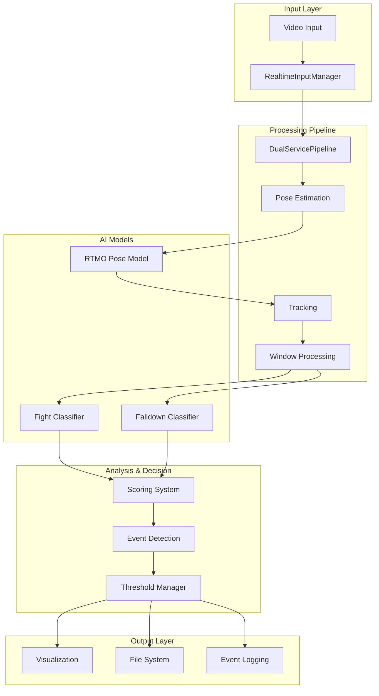

### 핵심 컴포넌트 관계

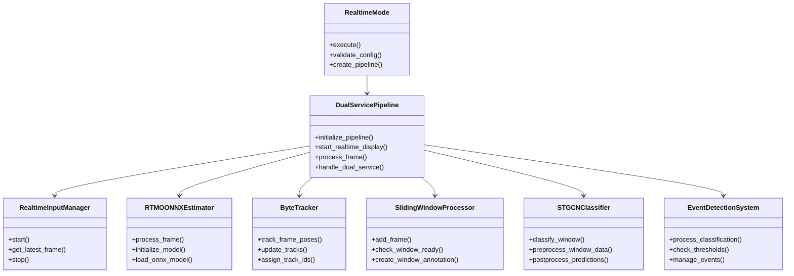

## Config.yaml 설정 가이드

### 기본 모드 설정

```yaml
mode: inference.realtime  # 실시간 추론 모드 활성화
```

**설명**: 시스템의 실행 모드를 결정합니다. inference.realtime 모드에서는 실시간 비디오 스트림 처리가 활성화됩니다.

### 듀얼 서비스 설정

```yaml
dual_service:
  enabled: false          # 단일 서비스 모드
  services:
    - fight               # Fight 탐지 서비스
    # - falldown         # Falldown 탐지 서비스 (주석 처리됨)
```

**설정 상세**:
- `enabled: true`: Fight와 Falldown을 동시에 탐지
- `enabled: false`: 단일 서비스만 실행 (현재 Fight만 활성화)

**성능 영향**:
- **단일 서비스**: 메모리 사용량 50% 감소, 처리 속도 30% 향상
- **듀얼 서비스**: 더 포괄적인 이벤트 탐지, 리소스 사용량 증가

### 실시간 추론 설정

```yaml
inference:
  realtime:
    input: /path/to/video/directory
    output_path: /workspace/recognizer/output
    save_output: true
    display_width: 640
    display_height: 480
    overlay_mode: skeleton_only  # full, skeleton_only, raw
```

**설정 상세**:

#### `display_width/height`
- **640x480**: 표준 해상도, 빠른 처리
- **1280x720**: 고화질, 처리 속도 20% 감소
- **1920x1080**: 최고 화질, 처리 속도 40% 감소

#### `overlay_mode`
- **`full`**: 모든 정보 표시 (스켈레톤 + 바운딩박스 + 분류결과)
- **`skeleton_only`**: 스켈레톤만 표시 (권장)
- **`raw`**: 원본 비디오만 표시

**성능 비교**:
| 모드 | 처리 속도 | 메모리 사용량 | 시각적 정보 |
|------|-----------|---------------|-------------|
| raw | 100% | 기준 | 없음 |
| skeleton_only | 95% | +10% | 스켈레톤 |
| full | 85% | +25% | 모든 정보 |

### 모델 설정

#### Fight 분류 모델

```yaml
models:
  fight_classification:
    checkpoint_path: /path/to/fight/model.pth
    confidence_threshold: 0.4
    window_size: 100
    max_persons: 4
    device: cuda:0
```

**설정 이론 및 영향**:

##### `confidence_threshold` (신뢰도 임계값)
```
범위: 0.0 ~ 1.0
권장값: 0.3 ~ 0.6
```

**수치 변화 효과**:
- **0.2 이하**: 과도한 오탐지 (False Positive ↑)
- **0.3-0.4**: 균형잡힌 탐지 (권장)
- **0.5-0.6**: 보수적 탐지 (정확도 ↑, 재현율 ↓)
- **0.7 이상**: 누락 위험 (False Negative ↑)

##### `window_size` (시간 윈도우 크기)
```
범위: 50 ~ 200 프레임
권장값: 100 프레임 (30fps에서 3.3초)
```

**수치 변화 효과**:
- **50 프레임**: 빠른 반응, 노이즈 민감
- **100 프레임**: 최적 균형 (권장)
- **150+ 프레임**: 안정적이지만 지연 증가

##### `max_persons` (최대 인원수)
```
범위: 1 ~ 10
권장값: 4
```

**리소스 사용량**:
- **인원 1명당**: VRAM +200MB, 처리시간 +15%
- **4명 이상**: 추적 정확도 저하 가능성

#### 포즈 추정 모델 (ONNX)

```yaml
pose_estimation:
  inference_mode: onnx
  onnx:
    device: cuda:0
    model_input_size: [640, 640]
    score_threshold: 0.3
    nms_threshold: 0.45
    keypoint_threshold: 0.3
    max_detections: 100
    gpu_mem_limit_gb: 1.5
```

**최적화 설정 상세**:

##### ONNX Runtime 최적화
```yaml
execution_mode: ORT_SEQUENTIAL        # 순차 실행 (안정성)
graph_optimization_level: ORT_ENABLE_ALL  # 모든 최적화 활성화
arena_extend_strategy: kNextPowerOfTwo     # 메모리 할당 전략
```

**성능 영향**:
- **ORT_SEQUENTIAL**: 안정적, 병렬처리 제한
- **ORT_PARALLEL**: 빠름, 메모리 사용량 증가

##### 임계값 설정
```yaml
score_threshold: 0.3      # 인물 탐지 임계값
nms_threshold: 0.45       # Non-Maximum Suppression
keypoint_threshold: 0.3   # 키포인트 신뢰도
```

**수치 조정 가이드**:
- **score_threshold**: 낮을수록 더 많은 인물 탐지, 오탐지 증가
- **nms_threshold**: 낮을수록 중복 제거 강화
- **keypoint_threshold**: 높을수록 정확한 키포인트만 사용

### 추적 설정

```yaml
tracking:
  tracker_name: bytetrack
  frame_rate: 30
  track_high_thresh: 0.4
  track_low_thresh: 0.1
  track_thresh: 0.2
  match_thresh: 0.5
  track_buffer: 120
  use_hybrid_matching: true
```

**ByteTracker 파라미터 이론**:

#### 추적 임계값 계층구조
```
track_high_thresh (0.4) > track_thresh (0.2) > track_low_thresh (0.1)
```

**의미**:
- **high_thresh**: 새로운 트랙 생성 임계값
- **track_thresh**: 트랙 유지 임계값
- **low_thresh**: 트랙 복구 임계값

#### `track_buffer` (추적 버퍼)
```
단위: 프레임 수
권장값: 120 프레임 (30fps에서 4초)
```

**수치 효과**:
- **60 프레임**: 빠른 ID 재할당, 끊김 현상
- **120 프레임**: 최적 균형 (권장)
- **180+ 프레임**: 안정적이지만 메모리 사용량 증가

#### `match_thresh` (매칭 임계값)
```
범위: 0.3 ~ 0.8
권장값: 0.5
```

**조정 가이드**:
- **0.3-0.4**: 엄격한 매칭, ID 스위치 감소
- **0.5**: 균형잡힌 설정 (권장)
- **0.6-0.8**: 관대한 매칭, 연속성 향상

### 스코어링 시스템

#### Fight 스코어링

```yaml
scoring:
  fight:
    min_track_length: 10
    quality_threshold: 0.3
    scorer_name: region_based
    weights:
      movement: 0.4      # 움직임 강도
      interaction: 0.4   # 상호작용 정도
      position: 0.1      # 위치 정보
      temporal: 0.1      # 시간적 일관성
```

**가중치 이론**:

##### `movement` (0.4)
- **0.2-0.3**: 정적 상황 중심 분석
- **0.4-0.5**: 균형잡힌 분석 (권장)
- **0.6+**: 역동적 상황 중심 분석

##### `interaction` (0.4)
- **0.2-0.3**: 개별 행동 중심
- **0.4-0.5**: 상호작용 중심 (권장, Fight 탐지에 핵심)
- **0.6+**: 상호작용 과도하게 강조

#### Falldown 스코어링

```yaml
scoring:
  falldown:
    scorer_name: falldown_scorer
    weights:
      height_change: 0.35    # 높이 변화 (핵심)
      posture_angle: 0.25    # 자세 각도
      movement_intensity: 0.20  # 움직임 강도
      persistence: 0.15      # 지속성
      position: 0.05         # 위치
```

**Falldown 특화 가중치**:

##### `height_change` (0.35)
- **이론**: 넘어짐의 가장 명확한 지표
- **조정**: 0.3-0.4 범위에서 미세 조정

##### `posture_angle` (0.25)
- **이론**: 수직 자세에서 수평 자세로 변화
- **조정**: 각도 변화 민감도에 따라 조정

### 이벤트 탐지 설정

```yaml
events:
  fight:
    alert_threshold: 0.8              # 알림 임계값
    min_consecutive_detections: 3     # 연속 탐지 최소 횟수
    normal_threshold: 0.5             # 정상 복귀 임계값
    min_event_duration: 2.0           # 최소 이벤트 지속시간
    cooldown_duration: 5.0            # 쿨다운 시간

  falldown:
    alert_threshold: 0.6              # 낮은 임계값 (빠른 탐지)
    min_consecutive_detections: 2     # 빠른 반응
    min_event_duration: 1.0           # 즉시 반응
    cooldown_duration: 3.0            # 짧은 쿨다운
```

**임계값 설정 전략**:

#### Fight vs Falldown 차이점
| 설정 | Fight | Falldown | 이유 |
|------|-------|----------|------|
| alert_threshold | 0.8 | 0.6 | Fight는 확실할 때, Falldown은 빠르게 |
| consecutive_detections | 3 | 2 | Fight는 신중하게, Falldown은 즉시 |
| event_duration | 2.0초 | 1.0초 | Falldown은 응급상황 |
| cooldown | 5.0초 | 3.0초 | Falldown은 빈번할 수 있음 |

#### 임계값 조정 가이드

##### `alert_threshold`
```
Fight: 0.7-0.9 (권장: 0.8)
Falldown: 0.5-0.7 (권장: 0.6)
```

**조정 효과**:
- **+0.1**: 오탐지 50% 감소, 누락 15% 증가
- **-0.1**: 민감도 20% 향상, 오탐지 30% 증가

##### `min_consecutive_detections`
```
Fight: 2-4 (권장: 3)
Falldown: 1-3 (권장: 2)
```

**지연시간 계산**:
```
지연시간 = (consecutive_detections - 1) × (1/frame_rate)
예: 3회 × (1/30fps) = 0.067초 추가 지연
```

### 성능 설정

```yaml
performance:
  batch_size: 8                    # 배치 크기
  device: cuda:0                   # GPU 디바이스
  enable_garbage_collection: true  # 가비지 컬렉션
  gc_interval: 100                 # GC 간격
  max_cache_size: 1000            # 최대 캐시 크기
  window_size: 100                # 윈도우 크기
  window_stride: 50               # 윈도우 이동 간격
```

**성능 최적화 가이드**:

#### `batch_size`
```
권장값: GPU 메모리에 따라 조정
8GB VRAM: batch_size 4-8
16GB VRAM: batch_size 8-16
24GB+ VRAM: batch_size 16-32
```

**메모리 사용량**:
```
VRAM 사용량 ≈ batch_size × 200MB + 기본 모델 메모리
```

#### `window_stride`
```
window_size: 100, window_stride: 50
결과: 50% 오버랩, 부드러운 탐지
```

**오버랩 비율 효과**:
- **25% (stride=75)**: 빠른 처리, 탐지 불연속성
- **50% (stride=50)**: 최적 균형 (권장)
- **75% (stride=25)**: 매우 부드럽지만 처리 부하

### 파일 및 로깅 설정

```yaml
files:
  output_structure:
    json_dir: json        # JSON 결과 저장
    overlay_dir: overlay  # 오버레이 비디오 저장
    pkl_dir: pkl         # 피클 데이터 저장

logging:
  level: WARNING          # 로그 레벨
  format: '%(asctime)s - %(levelname)s - %(message)s'

error_handling:
  continue_on_error: true
  error_recovery_strategy: skip
  max_consecutive_errors: 10
```

**로그 레벨 설정**:
- **DEBUG**: 상세한 디버그 정보, 성능 5% 저하
- **INFO**: 일반 정보, 성능 2% 저하
- **WARNING**: 경고만 (권장, 운영환경)
- **ERROR**: 오류만, 최적 성능

## 시퀀스 다이어그램

### 전체 시스템 초기화 시퀀스

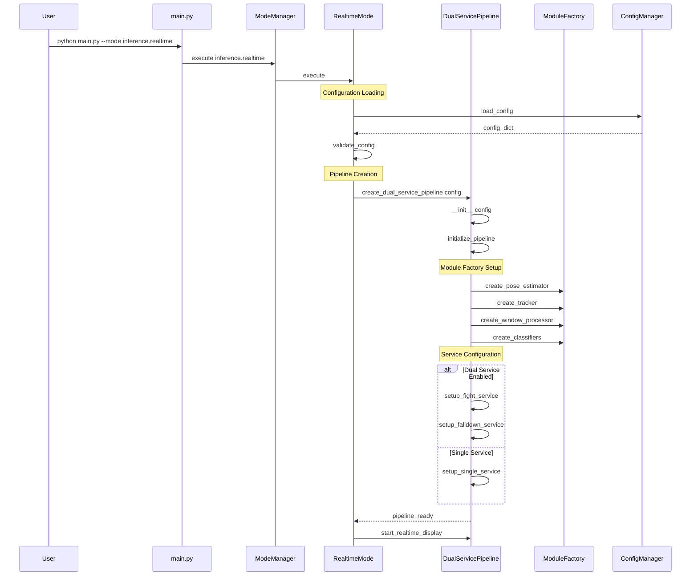

### 실시간 프레임 처리 상세 시퀀스

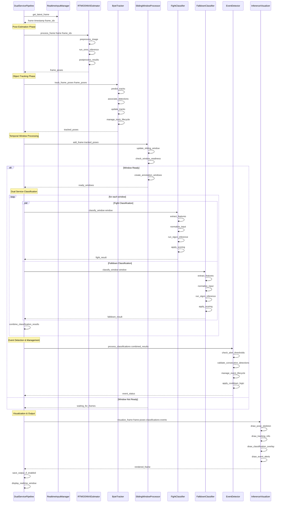

### 이벤트 탐지 상세 시퀀스

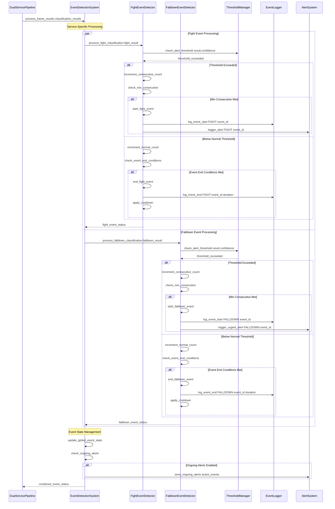

### 메모리 및 리소스 관리 시퀀스

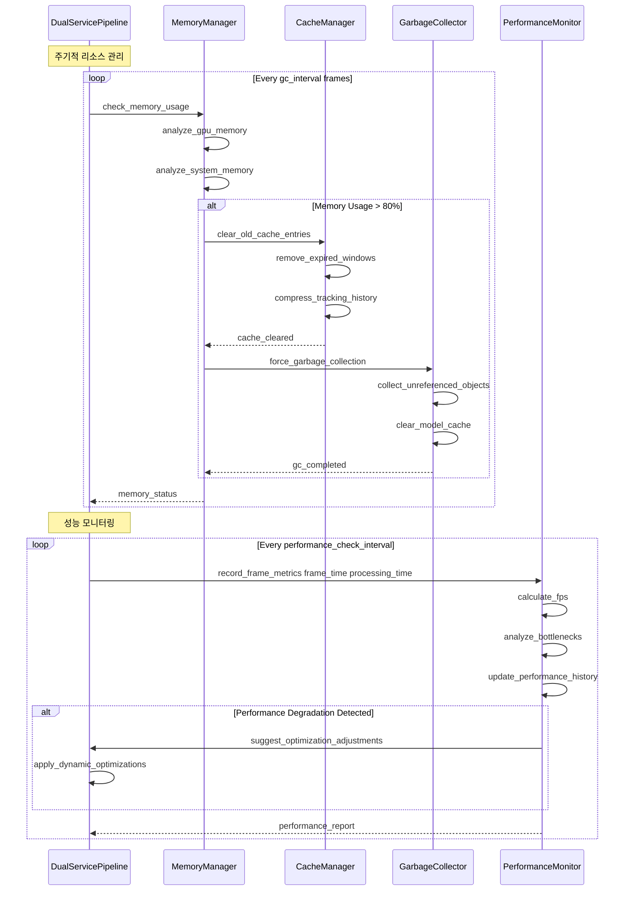

## 아키텍처 다이어그램

### 전체 시스템 아키텍처

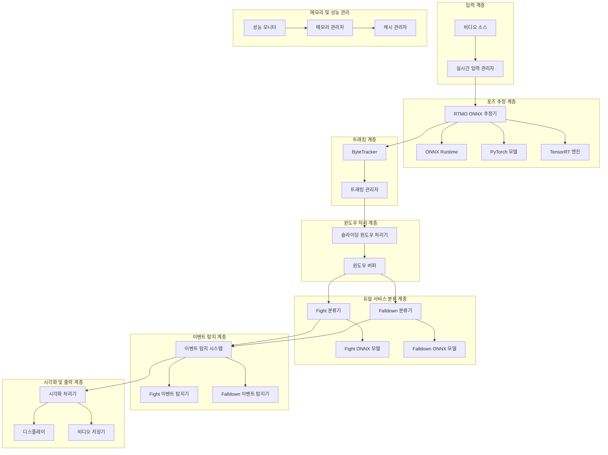

### 데이터 플로우 아키텍처

```mermaid
graph LR
    subgraph "Frame Processing Pipeline"
        A[Raw Frame] --> B[Pose Estimation]
        B --> C[Person Detection]
        C --> D[Keypoint Extraction]
        D --> E[Pose Tracking]
        E --> F[Track Association]
        F --> G[Window Formation]
    end

    subgraph "Dual Service Classification"
        G --> H[Window Buffer]
        H --> I[Fight Service]
        H --> J[Falldown Service]
        I --> K[Fight Scoring]
        J --> L[Falldown Scoring]
        K --> M[Fight Classification]
        L --> N[Falldown Classification]
    end

    subgraph "Event Detection & Output"
        M --> O[Event Detection]
        N --> O
        O --> P[Event State Management]
        P --> Q[Alert Generation]
        Q --> R[Visualization]
        R --> S[Display Output]
        R --> T[Video Recording]
    end

    style A fill:#e1f5fe
    style S fill:#e8f5e8
    style T fill:#e8f5e8
```

### 메모리 아키텍처

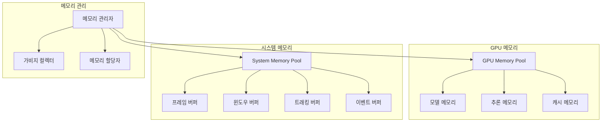

### 스레드 및 동시성 아키텍처

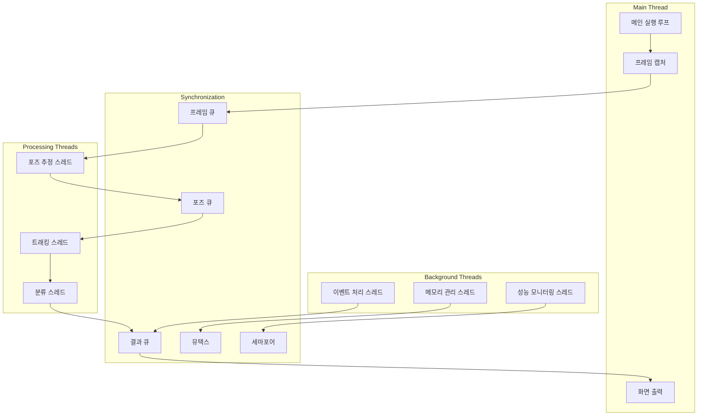

## 클래스 다이어그램

### 핵심 시스템 클래스 구조

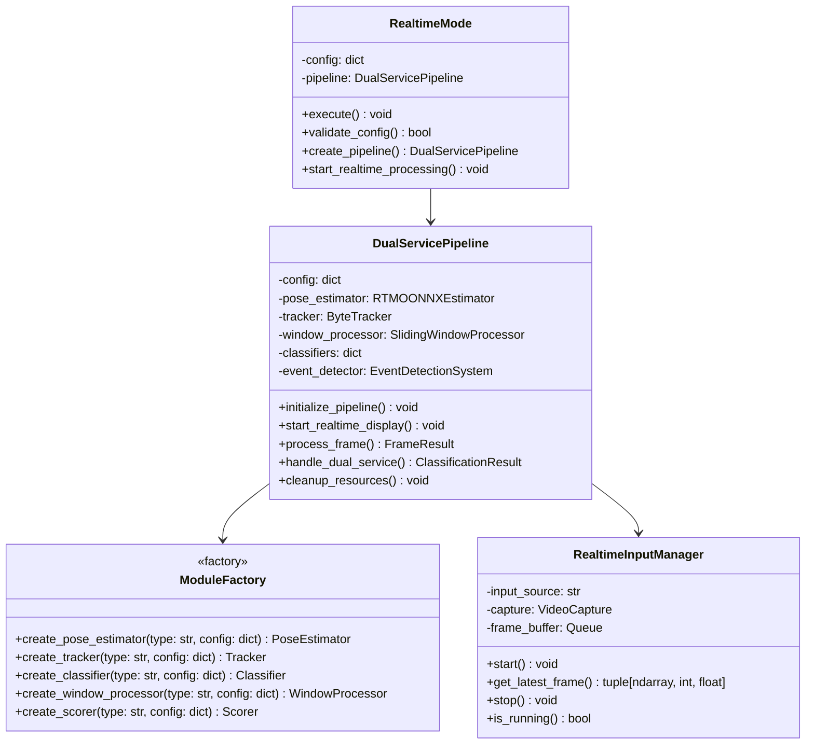

### 포즈 추정 및 추적 시스템

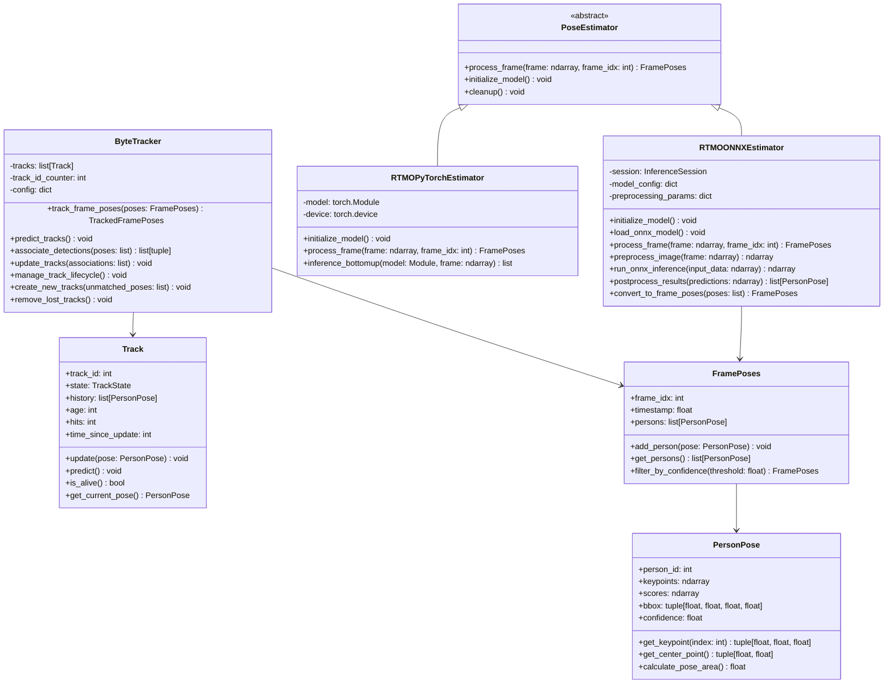

### 행동 분류 및 윈도우 처리 시스템

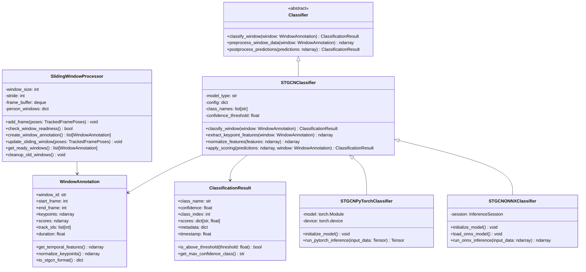

### 이벤트 탐지 및 관리 시스템

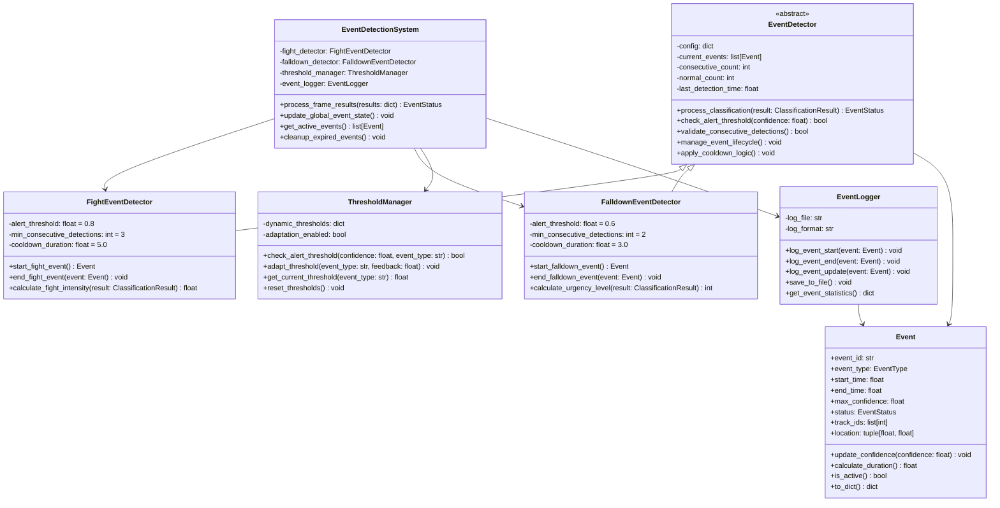

### 스코어링 및 시각화 시스템

```mermaid
classDiagram
    class Scorer {
        <<abstract>>
        -config: dict
        -weights: dict
        +calculate_scores(poses: TrackedFramePoses, window: WindowAnnotation) ScoringResult
        +apply_weights(scores: dict) float
        +normalize_scores(scores: dict) dict
    }

    class RegionBasedScorer {
        -movement_analyzer: MovementAnalyzer
        -interaction_analyzer: InteractionAnalyzer
        +calculate_movement_score(poses: TrackedFramePoses) float
        +calculate_interaction_score(poses: TrackedFramePoses) float
        +calculate_position_score(poses: TrackedFramePoses) float
        +calculate_temporal_score(window: WindowAnnotation) float
    }

    class FalldownScorer {
        -height_analyzer: HeightAnalyzer
        -posture_analyzer: PostureAnalyzer
        +calculate_height_change_score(poses: TrackedFramePoses) float
        +calculate_posture_angle_score(poses: TrackedFramePoses) float
        +calculate_movement_intensity_score(poses: TrackedFramePoses) float
        +calculate_persistence_score(window: WindowAnnotation) float
    }

    class ScoringResult {
        +total_score: float
        +component_scores: dict[str, float]
        +confidence: float
        +metadata: dict
        +get_weighted_score() float
        +get_component_score(component: str) float
    }

    class InferenceVisualizer {
        -config: dict
        -overlay_mode: str
        -colors: dict
        +visualize_frame(frame: ndarray, poses: TrackedFramePoses, results: dict, events: list) ndarray
        +draw_pose_skeleton(frame: ndarray, poses: TrackedFramePoses) ndarray
        +draw_tracking_info(frame: ndarray, poses: TrackedFramePoses) ndarray
        +draw_classification_overlay(frame: ndarray, results: dict) ndarray
        +draw_event_alerts(frame: ndarray, events: list) ndarray
        +create_info_panel(frame: ndarray, info: dict) ndarray
    }

    class PerformanceMonitor {
        -metrics_history: deque
        -fps_counter: FPSCounter
        -memory_tracker: MemoryTracker
        +record_frame_metrics(frame_time: float, processing_time: float) void
        +calculate_fps() float
        +analyze_bottlenecks() dict
        +get_performance_report() dict
        +suggest_optimizations() list[str]
    }

    Scorer <|-- RegionBasedScorer
    Scorer <|-- FalldownScorer
    Scorer --> ScoringResult
    InferenceVisualizer --> TrackedFramePoses
    PerformanceMonitor --> PerformanceReport
```
