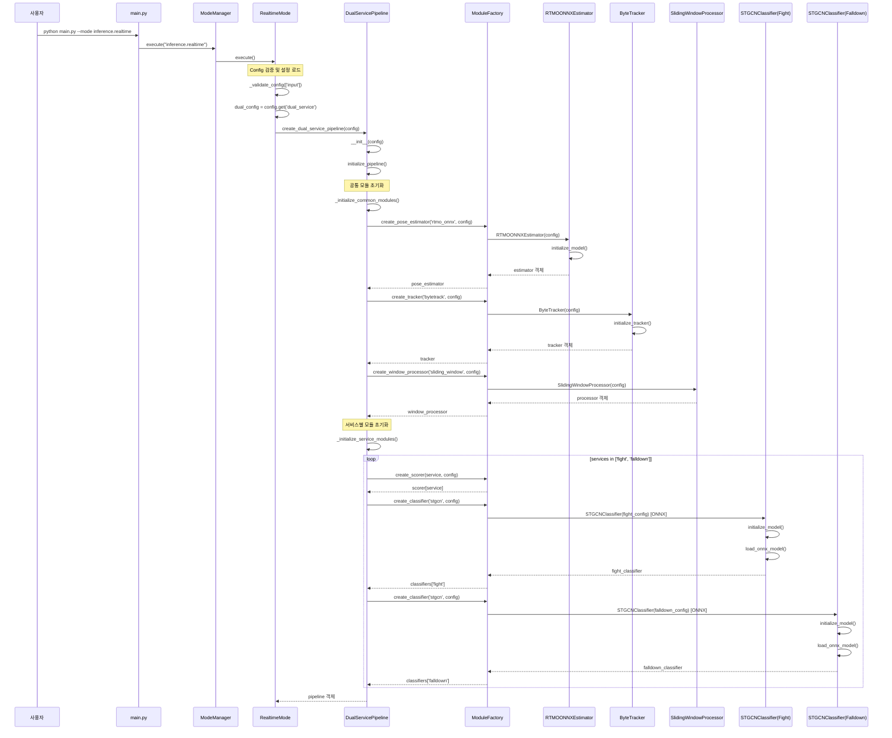
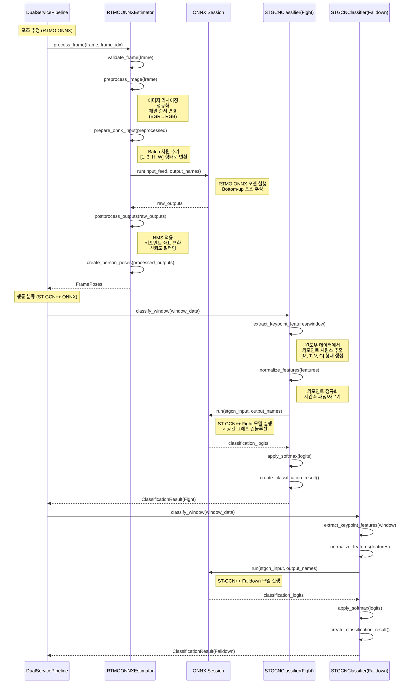
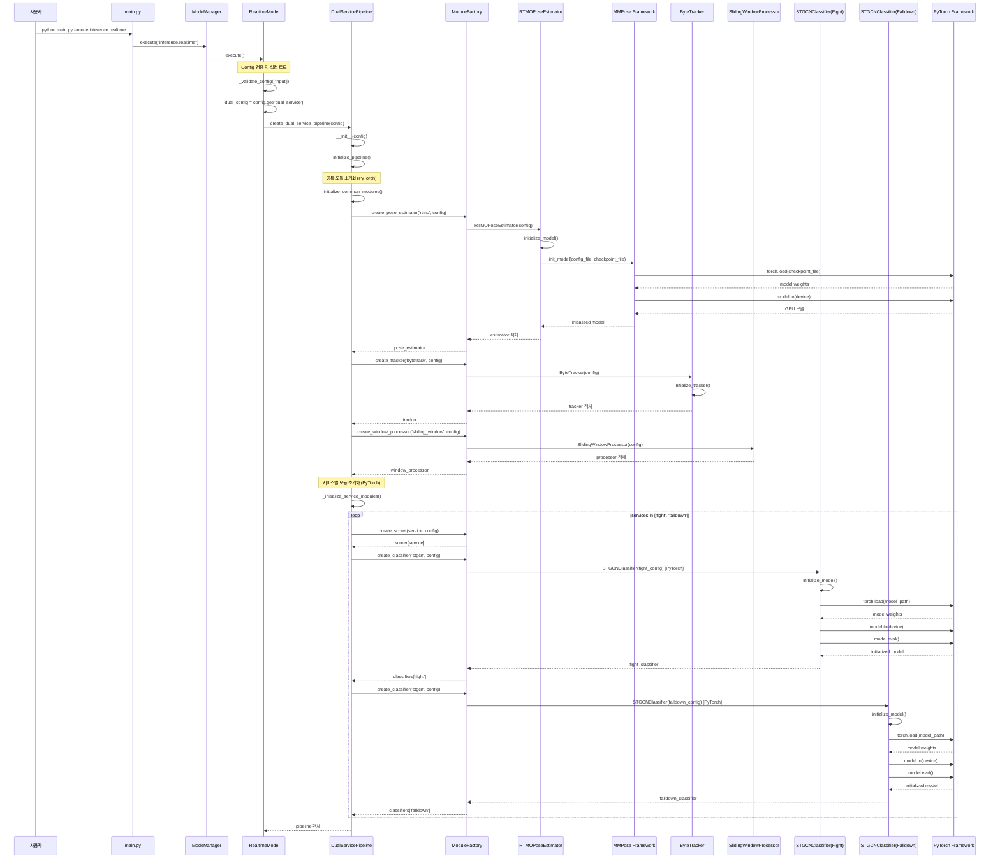
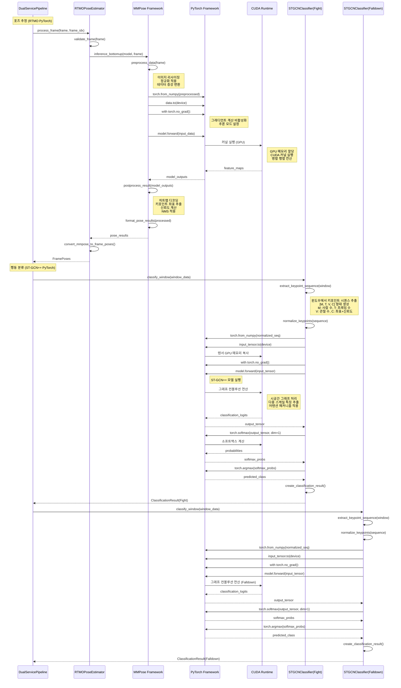

# Inference.Realtime 모드 시퀀스 다이어그램

## 개요

이 문서는 inference.realtime 모드의 상세한 시퀀스 다이어그램을 ONNX와 PyTorch 적용 케이스로 구분하여 제공합니다.

## ONNX 적용 시 시퀀스 다이어그램

### 1. 시스템 초기화 및 파이프라인 설정



### 2. 실시간 처리 루프 (ONNX 기반)

```mermaid
sequenceDiagram
    participant RealtimeMode as RealtimeMode
    participant DualPipeline as DualServicePipeline
    participant InputManager as RealtimeInputManager
    participant RTMOEstimator as RTMOONNXEstimator
    participant ONNXRuntime as ONNX Runtime
    participant ByteTracker as ByteTracker
    participant WindowProcessor as SlidingWindowProcessor
    participant FightClassifier as STGCNClassifier(Fight)
    participant FalldownClassifier as STGCNClassifier(Falldown)
    participant Visualizer as InferenceVisualizer
    participant CV2 as OpenCV Display

    RealtimeMode->>DualPipeline: start_realtime_display()
    DualPipeline->>InputManager: RealtimeInputManager(input_source)
    DualPipeline->>InputManager: start()
    InputManager-->>DualPipeline: capture 시작 완료

    DualPipeline->>Visualizer: InferenceVisualizer()
    DualPipeline->>CV2: cv2.namedWindow()

    loop 실시간 프레임 처리
        DualPipeline->>InputManager: get_latest_frame()
        InputManager-->>DualPipeline: frame, frame_idx, timestamp

        Note over DualPipeline: 프레임 처리 시작
        DualPipeline->>DualPipeline: frame_idx += 1

        Note over DualPipeline,ONNXRuntime: POSE ESTIMATION (ONNX)
        DualPipeline->>RTMOEstimator: process_frame(frame, frame_idx)
        RTMOEstimator->>RTMOEstimator: preprocess_frame(frame)
        RTMOEstimator->>ONNXRuntime: session.run(input_data)
        ONNXRuntime-->>RTMOEstimator: pose_predictions
        RTMOEstimator->>RTMOEstimator: postprocess_results(predictions)
        RTMOEstimator->>RTMOEstimator: convert_to_frame_poses()
        RTMOEstimator-->>DualPipeline: FramePoses 객체

        Note over DualPipeline: TRACKING
        DualPipeline->>ByteTracker: track_frame_poses(frame_poses)
        ByteTracker->>ByteTracker: update_tracks(detections)
        ByteTracker->>ByteTracker: assign_track_ids()
        ByteTracker-->>DualPipeline: tracked_frame_poses

        Note over DualPipeline: WINDOW PROCESSING
        DualPipeline->>WindowProcessor: add_frame(tracked_frame_poses)
        WindowProcessor->>WindowProcessor: check_window_ready()

        alt 윈도우 준비 완료
            WindowProcessor->>WindowProcessor: create_window_annotation()
            WindowProcessor-->>DualPipeline: ready_windows[]

            loop window in ready_windows
                Note over DualPipeline: DUAL SERVICE CLASSIFICATION
                DualPipeline->>DualPipeline: process_window_dual_service(window)

                Note over DualPipeline: Fight Service Processing
                DualPipeline->>DualPipeline: _extract_tracked_poses_from_window()
                DualPipeline->>DualPipeline: calculate_scores(tracked_poses)
                DualPipeline->>DualPipeline: _apply_scores_to_window()

                DualPipeline->>FightClassifier: classify_window(scored_window)
                FightClassifier->>FightClassifier: preprocess_window_data()
                FightClassifier->>ONNXRuntime: session.run(stgcn_input) [Fight ONNX]
                ONNXRuntime-->>FightClassifier: fight_predictions
                FightClassifier->>FightClassifier: postprocess_predictions()
                FightClassifier-->>DualPipeline: fight_classification_result

                Note over DualPipeline: Falldown Service Processing
                DualPipeline->>DualPipeline: _extract_tracked_poses_from_window()
                DualPipeline->>DualPipeline: calculate_scores(tracked_poses)
                DualPipeline->>DualPipeline: _apply_scores_to_window()

                DualPipeline->>FalldownClassifier: classify_window(scored_window)
                FalldownClassifier->>FalldownClassifier: preprocess_window_data()
                FalldownClassifier->>ONNXRuntime: session.run(stgcn_input) [Falldown ONNX]
                ONNXRuntime-->>FalldownClassifier: falldown_predictions
                FalldownClassifier->>FalldownClassifier: postprocess_predictions()
                FalldownClassifier-->>DualPipeline: falldown_classification_result

                DualPipeline->>DualPipeline: create_dual_classification_result()
                DualPipeline->>DualPipeline: latest_classification_result = result
            end
        else 윈도우 미준비
            WindowProcessor-->>DualPipeline: []
        end

        Note over DualPipeline: VISUALIZATION
        DualPipeline->>Visualizer: visualize_frame(frame, poses, classification)
        Visualizer->>Visualizer: draw_keypoints()
        Visualizer->>Visualizer: draw_bboxes()
        Visualizer->>Visualizer: draw_tracking_ids()
        Visualizer->>Visualizer: draw_classification_overlay()
        Visualizer-->>DualPipeline: display_frame

        DualPipeline->>CV2: cv2.imshow(window_name, display_frame)
        DualPipeline->>CV2: cv2.waitKey(1)

        alt 비디오 저장 모드
            DualPipeline->>CV2: video_writer.write(display_frame)
        end

        alt ESC 키 입력 또는 영상 종료
            break 루프 종료
        end
    end

    DualPipeline->>InputManager: stop()
    DualPipeline->>CV2: cv2.destroyAllWindows()
    DualPipeline-->>RealtimeMode: 처리 완료
```

### 3. ONNX 모델 추론 상세 과정



## PyTorch 적용 시 시퀀스 다이어그램

### 1. 시스템 초기화 및 파이프라인 설정 (PyTorch)



### 2. 실시간 처리 루프 (PyTorch 기반)

```mermaid
sequenceDiagram
    participant RealtimeMode as RealtimeMode
    participant DualPipeline as DualServicePipeline
    participant InputManager as RealtimeInputManager
    participant RTMOEstimator as RTMOPoseEstimator
    participant MMPose as MMPose Framework
    participant PyTorch as PyTorch Framework
    participant ByteTracker as ByteTracker
    participant WindowProcessor as SlidingWindowProcessor
    participant FightClassifier as STGCNClassifier(Fight)
    participant FalldownClassifier as STGCNClassifier(Falldown)
    participant Visualizer as InferenceVisualizer
    participant CV2 as OpenCV Display

    RealtimeMode->>DualPipeline: start_realtime_display()
    DualPipeline->>InputManager: RealtimeInputManager(input_source)
    DualPipeline->>InputManager: start()
    InputManager-->>DualPipeline: capture 시작 완료

    DualPipeline->>Visualizer: InferenceVisualizer()
    DualPipeline->>CV2: cv2.namedWindow()

    loop 실시간 프레임 처리
        DualPipeline->>InputManager: get_latest_frame()
        InputManager-->>DualPipeline: frame, frame_idx, timestamp

        Note over DualPipeline: 프레임 처리 시작
        DualPipeline->>DualPipeline: frame_idx += 1

        Note over DualPipeline,PyTorch: POSE ESTIMATION (PyTorch)
        DualPipeline->>RTMOEstimator: process_frame(frame, frame_idx)
        RTMOEstimator->>RTMOEstimator: validate_frame(frame)
        RTMOEstimator->>MMPose: inference_bottomup(model, frame)
        MMPose->>MMPose: preprocess_image(frame)
        Note right of MMPose: 이미지 전처리<br/>정규화 및 크기 조정
        MMPose->>PyTorch: model.forward(preprocessed_frame)
        Note right of PyTorch: GPU에서 forward pass<br/>CUDA 연산 수행
        PyTorch-->>MMPose: pose_predictions
        MMPose->>MMPose: postprocess_results(predictions)
        Note right of MMPose: NMS 적용<br/>키포인트 좌표 변환<br/>신뢰도 필터링
        MMPose-->>RTMOEstimator: pose_results
        RTMOEstimator->>RTMOEstimator: convert_to_frame_poses(pose_results)
        RTMOEstimator-->>DualPipeline: FramePoses 객체

        Note over DualPipeline: TRACKING
        DualPipeline->>ByteTracker: track_frame_poses(frame_poses)
        ByteTracker->>ByteTracker: update_tracks(detections)
        ByteTracker->>ByteTracker: assign_track_ids()
        ByteTracker-->>DualPipeline: tracked_frame_poses

        Note over DualPipeline: WINDOW PROCESSING
        DualPipeline->>WindowProcessor: add_frame(tracked_frame_poses)
        WindowProcessor->>WindowProcessor: check_window_ready()

        alt 윈도우 준비 완료
            WindowProcessor->>WindowProcessor: create_window_annotation()
            WindowProcessor-->>DualPipeline: ready_windows[]

            loop window in ready_windows
                Note over DualPipeline: DUAL SERVICE CLASSIFICATION
                DualPipeline->>DualPipeline: process_window_dual_service(window)

                Note over DualPipeline: Fight Service Processing (PyTorch)
                DualPipeline->>DualPipeline: _extract_tracked_poses_from_window()
                DualPipeline->>DualPipeline: calculate_scores(tracked_poses)
                DualPipeline->>DualPipeline: _apply_scores_to_window()

                DualPipeline->>FightClassifier: classify_window(scored_window)
                FightClassifier->>FightClassifier: preprocess_window_data()
                FightClassifier->>PyTorch: torch.tensor(window_data)
                PyTorch-->>FightClassifier: input_tensor
                FightClassifier->>PyTorch: input_tensor.to(device)
                FightClassifier->>PyTorch: model(input_tensor) [Fight PyTorch]
                Note right of PyTorch: GPU에서 ST-GCN++ 실행<br/>그래디언트 계산 비활성화
                PyTorch-->>FightClassifier: output_tensor
                FightClassifier->>PyTorch: torch.softmax(output_tensor)
                PyTorch-->>FightClassifier: probabilities
                FightClassifier->>FightClassifier: create_classification_result()
                FightClassifier-->>DualPipeline: fight_classification_result

                Note over DualPipeline: Falldown Service Processing (PyTorch)
                DualPipeline->>DualPipeline: _extract_tracked_poses_from_window()
                DualPipeline->>DualPipeline: calculate_scores(tracked_poses)
                DualPipeline->>DualPipeline: _apply_scores_to_window()

                DualPipeline->>FalldownClassifier: classify_window(scored_window)
                FalldownClassifier->>FalldownClassifier: preprocess_window_data()
                FalldownClassifier->>PyTorch: torch.tensor(window_data)
                PyTorch-->>FalldownClassifier: input_tensor
                FalldownClassifier->>PyTorch: input_tensor.to(device)
                FalldownClassifier->>PyTorch: model(input_tensor) [Falldown PyTorch]
                Note right of PyTorch: GPU에서 ST-GCN++ 실행
                PyTorch-->>FalldownClassifier: output_tensor
                FalldownClassifier->>PyTorch: torch.softmax(output_tensor)
                PyTorch-->>FalldownClassifier: probabilities
                FalldownClassifier->>FalldownClassifier: create_classification_result()
                FalldownClassifier-->>DualPipeline: falldown_classification_result

                DualPipeline->>DualPipeline: create_dual_classification_result()
                DualPipeline->>DualPipeline: latest_classification_result = result
            end
        else 윈도우 미준비
            WindowProcessor-->>DualPipeline: []
        end

        Note over DualPipeline: VISUALIZATION
        DualPipeline->>Visualizer: visualize_frame(frame, poses, classification)
        Visualizer->>Visualizer: draw_keypoints()
        Visualizer->>Visualizer: draw_bboxes()
        Visualizer->>Visualizer: draw_tracking_ids()
        Visualizer->>Visualizer: draw_classification_overlay()
        Visualizer-->>DualPipeline: display_frame

        DualPipeline->>CV2: cv2.imshow(window_name, display_frame)
        DualPipeline->>CV2: cv2.waitKey(1)

        alt 비디오 저장 모드
            DualPipeline->>CV2: video_writer.write(display_frame)
        end

        alt ESC 키 입력 또는 영상 종료
            break 루프 종료
        end
    end

    DualPipeline->>InputManager: stop()
    DualPipeline->>CV2: cv2.destroyAllWindows()
    DualPipeline-->>RealtimeMode: 처리 완료
```

### 3. PyTorch 모델 추론 상세 과정



## ONNX vs PyTorch 비교 분석

### 성능 특성 비교

| 구분 | ONNX | PyTorch |
|------|------|---------|
| **초기화 시간** | 빠름 (모델 로딩만) | 느림 (프레임워크 초기화 + 모델 로딩) |
| **메모리 사용량** | 낮음 (최적화된 런타임) | 높음 (프레임워크 오버헤드) |
| **추론 속도** | 빠름 (최적화된 연산) | 중간 (동적 그래프 오버헤드) |
| **GPU 활용** | 최적화됨 | 우수 (네이티브 CUDA 지원) |
| **배포 용이성** | 매우 좋음 | 보통 (의존성 많음) |

### 기술적 차이점

#### ONNX 기반 처리
- **정적 그래프**: 컴파일 타임에 그래프 최적화
- **전용 런타임**: ONNX Runtime을 통한 최적화된 실행
- **플랫폼 독립성**: 다양한 하드웨어에서 일관된 성능
- **메모리 효율성**: 최소한의 메모리 오버헤드

#### PyTorch 기반 처리
- **동적 그래프**: 런타임에 그래프 구성 및 실행
- **프레임워크 통합**: MMPose와의 네이티브 통합
- **디버깅 용이성**: 풍부한 디버깅 도구와 프로파일링
- **확장성**: 새로운 모델과 기능의 쉬운 통합

### 사용 시나리오 권장사항

#### ONNX 권장 상황
- 프로덕션 환경 배포
- 제한된 하드웨어 리소스
- 높은 처리량이 필요한 경우
- 크로스 플랫폼 호환성이 중요한 경우

#### PyTorch 권장 상황
- 개발 및 실험 단계
- 모델 커스터마이징이 빈번한 경우
- 풍부한 디버깅 정보가 필요한 경우
- 새로운 기능 개발 및 테스트

## 결론

inference.realtime 모드는 ONNX와 PyTorch 두 가지 백엔드를 지원하여 다양한 배포 요구사항을 충족할 수 있습니다. ONNX는 프로덕션 환경에서의 성능과 효율성에 중점을 두고, PyTorch는 개발 단계에서의 유연성과 확장성을 제공합니다. 시스템의 전체적인 아키텍처는 동일하지만, 각 백엔드의 특성에 따라 모델 로딩, 추론 과정, 메모리 관리 방식에서 차이를 보입니다.