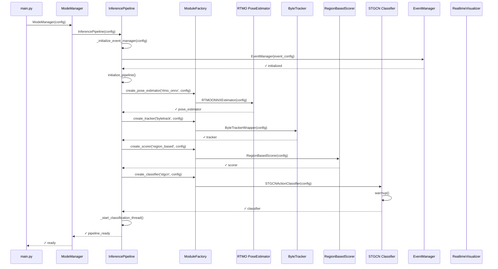
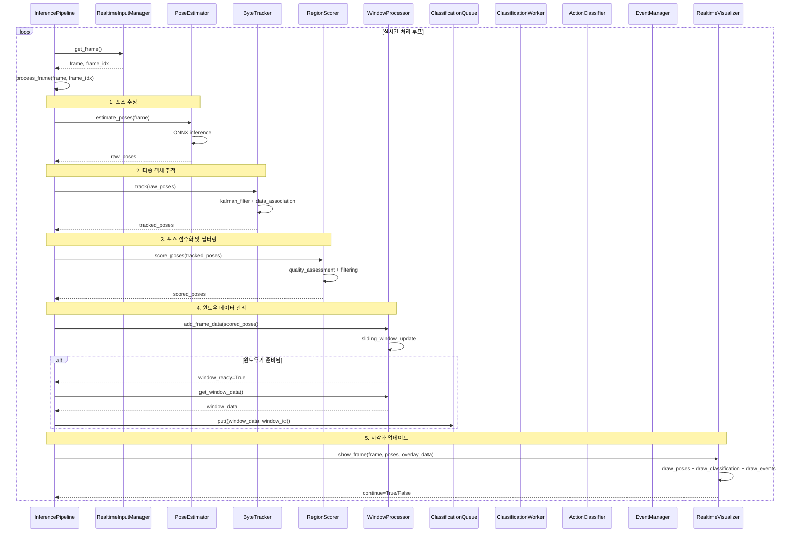
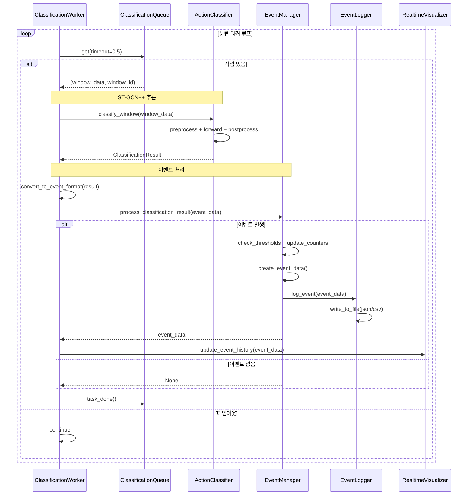
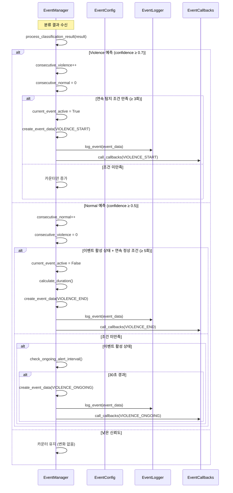
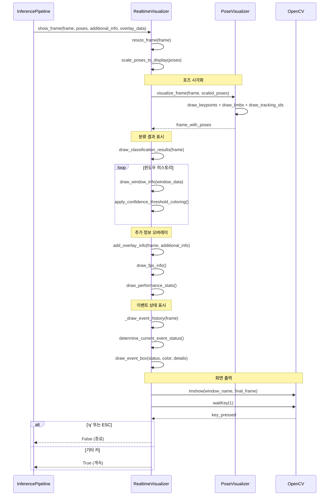
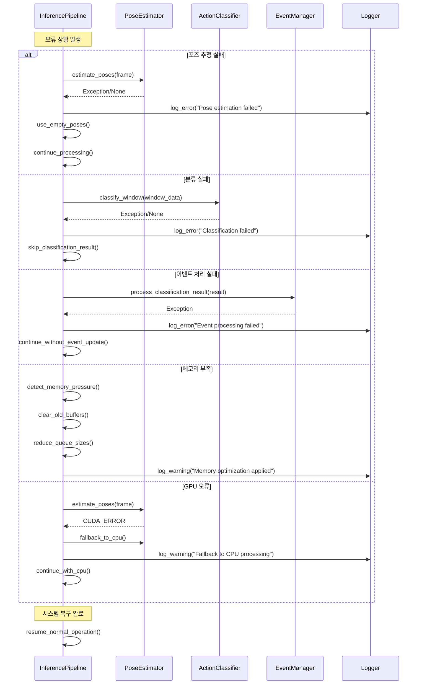
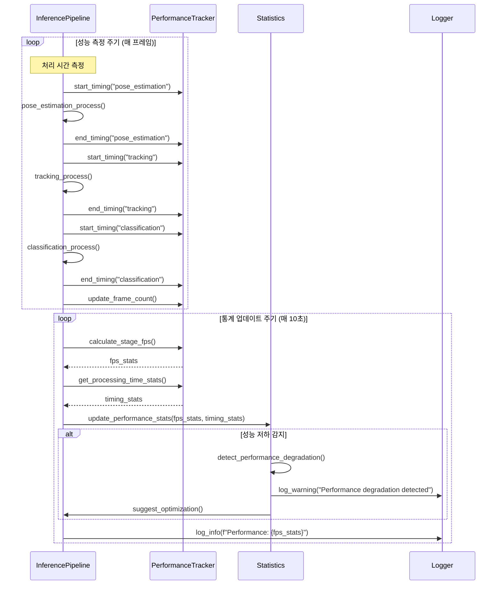
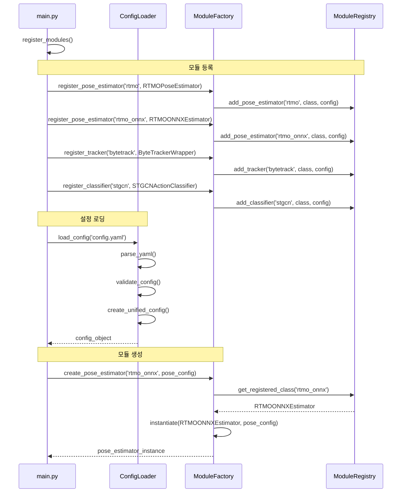
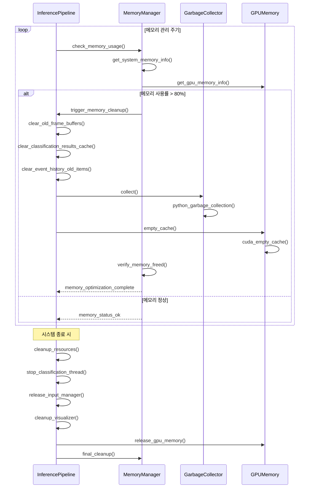

# 실시간 추론 시스템 시퀀스 다이어그램

## 개요

본 문서는 Violence Detection 실시간 추론 시스템의 상세한 시퀀스 다이어그램과 상호작용 흐름을 제공한다.

---

## 1. 전체 시스템 초기화 시퀀스

---

## 2. 실시간 처리 메인 루프

---

## 3. 비동기 분류 처리 시퀀스

---

## 4. 이벤트 생명주기 상세 시퀀스

---

## 5. 시각화 업데이트 시퀀스

---

## 6. 오류 처리 및 복구 시퀀스

---

## 7. 성능 모니터링 시퀀스

---

## 8. 설정 로딩 및 모듈 팩토리 시퀀스

---

## 9. 메모리 관리 및 리소스 정리 시퀀스

---

## 시퀀스 다이어그램 요약

### 주요 상호작용 패턴

1. **초기화 단계**: 순차적 모듈 로딩 및 설정
2. **실시간 처리**: 파이프라인 병렬 처리
3. **비동기 분류**: 큐 기반 백그라운드 처리
4. **이벤트 관리**: 상태 기반 이벤트 생명주기
5. **오류 처리**: 단계별 fallback 및 복구
6. **성능 모니터링**: 주기적 통계 수집 및 최적화

### 핵심 설계 원칙

- **비동기 처리**: 분류 작업의 독립적 실행
- **모듈 분리**: 각 컴포넌트의 독립성 보장
- **상태 관리**: 이벤트 및 성능 상태의 체계적 관리
- **오류 복구**: 단계별 fallback 메커니즘
- **리소스 최적화**: 동적 메모리 관리 및 정리