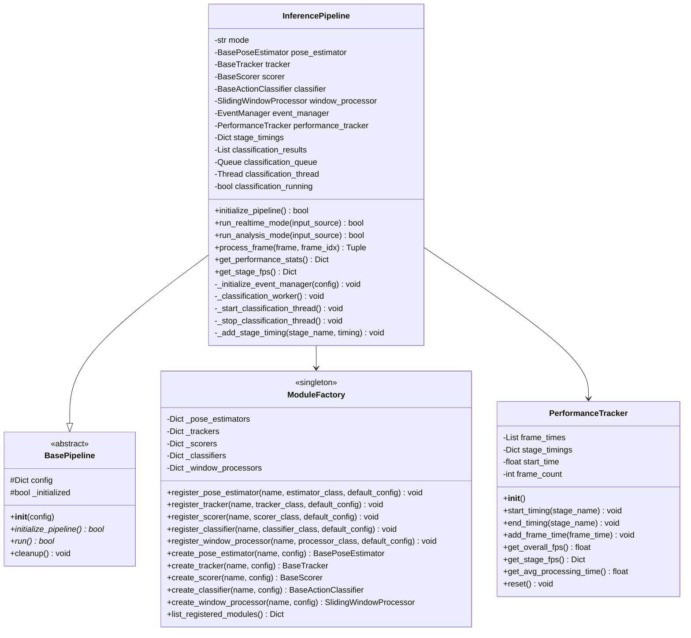
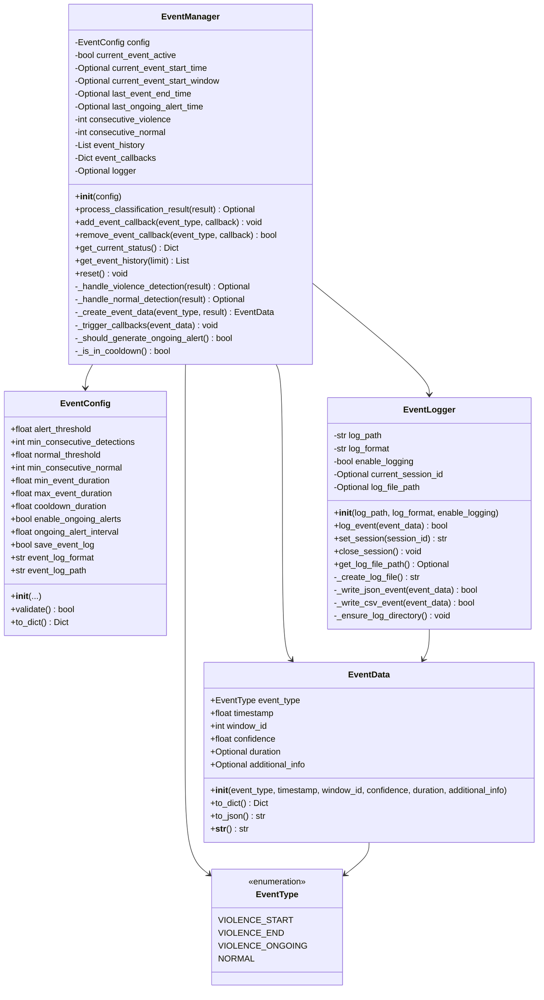
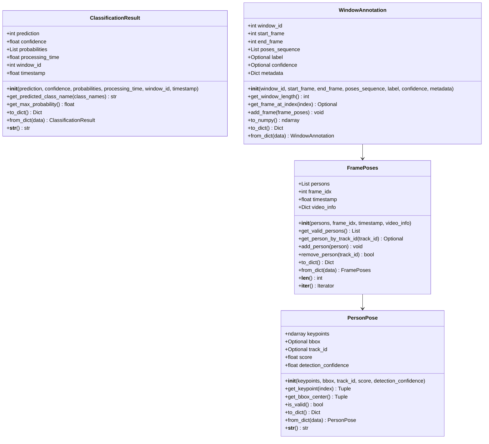
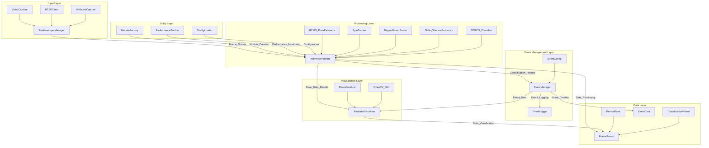
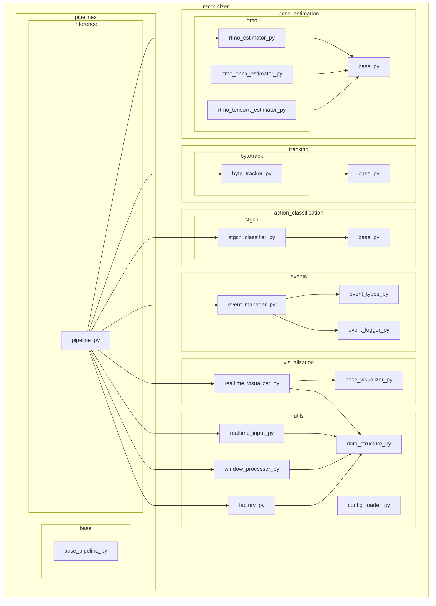
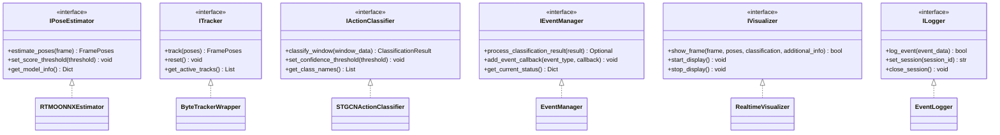
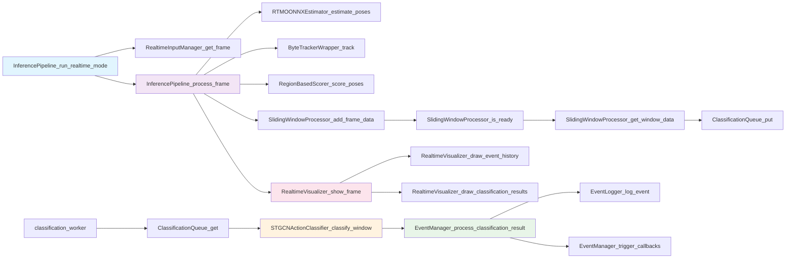
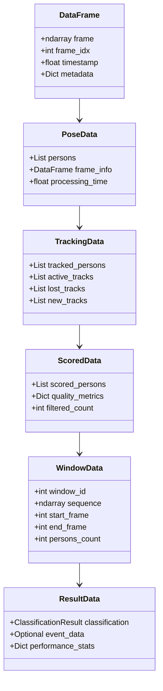

# 실시간 추론 시스템 UML 다이어그램

## 개요

본 문서는 Violence Detection 실시간 추론 시스템의 UML 다이어그램을 제공한다. 클래스 다이어그램, 컴포넌트 다이어그램, 패키지 다이어그램을 통해 시스템의 구조적 관계를 시각화한다.
---

## 목차

- [실시간 추론 시스템 UML 다이어그램](#실시간-추론-시스템-uml-다이어그램)
  - [개요](#개요)
  - [목차](#목차)
  - [전체 시스템 클래스 다이어그램](#전체-시스템-클래스-다이어그램)
  - [파이프라인 클래스 다이어그램](#파이프라인-클래스-다이어그램)
  - [이벤트 관리 클래스 다이어그램](#이벤트-관리-클래스-다이어그램)
  - [데이터 구조 클래스 다이어그램](#데이터-구조-클래스-다이어그램)
  - [컴포넌트 다이어그램](#컴포넌트-다이어그램)
  - [패키지 다이어그램](#패키지-다이어그램)
  - [상속 계층 다이어그램](#상속-계층-다이어그램)
  - [인터페이스 다이어그램](#인터페이스-다이어그램)
  - [메서드 호출 관계 다이어그램](#메서드-호출-관계-다이어그램)
  - [데이터 플로우 클래스 다이어그램](#데이터-플로우-클래스-다이어그램)
  - [UML 다이어그램 요약](#uml-다이어그램-요약)
    - [주요 설계 패턴](#주요-설계-패턴)
    - [핵심 아키텍처 특징](#핵심-아키텍처-특징)
    - [확장 포인트](#확장-포인트)

---

## 전체 시스템 클래스 다이어그램

```mermaid
classDiagram
    class InferencePipeline {
        -BasePoseEstimator pose_estimator
        -BaseTracker tracker
        -BaseScorer scorer
        -BaseActionClassifier classifier
        -SlidingWindowProcessor window_processor
        -EventManager event_manager
        -List frame_buffer
        -Queue classification_queue
        -Thread classification_thread
        +__init__(config)
        +initialize_pipeline() bool
        +run_realtime_mode(input_source) bool
        +process_frame(frame, frame_idx) Tuple
        +get_performance_stats() Dict
        +_classification_worker() void
        +_start_classification_thread() void
        +_stop_classification_thread() void
    }

    class RealtimeInputManager {
        -Union input_source
        -int buffer_size
        -Optional target_fps
        -int frame_skip
        -VideoCapture cap
        -Queue frame_queue
        -Thread capture_thread
        -bool is_running
        +__init__(input_source, buffer_size, target_fps, frame_skip)
        +start() bool
        +stop() void
        +get_frame() Optional
        +get_video_info() Dict
        -_analyze_source_type(source) str
        -_capture_loop() void
    }

    class EventManager {
        -EventConfig config
        -bool current_event_active
        -int consecutive_violence
        -int consecutive_normal
        -List event_history
        -Dict event_callbacks
        -EventLogger logger
        +__init__(config)
        +process_classification_result(result) Optional
        +add_event_callback(event_type, callback) void
        +get_current_status() Dict
        +get_event_history(limit) List
        -_handle_violence_detection(result) Optional
        -_handle_normal_detection(result) Optional
        -_create_event_data(event_type, result) EventData
    }

    class RealtimeVisualizer {
        -str window_name
        -int display_width
        -int display_height
        -int fps_limit
        -float confidence_threshold
        -PoseVisualizer pose_visualizer
        -List classification_history
        -List event_history
        -bool is_running
        +__init__(window_name, display_width, display_height, fps_limit, confidence_threshold)
        +start_display() void
        +stop_display() void
        +show_frame(frame, poses, classification, additional_info, overlay_data) bool
        +update_event_history(event_data) void
        +update_classification_history(classification) void
        -_draw_event_history(frame) ndarray
        -draw_classification_results(frame) ndarray
        -add_overlay_info(frame, additional_info) ndarray
    }

    class BasePoseEstimator {
        <<abstract>>
        +estimate_poses(frame) FramePoses
        +set_score_threshold(threshold) void
        +get_model_info() Dict
        +warmup() void
    }

    class BaseTracker {
        <<abstract>>
        +track(poses) FramePoses
        +reset() void
        +get_active_tracks() List
        +update_tracks(detections) void
    }

    class BaseScorer {
        <<abstract>>
        +score_poses(poses) FramePoses
        +set_quality_threshold(threshold) void
        +get_scoring_criteria() Dict
        +filter_poses(poses) FramePoses
    }

    class BaseActionClassifier {
        <<abstract>>
        +classify_window(window_data) ClassificationResult
        +set_confidence_threshold(threshold) void
        +get_class_names() List
        +warmup() void
    }

    class SlidingWindowProcessor {
        -int window_size
        -int stride
        -List frames_buffer
        -int current_window_id
        +__init__(window_size, stride)
        +add_frame_data(frame_poses) void
        +is_ready() bool
        +get_window_data() ndarray
        +reset() void
        +get_buffer_size() int
    }

    class PoseVisualizer {
        -List keypoint_connections
        -Dict color_palette
        +draw_poses(frame, poses) ndarray
        +draw_keypoints(frame, keypoints) ndarray
        +draw_skeleton(frame, keypoints) ndarray
        +set_colors(colors) void
    }

    InferencePipeline --> RealtimeInputManager
    InferencePipeline --> EventManager
    InferencePipeline --> RealtimeVisualizer
    InferencePipeline --> BasePoseEstimator
    InferencePipeline --> BaseTracker
    InferencePipeline --> BaseScorer
    InferencePipeline --> BaseActionClassifier
    InferencePipeline --> SlidingWindowProcessor
    RealtimeVisualizer --> PoseVisualizer
```

---

## 파이프라인 클래스 다이어그램

---

## 이벤트 관리 클래스 다이어그램

---

## 데이터 구조 클래스 다이어그램

---

## 컴포넌트 다이어그램

---

## 패키지 다이어그램

---

## 상속 계층 다이어그램

```mermaid
classDiagram
    class BasePipeline {
        <<abstract>>
        +initialize_pipeline() bool
        +run() bool
        +cleanup() void
    }

    class BasePoseEstimator {
        <<abstract>>
        +estimate_poses(frame) FramePoses
        +set_score_threshold(threshold) void
        +get_model_info() Dict
    }

    class BaseTracker {
        <<abstract>>
        +track(poses) FramePoses
        +reset() void
        +get_active_tracks() List
    }

    class BaseScorer {
        <<abstract>>
        +score_poses(poses) FramePoses
        +set_quality_threshold(threshold) void
        +get_scoring_criteria() Dict
    }

    class BaseActionClassifier {
        <<abstract>>
        +classify_window(window_data) ClassificationResult
        +set_confidence_threshold(threshold) void
        +get_class_names() List
        +warmup() void
    }

    class InferencePipeline {
        +run_realtime_mode(input_source) bool
        +run_analysis_mode(input_source) bool
    }

    class RTMOPoseEstimator {
        +estimate_poses(frame) FramePoses
        -_preprocess(frame) ndarray
        -_postprocess(output) FramePoses
    }

    class RTMOONNXEstimator {
        +estimate_poses(frame) FramePoses
        -_load_onnx_model() void
        -_onnx_inference(input_data) ndarray
    }

    class RTMOTensorRTEstimator {
        +estimate_poses(frame) FramePoses
        -_load_tensorrt_engine() void
        -_tensorrt_inference(input_data) ndarray
    }

    class ByteTrackerWrapper {
        +track(poses) FramePoses
        -_update_tracker(detections) List
        -_convert_to_poses(tracks) FramePoses
    }

    class RegionBasedScorer {
        +score_poses(poses) FramePoses
        -_calculate_region_score(pose) float
        -_filter_by_quality(poses) List
    }

    class STGCNActionClassifier {
        +classify_window(window_data) ClassificationResult
        -_preprocess_window(window_data) ndarray
        -_pytorch_inference(input_data) ndarray
        -_postprocess_output(output) ClassificationResult
    }

    BasePipeline <|-- InferencePipeline
    BasePoseEstimator <|-- RTMOPoseEstimator
    BasePoseEstimator <|-- RTMOONNXEstimator
    BasePoseEstimator <|-- RTMOTensorRTEstimator
    BaseTracker <|-- ByteTrackerWrapper
    BaseScorer <|-- RegionBasedScorer
    BaseActionClassifier <|-- STGCNActionClassifier
```

---

## 인터페이스 다이어그램

---

## 메서드 호출 관계 다이어그램

---

## 데이터 플로우 클래스 다이어그램

---

## UML 다이어그램 요약

### 주요 설계 패턴

1. **Strategy Pattern**: 각 모듈(포즈 추정, 추적, 분류)은 교체 가능한 전략으로 구현
2. **Factory Pattern**: ModuleFactory를 통한 모듈 생성 및 관리
3. **Observer Pattern**: EventManager의 콜백 시스템
4. **Template Method**: BasePipeline의 추상 메서드 구조
5. **Singleton Pattern**: ModuleFactory의 전역 인스턴스 관리

### 핵심 아키텍처 특징

1. **계층화된 구조**: 입력, 처리, 이벤트 관리, 시각화 계층 분리
2. **플러그인 아키텍처**: 각 모듈은 독립적으로 교체 가능
3. **비동기 처리**: 분류 작업의 별도 스레드 처리
4. **이벤트 기반**: 결과 처리를 위한 이벤트 시스템
5. **데이터 중심**: 명확한 데이터 구조와 변환 흐름

### 확장 포인트

1. **새로운 포즈 추정기**: BasePoseEstimator 상속
2. **새로운 분류기**: BaseActionClassifier 상속
3. **새로운 이벤트 타입**: EventType 열거형 확장
4. **새로운 시각화**: IVisualizer 인터페이스 구현
5. **새로운 로거**: ILogger 인터페이스 구현

