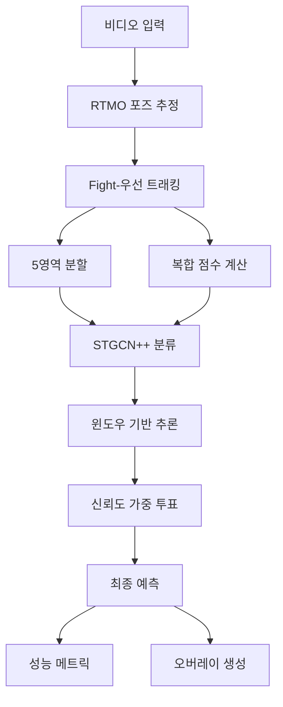

# STGCN++ Violence Detection - 고급 사용자 가이드

## 📋 목차

1. [아키텍처 심화](#아키텍처-심화)
2. [Fight-우선 트래킹 알고리즘](#fight-우선-트래킹-알고리즘)
3. [성능 최적화](#성능-최적화)
4. [커스터마이징](#커스터마이징)
5. [실시간 처리](#실시간-처리)
6. [대용량 데이터 처리](#대용량-데이터-처리)
7. [모델 파인튜닝](#모델-파인튜닝)

---

## 🏗️ 아키텍처 심화

### 전체 시스템 구조



### 데이터 플로우 분석

#### 1. 포즈 추정 단계
```python
# Input: 비디오 프레임 (H, W, 3)
# Process: RTMO 다중 인물 포즈 추정
# Output: [(N, 17, 2), (N, 17)] per frame
#         N: 검출된 인물 수, 17: COCO 키포인트, 2: XY 좌표

pose_results = []
for frame in video_frames:
    keypoints, scores = rtmo_model.predict(frame)
    pose_results.append((keypoints, scores))
```

#### 2. Fight-우선 트래킹 단계
```python
# Input: 프레임별 포즈 결과
# Process: 5영역 분할 + 복합 점수 계산
# Output: 최고 우선순위 인물 시퀀스 (T, 17, 2)

for frame_result in pose_results:
    keypoints_list, scores_list = frame_result
    
    # 복합 점수 계산
    composite_scores = tracker.calculate_composite_scores(
        keypoints_list, scores_list
    )
    
    # 최고 점수 인물 선택
    best_idx = np.argmax(composite_scores)
    selected_keypoints = keypoints_list[best_idx]
```

#### 3. STGCN++ 분류 단계
```python
# Input: 키포인트 시퀀스 (T, 17, 2)
# Process: 윈도우 기반 시공간 그래프 분석
# Output: Fight/NonFight 예측 + 신뢰도

window_predictions = []
for start_idx in range(0, len(sequence), stride):
    window = sequence[start_idx:start_idx+window_size]
    prediction, confidence = stgcn_model.predict(window)
    window_predictions.append((prediction, confidence))

# 신뢰도 가중 투표
final_prediction = weighted_majority_vote(window_predictions)
```

---

## 🎯 Fight-우선 트래킹 알고리즘

### 5영역 분할 시스템

#### 영역 정의
```python
def define_regions(frame_width, frame_height):
    w, h = frame_width, frame_height
    
    regions = {
        # 전체 4분할 (완전한 공간 커버리지)
        'top_left': (0, 0, w//2, h//2),              # 25% 영역
        'top_right': (w//2, 0, w, h//2),             # 25% 영역
        'bottom_left': (0, h//2, w//2, h),           # 25% 영역
        'bottom_right': (w//2, h//2, w, h),          # 25% 영역
        
        # 중앙 집중 영역 (가장 중요)
        'center': (w//4, h//4, 3*w//4, 3*h//4)       # 중앙 50% 영역
    }
    
    return regions
```

#### 영역별 가중치 전략

```python
# 기본 전략: 중앙 집중
region_weights_center_focused = {
    'center': 1.0,         # 최고 우선순위
    'top_left': 0.7,       # 중간 우선순위
    'top_right': 0.7,      # 중간 우선순위
    'bottom_left': 0.6,    # 낮은 우선순위
    'bottom_right': 0.6    # 낮은 우선순위
}

# 균등 전략: 전체 영역 동등
region_weights_balanced = {
    'center': 0.8,
    'top_left': 0.8,
    'top_right': 0.8,
    'bottom_left': 0.8,
    'bottom_right': 0.8
}

# 상단 집중: 상체 중심 분석
region_weights_upper_focused = {
    'center': 1.0,
    'top_left': 0.9,
    'top_right': 0.9,
    'bottom_left': 0.5,
    'bottom_right': 0.5
}
```

### 복합 점수 계산 알고리즘

#### 1. 위치 점수 (Position Score)
```python
def calculate_position_score(keypoints, regions, region_weights):
    """인물의 영역별 위치 점수 계산"""
    
    # 유효한 키포인트의 중심점 계산
    valid_points = keypoints[keypoints[:, 0] > 0]
    if len(valid_points) == 0:
        return 0.0
    
    person_center = np.mean(valid_points, axis=0)
    
    # 각 영역에서의 점수 계산
    region_scores = {}
    for region_name, (x1, y1, x2, y2) in regions.items():
        if x1 <= person_center[0] <= x2 and y1 <= person_center[1] <= y2:
            # 영역 중심에서의 거리 기반 점수
            region_center = np.array([(x1+x2)/2, (y1+y2)/2])
            distance = np.linalg.norm(person_center - region_center)
            max_distance = np.linalg.norm([x2-x1, y2-y1]) / 2
            
            # 거리 기반 점수 (중심에 가까울수록 높음)
            distance_score = max(0.5, 1.0 - (distance / max_distance) * 0.5)
            region_scores[region_name] = distance_score * region_weights[region_name]
        else:
            region_scores[region_name] = 0.0
    
    return max(region_scores.values())
```

#### 2. 움직임 점수 (Movement Score)
```python
def calculate_movement_score(current_keypoints, previous_positions):
    """동작의 격렬함 기반 점수 계산"""
    
    if len(previous_positions) < 2:
        return 0.5  # 기본값
    
    # 현재 위치 계산
    valid_points = current_keypoints[current_keypoints[:, 0] > 0]
    current_pos = np.mean(valid_points, axis=0) if len(valid_points) > 0 else np.array([0, 0])
    
    # 이전 위치들과의 거리 계산
    movements = []
    for prev_pos in previous_positions[-5:]:  # 최근 5프레임
        movement = np.linalg.norm(current_pos - prev_pos)
        movements.append(movement)
    
    # 평균 움직임 정규화 (0-1 범위)
    avg_movement = np.mean(movements)
    movement_score = min(1.0, avg_movement / 50.0)  # 50픽셀을 최대값으로 설정
    
    return movement_score
```

#### 3. 상호작용 점수 (Interaction Score)
```python
def calculate_interaction_score(person_keypoints, all_keypoints_list):
    """인물 간 상호작용 강도 계산"""
    
    if len(all_keypoints_list) < 2:
        return 0.0  # 단일 인물
    
    person_center = np.mean(person_keypoints[person_keypoints[:, 0] > 0], axis=0)
    max_interaction = 0.0
    
    for other_keypoints in all_keypoints_list:
        if np.array_equal(person_keypoints, other_keypoints):
            continue  # 자기 자신 제외
        
        other_center = np.mean(other_keypoints[other_keypoints[:, 0] > 0], axis=0)
        distance = np.linalg.norm(person_center - other_center)
        
        # 거리 기반 상호작용 점수 (가까울수록 높음)
        if distance > 0:
            interaction = max(0.0, 1.0 - (distance / 150.0))  # 150픽셀 임계값
            max_interaction = max(max_interaction, interaction)
    
    return max_interaction
```

#### 4. 검출 신뢰도 점수 (Detection Score)
```python
def calculate_detection_score(keypoint_scores):
    """키포인트 검출 품질 점수"""
    
    valid_scores = keypoint_scores[keypoint_scores > 0]
    if len(valid_scores) == 0:
        return 0.0
    
    # 평균 신뢰도와 유효 키포인트 비율 조합
    avg_confidence = np.mean(valid_scores)
    valid_ratio = len(valid_scores) / len(keypoint_scores)
    
    detection_score = (avg_confidence * 0.7) + (valid_ratio * 0.3)
    return detection_score
```

#### 5. 시간적 일관성 점수 (Consistency Score)
```python
def calculate_consistency_score(recent_composite_scores):
    """최근 프레임들에서의 점수 일관성"""
    
    if len(recent_composite_scores) < 3:
        return 0.5  # 기본값
    
    # 표준편차의 역수로 일관성 측정
    std_dev = np.std(recent_composite_scores)
    consistency = 1.0 / (1.0 + std_dev)
    
    return consistency
```

### 최종 복합 점수 통합

```python
def calculate_final_composite_score(keypoints, scores, context, weights):
    """모든 점수를 가중합으로 통합"""
    
    position_score = calculate_position_score(keypoints, context['regions'], context['region_weights'])
    movement_score = calculate_movement_score(keypoints, context['previous_positions'])
    interaction_score = calculate_interaction_score(keypoints, context['all_keypoints'])
    detection_score = calculate_detection_score(scores)
    consistency_score = calculate_consistency_score(context['recent_scores'])
    
    final_score = (
        position_score * weights['position'] +
        movement_score * weights['movement'] +
        interaction_score * weights['interaction'] +
        detection_score * weights['detection'] +
        consistency_score * weights['consistency']
    )
    
    return final_score
```

---

## 🚀 성능 최적화

### GPU 메모리 최적화

#### 1. 배치 처리 최적화
```python
def optimize_batch_processing():
    """GPU 메모리 효율적 배치 처리"""
    
    # GPU 메모리 상태 모니터링
    import torch
    
    def get_gpu_memory():
        if torch.cuda.is_available():
            return torch.cuda.memory_allocated() / 1024**3  # GB 단위
        return 0
    
    # 동적 배치 크기 조정
    initial_batch_size = 8
    current_batch_size = initial_batch_size
    
    for batch in video_batches:
        try:
            # 현재 배치 크기로 처리 시도
            result = process_batch(batch[:current_batch_size])
            
            # 성공 시 배치 크기 점진적 증가
            if len(batch) > current_batch_size:
                current_batch_size = min(current_batch_size + 1, 16)
                
        except RuntimeError as e:
            if "out of memory" in str(e):
                # 메모리 부족 시 배치 크기 감소
                current_batch_size = max(current_batch_size - 2, 1)
                torch.cuda.empty_cache()
                continue
            else:
                raise e
```

#### 2. 모델 가중치 공유
```python
class OptimizedPipeline:
    """메모리 효율적인 파이프라인"""
    
    def __init__(self):
        # 모델들을 순차적으로 로드하여 메모리 절약
        self.pose_model = None
        self.gcn_model = None
        
    def load_pose_model(self):
        if self.pose_model is None:
            self.pose_model = RTMOPoseEstimator(...)
            
    def unload_pose_model(self):
        if self.pose_model is not None:
            del self.pose_model
            self.pose_model = None
            torch.cuda.empty_cache()
            
    def process_with_memory_management(self, video_path):
        # 1. 포즈 추정 단계
        self.load_pose_model()
        pose_results = self.pose_model.estimate_poses_from_video(video_path)
        self.unload_pose_model()
        
        # 2. 트래킹 단계 (CPU에서 진행)
        tracker_results = self.tracker.process_video_sequence(pose_results)
        
        # 3. 분류 단계
        self.load_gcn_model()
        classification_result = self.gcn_model.classify_video_sequence(tracker_results)
        self.unload_gcn_model()
        
        return classification_result
```

### CPU 병렬 처리

#### 1. 멀티프로세싱 활용
```python
import multiprocessing as mp
from concurrent.futures import ProcessPoolExecutor

def process_video_parallel(video_paths, num_workers=4):
    """멀티프로세싱 기반 병렬 처리"""
    
    def process_single_video_worker(video_path):
        # 각 프로세스에서 독립적인 파이프라인 생성
        pipeline = EndToEndPipeline(...)
        result = pipeline.process_single_video(video_path)
        pipeline.cleanup()
        return result
    
    with ProcessPoolExecutor(max_workers=num_workers) as executor:
        futures = [executor.submit(process_single_video_worker, path) 
                  for path in video_paths]
        
        results = []
        for future in futures:
            try:
                result = future.result(timeout=300)  # 5분 타임아웃
                results.append(result)
            except Exception as e:
                logger.error(f"비디오 처리 실패: {e}")
                results.append(None)
    
    return results
```

#### 2. 스레드 기반 I/O 최적화
```python
import threading
from queue import Queue

class AsyncVideoProcessor:
    """비동기 비디오 처리기"""
    
    def __init__(self, pipeline, max_queue_size=10):
        self.pipeline = pipeline
        self.input_queue = Queue(maxsize=max_queue_size)
        self.output_queue = Queue()
        self.processing_thread = None
        self.running = False
        
    def start_processing(self):
        """백그라운드 처리 시작"""
        self.running = True
        self.processing_thread = threading.Thread(target=self._process_loop)
        self.processing_thread.start()
        
    def _process_loop(self):
        """백그라운드 처리 루프"""
        while self.running:
            try:
                video_path = self.input_queue.get(timeout=1)
                result = self.pipeline.process_single_video(video_path)
                self.output_queue.put((video_path, result))
                self.input_queue.task_done()
            except:
                continue
                
    def add_video(self, video_path):
        """처리할 비디오 추가"""
        self.input_queue.put(video_path)
        
    def get_result(self, timeout=None):
        """처리 결과 가져오기"""
        return self.output_queue.get(timeout=timeout)
```

---

## 🔧 커스터마이징

### Fight-우선 트래킹 커스터마이징

#### 1. 도메인별 영역 가중치 설정

```python
# 실내 CCTV 환경 (중앙 집중)
indoor_weights = {
    'center': 1.2,
    'top_left': 0.6,
    'top_right': 0.6,
    'bottom_left': 0.5,
    'bottom_right': 0.5
}

# 야외 광장 환경 (균등 분산)
outdoor_weights = {
    'center': 0.9,
    'top_left': 0.8,
    'top_right': 0.8,
    'bottom_left': 0.8,
    'bottom_right': 0.8
}

# 복도/통로 환경 (수직 중심)
corridor_weights = {
    'center': 1.0,
    'top_left': 0.7,
    'top_right': 0.7,
    'bottom_left': 0.7,
    'bottom_right': 0.7
}
```

#### 2. 상황별 복합 점수 가중치

```python
# 폭력 예방 중심 (높은 민감도)
prevention_weights = {
    'position': 0.2,
    'movement': 0.3,      # 움직임 중시
    'interaction': 0.35,   # 상호작용 중시
    'detection': 0.1,
    'consistency': 0.05
}

# 정확도 중심 (낮은 오탐률)
accuracy_weights = {
    'position': 0.4,      # 위치 중시
    'movement': 0.2,
    'interaction': 0.2,
    'detection': 0.15,    # 검출 품질 중시
    'consistency': 0.05
}

# 실시간 중심 (빠른 반응)
realtime_weights = {
    'position': 0.35,
    'movement': 0.35,     # 즉시 감지
    'interaction': 0.2,
    'detection': 0.05,
    'consistency': 0.05   # 일관성 덜 중시
}
```

### STGCN++ 분류 커스터마이징

#### 1. 윈도우 전략 최적화

```python
class AdaptiveWindowClassifier:
    """적응적 윈도우 크기 분류기"""
    
    def __init__(self, base_window_size=30):
        self.base_window_size = base_window_size
        
    def classify_with_adaptive_windows(self, keypoints, scores):
        """움직임 강도에 따른 적응적 윈도우 크기"""
        
        # 움직임 강도 계산
        movement_intensity = self.calculate_movement_intensity(keypoints)
        
        # 윈도우 크기 조정
        if movement_intensity > 0.8:
            window_size = 20  # 격렬한 움직임: 짧은 윈도우
            stride = 5
        elif movement_intensity > 0.5:
            window_size = 30  # 보통 움직임: 기본 윈도우
            stride = 10
        else:
            window_size = 45  # 느린 움직임: 긴 윈도우
            stride = 15
            
        return self.classify_video_sequence(
            keypoints, scores, window_size, stride
        )
```

#### 2. 다중 모델 앙상블

```python
class EnsembleClassifier:
    """다중 STGCN++ 모델 앙상블"""
    
    def __init__(self, model_configs):
        self.models = []
        for config in model_configs:
            model = STGCNActionClassifier(**config)
            self.models.append(model)
            
    def ensemble_predict(self, keypoints, scores):
        """다중 모델 예측 결과 통합"""
        
        predictions = []
        confidences = []
        
        for model in self.models:
            result = model.classify_video_sequence(keypoints, scores)
            predictions.append(result['prediction'])
            confidences.append(result['confidence'])
        
        # 신뢰도 가중 투표
        weighted_sum = sum(pred * conf for pred, conf in zip(predictions, confidences))
        total_confidence = sum(confidences)
        
        final_prediction = 1 if weighted_sum / total_confidence > 0.5 else 0
        final_confidence = total_confidence / len(self.models)
        
        return {
            'prediction': final_prediction,
            'confidence': final_confidence,
            'individual_predictions': predictions,
            'individual_confidences': confidences
        }
```

---

## ⚡ 실시간 처리

### 웹캠 실시간 처리

```python
import cv2
import time
from collections import deque

class RealTimeViolenceDetector:
    """실시간 폭력 검출 시스템"""
    
    def __init__(self, pipeline, buffer_size=30, detection_interval=15):
        self.pipeline = pipeline
        self.buffer_size = buffer_size
        self.detection_interval = detection_interval
        
        self.frame_buffer = deque(maxlen=buffer_size)
        self.pose_buffer = deque(maxlen=buffer_size)
        self.frame_count = 0
        
    def process_webcam(self, camera_id=0):
        """웹캠 실시간 처리"""
        
        cap = cv2.VideoCapture(camera_id)
        cap.set(cv2.CAP_PROP_FRAME_WIDTH, 640)
        cap.set(cv2.CAP_PROP_FRAME_HEIGHT, 480)
        cap.set(cv2.CAP_PROP_FPS, 30)
        
        while True:
            ret, frame = cap.read()
            if not ret:
                break
                
            self.frame_buffer.append(frame)
            self.frame_count += 1
            
            # 포즈 추정 (매 프레임)
            keypoints, scores = self.pipeline.pose_estimator.estimate_poses_single_frame(frame)
            self.pose_buffer.append((keypoints, scores))
            
            # 폭력 검출 (설정된 간격마다)
            if self.frame_count % self.detection_interval == 0 and len(self.pose_buffer) >= self.buffer_size:
                detection_result = self.detect_violence()
                
                # 결과 표시
                self.display_result(frame, detection_result)
            
            # 프레임 표시
            cv2.imshow('Real-time Violence Detection', frame)
            
            if cv2.waitKey(1) & 0xFF == ord('q'):
                break
                
        cap.release()
        cv2.destroyAllWindows()
        
    def detect_violence(self):
        """현재 버퍼에서 폭력 검출"""
        
        # Fight-우선 트래킹
        selected_keypoints, selected_scores = self.pipeline.tracker.process_video_sequence(
            list(self.pose_buffer), self.buffer_size
        )
        
        # STGCN++ 분류
        result = self.pipeline.classifier.classify_video_sequence(
            selected_keypoints, selected_scores
        )
        
        return result
        
    def display_result(self, frame, result):
        """결과를 프레임에 표시"""
        
        label = result['prediction_label']
        confidence = result['confidence']
        
        # 색상 선택 (Fight: 빨강, NonFight: 초록)
        color = (0, 0, 255) if label == 'Fight' else (0, 255, 0)
        
        # 텍스트 표시
        text = f"{label}: {confidence:.2f}"
        cv2.putText(frame, text, (10, 30), cv2.FONT_HERSHEY_SIMPLEX, 1, color, 2)
        
        # 위험도에 따른 경고 표시
        if label == 'Fight' and confidence > 0.8:
            cv2.rectangle(frame, (5, 5), (635, 475), (0, 0, 255), 5)
            cv2.putText(frame, "VIOLENCE DETECTED!", (150, 60), 
                       cv2.FONT_HERSHEY_SIMPLEX, 1, (0, 0, 255), 3)
```

### 스트리밍 서버 구현

```python
from flask import Flask, Response, jsonify
import json
import threading

class ViolenceDetectionServer:
    """HTTP 스트리밍 서버"""
    
    def __init__(self, pipeline):
        self.app = Flask(__name__)
        self.pipeline = pipeline
        self.detector = RealTimeViolenceDetector(pipeline)
        
        self.setup_routes()
        
    def setup_routes(self):
        """API 라우트 설정"""
        
        @self.app.route('/video_feed')
        def video_feed():
            return Response(
                self.generate_frames(),
                mimetype='multipart/x-mixed-replace; boundary=frame'
            )
            
        @self.app.route('/detection_status')
        def detection_status():
            # 최근 검출 결과 반환
            return jsonify(self.detector.get_latest_result())
            
        @self.app.route('/start_detection')
        def start_detection():
            threading.Thread(target=self.detector.process_webcam).start()
            return jsonify({'status': 'started'})
            
    def generate_frames(self):
        """비디오 프레임 스트리밍"""
        
        cap = cv2.VideoCapture(0)
        
        while True:
            success, frame = cap.read()
            if not success:
                break
                
            # 프레임 인코딩
            ret, buffer = cv2.imencode('.jpg', frame)
            frame_bytes = buffer.tobytes()
            
            yield (b'--frame\r\n'
                   b'Content-Type: image/jpeg\r\n\r\n' + frame_bytes + b'\r\n')
    
    def run(self, host='0.0.0.0', port=5000):
        """서버 실행"""
        self.app.run(host=host, port=port, threaded=True)
```

---

## 📊 대용량 데이터 처리

### 분산 처리 시스템

```python
import ray
from typing import List

@ray.remote
class DistributedProcessor:
    """Ray를 활용한 분산 처리"""
    
    def __init__(self, pipeline_config):
        self.pipeline = EndToEndPipeline(**pipeline_config)
        
    def process_video_batch(self, video_paths: List[str]):
        """비디오 배치 처리"""
        results = []
        for video_path in video_paths:
            result = self.pipeline.process_single_video(video_path)
            results.append(result)
        return results

class LargeScaleProcessor:
    """대용량 데이터 처리 관리자"""
    
    def __init__(self, num_workers=4):
        ray.init()
        self.num_workers = num_workers
        
        # 워커 생성
        self.workers = [DistributedProcessor.remote(pipeline_config) 
                       for _ in range(num_workers)]
        
    def process_large_dataset(self, video_paths: List[str], batch_size=10):
        """대용량 데이터셋 처리"""
        
        # 비디오를 배치로 분할
        batches = [video_paths[i:i+batch_size] 
                  for i in range(0, len(video_paths), batch_size)]
        
        # 배치를 워커에 분산
        futures = []
        for i, batch in enumerate(batches):
            worker = self.workers[i % self.num_workers]
            future = worker.process_video_batch.remote(batch)
            futures.append(future)
        
        # 결과 수집
        all_results = []
        for future in futures:
            batch_results = ray.get(future)
            all_results.extend(batch_results)
            
        return all_results
```

### 메모리 효율적 처리

```python
import gc
from pathlib import Path

class MemoryEfficientProcessor:
    """메모리 효율적 대용량 처리"""
    
    def __init__(self, pipeline_config, max_memory_gb=8):
        self.pipeline_config = pipeline_config
        self.max_memory_gb = max_memory_gb
        
    def estimate_memory_usage(self, video_path):
        """비디오 메모리 사용량 추정"""
        
        video_size_mb = Path(video_path).stat().st_size / (1024 * 1024)
        
        # 대략적인 메모리 사용량 추정 (경험적 공식)
        estimated_memory_gb = video_size_mb * 0.01  # 1% 정도
        
        return estimated_memory_gb
        
    def process_with_memory_limit(self, video_paths):
        """메모리 제한 하에서 처리"""
        
        current_batch = []
        current_memory = 0
        results = []
        
        for video_path in video_paths:
            estimated_memory = self.estimate_memory_usage(video_path)
            
            if current_memory + estimated_memory > self.max_memory_gb:
                # 현재 배치 처리
                if current_batch:
                    batch_results = self.process_batch_with_cleanup(current_batch)
                    results.extend(batch_results)
                
                # 배치 초기화
                current_batch = [video_path]
                current_memory = estimated_memory
            else:
                current_batch.append(video_path)
                current_memory += estimated_memory
        
        # 마지막 배치 처리
        if current_batch:
            batch_results = self.process_batch_with_cleanup(current_batch)
            results.extend(batch_results)
            
        return results
    
    def process_batch_with_cleanup(self, video_paths):
        """메모리 정리와 함께 배치 처리"""
        
        # 파이프라인 생성
        pipeline = EndToEndPipeline(**self.pipeline_config)
        
        try:
            # 배치 처리
            results = pipeline.process_batch_videos(
                video_paths, 
                generate_overlay=False,  # 메모리 절약
                save_individual_results=True
            )
            
            return results['individual_results']
            
        finally:
            # 명시적 정리
            pipeline.cleanup()
            del pipeline
            gc.collect()
            
            # GPU 메모리 정리
            if torch.cuda.is_available():
                torch.cuda.empty_cache()
```

---

## 🎓 모델 파인튜닝

### 커스텀 데이터셋 학습

```python
# MMAction2 기반 STGCN++ 파인튜닝 설정
custom_config = """
_base_ = ['../../_base_/models/stgcn++.py']

# 모델 설정
model = dict(
    cls_head=dict(
        num_classes=2,  # Fight, NonFight
        dropout=0.5
    )
)

# 데이터셋 설정
dataset_type = 'PoseDataset'
ann_file_train = 'data/custom_train.pkl'
ann_file_val = 'data/custom_val.pkl'
ann_file_test = 'data/custom_test.pkl'

train_pipeline = [
    dict(type='PoseNormalize'),
    dict(type='PoseRandomFlip', flip_ratio=0.5),
    dict(type='PoseRandomResample', keep_ratio=0.95),
    dict(type='FormatShape', input_format='NCTVM'),
    dict(type='Collect', keys=['keypoint', 'label'], meta_keys=[]),
    dict(type='ToTensor', keys=['keypoint'])
]

# 학습 설정
optimizer = dict(type='SGD', lr=0.01, momentum=0.9, weight_decay=0.0001)
optimizer_config = dict(grad_clip=dict(max_norm=40, norm_type=2))

lr_config = dict(policy='step', step=[20, 40])
total_epochs = 50

# Fight-특화 손실 함수
loss_config = dict(
    type='CrossEntropyLoss',
    class_weight=[1.0, 2.0],  # Fight 클래스에 더 높은 가중치
    use_sigmoid=False
)
"""
```

### 성능 모니터링 및 검증

```python
class ModelValidator:
    """모델 성능 검증 도구"""
    
    def __init__(self, pipeline, validation_data):
        self.pipeline = pipeline
        self.validation_data = validation_data
        
    def validate_performance(self):
        """종합 성능 검증"""
        
        results = []
        
        for video_path, ground_truth in self.validation_data:
            result = self.pipeline.process_single_video(
                video_path, ground_truth
            )
            results.append(result)
        
        # 성능 메트릭 계산
        predictions = [r['classification']['prediction'] for r in results]
        ground_truths = [r['ground_truth_label'] for r in results]
        confidences = [r['classification']['confidence'] for r in results]
        
        metrics = self.pipeline.metrics_calculator.calculate_comprehensive_metrics(
            predictions, ground_truths, confidences
        )
        
        return metrics
    
    def analyze_failure_cases(self, threshold=0.5):
        """실패 사례 분석"""
        
        failure_cases = []
        
        for video_path, ground_truth in self.validation_data:
            result = self.pipeline.process_single_video(video_path, ground_truth)
            
            prediction = result['classification']['prediction']
            confidence = result['classification']['confidence']
            
            # 실패 조건: 잘못된 예측 또는 낮은 신뢰도
            if prediction != ground_truth or confidence < threshold:
                failure_cases.append({
                    'video_path': video_path,
                    'ground_truth': ground_truth,
                    'prediction': prediction,
                    'confidence': confidence,
                    'failure_type': self.classify_failure_type(
                        ground_truth, prediction, confidence
                    )
                })
        
        return failure_cases
    
    def classify_failure_type(self, gt, pred, conf):
        """실패 유형 분류"""
        
        if gt == 1 and pred == 0:
            return 'False Negative' if conf > 0.5 else 'Low Confidence FN'
        elif gt == 0 and pred == 1:
            return 'False Positive' if conf > 0.5 else 'Low Confidence FP'
        else:
            return 'Low Confidence Correct'
```

---

이 고급 가이드는 STGCN++ Violence Detection 시스템의 깊이 있는 이해와 고급 활용을 위한 종합적인 자료입니다. 각 섹션의 코드와 알고리즘을 통해 시스템을 더욱 효과적으로 활용하고 커스터마이징할 수 있습니다.